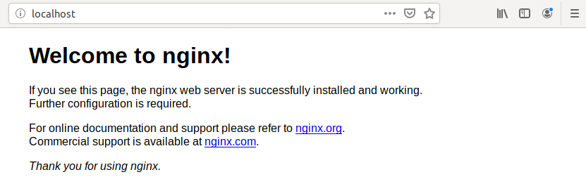

# 3. Docker 설치와 튜토리얼

## Docker for Windows 설치
0. 작동 조건 확인
	* Windows 10 pro 또는 Enterprise(64bit) 단말기
	* VirtualBox와 같은 서드파디 제품 가상화 환경을 설치하지 않을 것
	* Hyper-V를 유효화할 것
		- [제어판] -> [프로그램 및 기능] -> [Windows기능 켜기/끄기] => [x] [Hyper-V] 체크
1. Windows용 Docker 설치
	- https://hub.docker.com/editions/community/docker-ce-desktop-windows/
2. 설정
	* [General] - Windows Subsystem for Linux(WSL) tkdyd
		- [x] Expose daemon on tcp://localhost:2375 without TLS
	* [Shared Drives] - 클라이언트 pc와 파일 공유
	* [Advanced] - CPU, 메모리 조정
	* [Network] - 네트워크 설정
	* [Proxies] - 프로시 설정(프록시 서버 사용 할 시)

---
## 테스트 환경 및 도구
* Linux Ubuntu 5.0.0.-23-generic #24~18.04.1-Ubuntu(64bit)
	
## Linux 설치

### 사전 환경 설정
1. apt 업데이트 후, 패키지 설치  
`sudo apt-get update`
```
sudo apt-get install -y apt-transport-https ca-certificates \
	curl software-properties-common`
```

2. GPG키 추가 및 GPG키 확인  
`curl -fsSL https://download.docker.com/linux/ubuntu/gpg | sudo apt-key add -`  
`sudo apt-key fingerprint 0EBFCD88`
```
pub   rsa4096 2017-02-22 [SCEA]
      9DC8 5822 9FC7 DD38 854A  E2D8 8D81 803C 0EBF CD88
uid           [ unknown] Docker Release (CE deb) <docker@docker.com>
sub   rsa4096 2017-02-22 [S]
```

3. repository 등록
```
sudo add-apt-repository \
   "deb [arch=amd64] https://download.docker.com/linux/ubuntu \
   $(lsb_release -cs) stable"
```

### Docker 설치
1. apt 업데이트 후, docker ce 버전 설치  
`sudo apt-get update`  
`sudo apt-get install docker-ce docker-ce-cli containerd.io'  
	or `sudo apt-get install docker-ce`
	* 이전 버전 제거  
		`sudo apt-get remove docker docker-engine docker.io containerd runc`  
	*수시로 설치 방법 확인 : https://docs.docker.com/install/

---
## 작동 테스트
1. Docker 명령어 확인
`docker`
`sudo docker container run ubuntu:latest /bin/echo 'Hello world'`
* 작동을 확인할때 '관리자' 권한으로 실행
* 형식 : sudo docker container run(컨테이너 작성 및 실행) <Docker 이미지명> <실행할 명령>

2. Docker 버전 확인
`sudo docker version`
```
Client: Docker Engine - Community
 Version:           19.03.6
 API version:       1.40
 Go version:        go1.12.16
 Git commit:        369ce74a3c
 Built:             Thu Feb 13 01:27:49 2020
 OS/Arch:           linux/amd64
 Experimental:      false

Server: Docker Engine - Community
 Engine:
  Version:          19.03.6
  API version:      1.40 (minimum version 1.12)
  Go version:       go1.12.16
  Git commit:       369ce74a3c
  Built:            Thu Feb 13 01:26:21 2020
  OS/Arch:          linux/amd64
  Experimental:     false
 containerd:
  Version:          1.2.13
  GitCommit:        7ad184331fa3e55e52b890ea95e65ba581ae3429
 runc:
  Version:          1.0.0-rc10
  GitCommit:        dc9208a3303feef5b3839f4323d9beb36df0a9dd
 docker-init:
  Version:          0.18.0
  GitCommit:        fec3683
```

3. Docker 실행환경 확인
`sudo docker system info`
```
Client:
 Debug Mode: false

Server:
 Containers: 4						// 컨테이너 수
  Running: 0
  Paused: 0
  Stopped: 4
 Images: 2
 Server Version: 19.03.6			// Docker 버전
 Storage Driver: overlay2			// 스토리지 드라이버 종류
  Backing Filesystem: extfs
  Supports d_type: true
  Native Overlay Diff: true
 Logging Driver: json-file
 Cgroup Driver: cgroupfs
 Plugins:
  Volume: local
  Network: bridge host ipvlan macvlan null overlay
  Log: awslogs fluentd gcplogs gelf journald json-file local logentries splunk syslog
 Swarm: inactive
 Runtimes: runc
 Default Runtime: runc
 Init Binary: docker-init
 containerd version: 7ad184331fa3e55e52b890ea95e65ba581ae3429
 runc version: dc9208a3303feef5b3839f4323d9beb36df0a9dd
 init version: fec3683
 Security Options:
  apparmor
  seccomp
   Profile: default
 Kernel Version: 5.0.0-23-generic
 Operating System: Ubuntu 18.04.2 LTS
 OSType: linux							// OS종류
 Architecture: x86_64					// 아키텍처
 CPUs: 4
 Total Memory: 1.92GiB
 Name: Ubuntu
 ID: QLAX:XISI:KEYS:JNWX:XZ7V:WCEF:XPHJ:5ELA:JXGH:NLYM:EHUB:Q2I5
 Docker Root Dir: /var/lib/docker
 Debug Mode: false
 Registry: https://index.docker.io/v1/
 Labels:
 Experimental: false
 Insecure Registries:
  127.0.0.0/8
 Live Restore Enabled: false

WARNING: No swap limit support
```

4. Docker 디스크 이용 상황
`sudo docker system df`
	* -v : 상세 내용 확인
```
TYPE              TOTAL           ACTIVE          SIZE            RECLAIMABLE
Images            2               2               64.21MB         0B (0%)
Containers        4               0               0B              0B
Local Volumes     0               0               0B              0B
Build Cache       0               0               0B              0B
```

### Docker 그룹 User 추가
* Docker는 root만 사용 가능
* Docker 그룹에 일반 사용자 추가해야, 일반 사용자 Docker 사용 가능
`cat /etc/group | grep docker`
`sudo usermod -aG docker $USER`
`sudo service docker restart`
	or `sudo systemctl restart docker.service`

---
## 웹 서버 작동
0. 오픈 웹 서버인 Nginx 사용
	- 대량의 요청 처리 가능, 리버스 프록시 및 로드밸런서 기능 존재
	* __이후, `root`계정을 사용해 `sudo`사용의 생략함__
	
1. Docker Hub에서 Nginx 이미지 다운로드 및 확인
`docker pull nginx:latest`
	or `docker pull nginx` - 자동으로 최신버전 사용
```
Using default tag: latest
latest: Pulling from library/nginx
68ced04f60ab: Pull complete 
c4039fd85dcc: Pull complete 
c16ce02d3d61: Pull complete 
Digest: sha256:380eb808e2a3b0dd954f92c1cae2f845e6558a15037efefcabc5b4e03d666d03
Status: Downloaded newer image for nginx:latest
docker.io/library/nginx:latest
```

`docker image ls`
	or `docker images`
```
REPOSITORY        TAG               IMAGE ID          CREATED           SIZE
nginx             latest            a1523e859360      5 days ago        127MB
ubuntu            latest            72300a873c2c      10 days ago       64.2MB
hello-world       latest            fce289e99eb9      14 months ago     1.84kB
```

2. Nginx 서버 가동 및 확인
`docker container run --name webserver -d -p 80:80 nginx`
	* 컨테이너 이름 : webserver
	* 외부:내부 포트 :  80:80
	* -d : 컨테이너 백그라운드 실행 및 컨테이너ID 출력
컨테이너 ID : 003fd30d1f93ea4b0a0c4375475844bd367fa215795d5c26175ad06fadd6a2

* http://localhost:80

`docker container ps`
```
CONTAINER ID      IMAGE         COMMAND                  CREATED           STATUS              PORTS                NAMES
003fd30d1f93      nginx         "nginx -g 'daemon of…"   34 minutes ago    Up 34 minutes       0.0.0.0:80->80/tcp   webserver
```

`docker container stats webserver`
```
CONTAINER ID    NAME           CPU %        MEM USAGE / LIMIT    MEM %        NET I/O          BLOCK I/O         PIDS
003fd30d1f93    webserver      0.00%        3.309MiB / 1.92GiB   0.17%        6.99kB / 3.59kB  7.04MB / 0B       2
```
* 실시간으로 갱신됨

3. 컨테이너 정지 및 실행
`docker stop webserver`
`docker start webserver`