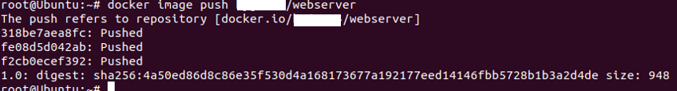

# 4. Docker 명령

## 4.1 Docker 이미지 조작
#### 1. 이미지 다운로드
`docker image pull [옵션] 이미지명[:태그명]`  
	`docker image pull -a centos`  
	* -a : 모든 태그를 취득(태그 지정 불가)  
	`docker image pull gcr.io.tensorflow/tesorflow centos`  
	* 'https://' 제외하고 취득할 이미지 URL 지정 가능  

---
#### 2. 이미지 목록 표시
`docker image ls [옵션] [repository]`
	* 주요 옵션
	-all, -a : 모든 이미지 표시
	--digests : 다이제스트를 표시(이미지를 고유하게 식별하기 위해 존재)
	--no-turnc : 결과를 모두 표시
	--quiet, -q : Docker 이미지 ID만 표시
	* `docker images`도 사용 가능
```bash
REPOSITORY        TAG               IMAGE ID          CREATED           SIZE
nginx             latest            a1523e859360      5 days ago        127MB
ubuntu            latest            72300a873c2c      10 days ago       64.2MB
hello-world       latest            fce289e99eb9      14 months ago     1.84kB
```

Dcoker image 항목|설명
---|---
REPOSITORY	| 이미지 이름
TAG			| 이미지 태그명
IMAGE ID	| 이미지 ID    
CREATED		| 작성일
SIZE		| 이미지 크기


#### Docker Content Trust(DCT) on/off
* 서명 확인, 서명이 되어 있지 않은 이미지는 오류 발생
`exeport DOCKER_CONTENT_TRUST=1` - ON
`exeport DOCKER_CONTENT_TRUST=0` - OFF

---
#### 3. 이미지 상세 정보 확인
`docker image inspect 다운받은_이미지명[:태그명]`
* JSON 형태로 출력
* 주요 정보
	항목 | 내용
	:---:|:-:
	이미지|"Id"
	작성일|"Created"
	Docker 버전|"DockerVersion"
	CPU 아키텍처|"Architecture"
* `--format` 옵션을 사용해 원하는 값을 출력 가능
	Ex)
	```bash
	root@Ubuntu:~# docker image inspect --format="{{.Os}}" nginx
	linux
	root@Ubuntu:~# docker image inspect --format="{{.ContainerConfig.Image}}" nginx
	sha256:b8ca01edcd68bd3819673fba5b097e71ad11875d0fd25008b63969fb115f5b46
	root@Ubuntu:~# docker image inspect --format="{{.Architecture}}" nginx
	amd64
	```

---
#### 4. 이미지 태그 설정
*Docker Hub 이미지 등록 규칙
`Docker_Hub_사용자명/이미지명[:태그명]`
	Ex)
	```bash
	root@Ubuntu:~# docker image tag nginx asashiho/webserver:1.0
	root@Ubuntu:~# docker images
	REPOSITORY           TAG                 IMAGE ID            CREATED             SIZE
	asashiho/webserver   1.0                 a1523e859360        6 days ago          127MB
	nginx                latest              a1523e859360        6 days ago          127MB
	ubuntu               latest              72300a873c2c        11 days ago         64.2MB
	```
* 이미지ID가 같음, 복사 또는 이름을 바꾼게 아니라, 링크 또는 별명을 붙인 거에 가까움

---
#### 5. 이미지 검색
`docker search [옵션] 검색_키워드`
	*주요 옵션
	--no-trunc			: 결과를 모두 표시
	--limit				: n건의 검색 결과를 표시
	--filter=starts=n	: 즐겨찾기의 수(n 이상)를 지정
*주요 항목
항목|설명
---|---
STARS		| 즐겨찾기 수
AUTOMATED	| Dockerfile을 바탕으로 자동 생성된 이미지 여부 확인
Ex)
```bash
root@Ubuntu:~# docker search nginx --filter=stars=100
NAME                      DESCRIPTION                                     STARS               OFFICIAL            AUTOMATED
nginx                     Official build of Nginx.                        12745               [OK]                
jwilder/nginx-proxy       Automated Nginx reverse proxy for docker con…   1748                                    [OK]
richarvey/nginx-php-fpm   Container running Nginx + PHP-FPM capable of…   758                                     [OK]
```
* 안전을 위해 공식 이미지 또는 Dockerfile이 제대로 공개된 것을 사용 권장

---
#### 6. 이미지 삭제
`docker image rm [옵션] 이미지명 [이미지명]`
	*주요 옵션
	--force, -f		: 이미지를 강제로 삭제
	--no-prune		: 중간 이미지를 삭제하니 않음
* 이미지명 : [REPOSITORY], [IMAGE ID]
* [IMAGE ID]는 앞3장리 정도만 지정해도 가능
* 1.10 이전 버전에는 '중간 이미지'가 존재했지만 현재는 '중간 이미지' 사용을 잘 안함

##### 사용하지 않는 이미지를 삭제 할때는 prune 명령 사용
`docker image prune [옵션]`
	*주요 옵션
	--force, -f		: 이미지를 강제로 삭제
	--all, -a		: 사용하지 않는 이미지 모두 삭제
* 디스크 용량을 위해 정기적으로 삭제 권장

---
#### 7. Docker Hub에 로그인
`docker login [옵션] [서버]`
	*주요 옵션
	--password, -p	: 비밀번호
	--username, -u	: 사용자명
* Docker Hub에 업로드 할려면 로그인 필요
* 로그인 중, '/root/.docker/config.json'에 암호화 되지 않는채로 비밀번호가 저장됨

##### 로그아웃
`docker logout [서버]`

---
#### 8. 이미지 업로드
`docker image push 이미지명[:태그명]`

* Docker Hub 및 'docker search'로 등록 확인 가능
* 업로드 하고 시간이 어느 정도 지나야 검색 가능것으로 보임

---
## 4.2 Dockerm 컨테이너 생성/시작/정지
* Docker 컨테이너의 라이프 사이클
[^라이프사이클]

### 컨테이너 조작 주요 기본 명령

---
#### 1. 컨테이너 생성
`docker container create`
* 이미지에 포함된 Linux디렉터리 및 파일 집합(/etc, /bin)을 스냅샷으로 만듬 -> 컨테이너 생성
* 컨테이너만 생성 -> 동작 준비 상태

---
#### 2. 컨테이너 생성 및 작동
`docker container run [옵션] 이미지명[:태그명] [인수]`
	* 주요 옵션
	-a					: 표준 입력, 표준 출력, 표준 오류 출력에 Attach
	-d	  				: 컨테이너 생성 및 백그라운드 실행
	-e	   				: 컨테이너에 환경 변수 전달
	-p	   				: 호스트와 컨테이너의 포트를 매핑
	--tty, -t			: 단말기 디바이스 사용
	--interactive, -i	: 컨테이너의 표준 입력을 오픈
	--cidfile			: 컨테이너 ID를 파일로 출력
	--name	   			: 컨테이너 이름 지정
	--restart			: 커맨드 실행 결과에 따라 컨테이너를 재구동
	--net	   			: 네트워크 설정(default로 호스트OS와 bridge 접속 사용)
	--cpu-share			: 제한 값 설정 가능
	<!-- 추가 옵션: http://pyrasis.com/book/DockerForTheReallyImpatient/Chapter20/28 -->
Ex) 1
```bash
root@Ubuntu:~# docker container run -it --name "test4" centos /bin/cal
	 March 2020     
Su Mo Tu We Th Fr Sa
 1  2  3  4  5  6  7
 8  9 10 11 12 13 14
15 16 17 18 19 20 21
22 23 24 25 26 27 28
29 30 31  
```
* `/bin/cal`	: 컨테이너에서 실행 할 명령
* `-it` 		: tty를 확보해, 표춘 출력을 오픈

Ex) 2
`Docker container run -it --name "test3" ubuntu /bin/bash`

##### 2.1 백그라운드 실행
`docker container run [실행 옵션] 이미지명[:태그명] [인수]`
	* 주요 옵션
	--detach, -d	  	: 컨테이너 생성 및 백그라운드 실행
	--user, -u	   		: 컨테이너에 환경 변수 전달	
	--rm   				: 명령 실행 완료 후 컨테이너 자동 삭제
	--restart=no		: 커맨드 실행 결과에 따라 컨테이너를 재구동
* `--restart` 옵션
설정값|설명
---|---
no					| 재시작하니 않음
no-failure			| 종료 스테이터스가 0이 아닐 때 재시작
on-failure:n(횟수)	| 종료 스테이터스가 0이 아닐 때 n번 재시작
always				| 항상 재시작
unless-stoped		| 최근 컨테이너가 정지 상태가 아니라면 항상 재시작
Ex) 1
```bash
root@Ubuntu:~# docker container run -d centos /bin/ping localhost
312e4fe737bccee9f70d94bdecb6c2bc94c9f037ee454c97190b5c7161ccadd6
root@Ubuntu:~# docker container logs -t 312e4
2020-03-04T05:42:27.179599844Z PING localhost (127.0.0.1) 56(84) bytes of data.
2020-03-04T05:42:27.179623121Z 64 bytes from localhost (127.0.0.1): icmp_seq=1 ttl=64 time=0.013 ms
2020-03-04T05:42:28.206352750Z 64 bytes from localhost (127.0.0.1): icmp_seq=2 ttl=64 time=0.065 ms
2020-03-04T05:42:29.230597384Z 64 bytes from localhost (127.0.0.1): icmp_seq=3 ttl=64 time=0.067 ms
2020-03-04T05:42:30.254860416Z 64 bytes from localhost (127.0.0.1): icmp_seq=4 ttl=64 time=0.066 ms
~
```
* 백그라운드(디태치 모드)에서  로컬호스트에 핑를 보냄
* `docker container logs`로 백그라운드 실행중인 로그 확인
* -t : 타임스탬프 표시
* __실행 후 컨테이너를 자동 삭제를 원하면 `-rm` 옵션을 사용__

Ex) 2
```bash
root@Ubuntu:~# docker container run -it --restart=always centos /bin/bash
[root@de4f120f04bf /]# exit
exit
root@Ubuntu:~# docker container ps
CONTAINER ID        IMAGE               COMMAND             CREATED             STATUS              PORTS               NAMES
de4f120f04bf        centos              "/bin/bash"         26 seconds ago      Up 15 seconds                           wizardly_cerf
```
* `exit`로 종료해도 컨테이너는 계속 작동됨
* __`--rm`와 `--restart` 옵션은 동시 사용 못함__

##### 2.2 네트워크 설정
`docker container run [실행 옵션] 이미지명[:태그명] [인수]`
	* 주요 옵션
	--add-host=[호스트명:IP 주소]      	: 컨테이너의 /etc/hosts에 호스트명과 IP주소를 정의
	--dns=[IP 주소]                 	: 컨테이너용 DNS서버의 IP주소 지정
	--expose	                 	: 지정한 범위의 포트 번호를 할당
	--mac-address=[MAC 주소]         : 컨테이너 MAC 주소를 지정
	--net=[bridge]					: 컨테이너 네트워크를 지정
	--hostname, -h               	: 컨테이너 자신의 호스트명을 지정
	--publish, -p[호스트의 포트 번호]:[컨테이너의 포트 번호]	: 호스트화 컨테이너의 포드 매핑
	--publish-all, -P              	: 호스트의 임의의 포트를 컨테이너에 할당
* `--net` 옵션
설정값|설명
---|---
bridge				| 브리지 연결(기본값)을 사용
none				| 네트워크 연결 안함
container:<name|id>	| 다른 컨테이너의 네트워크를 사용
host				| 컨테이너가 호스트OS의 네트워크를 사용
NETWORK				| 사용자 정의 네트워크 사용(docker network create)
Ex) 컨테이너 포트 매핑
```bash
root@Ubuntu:~# docker container run -d -p 8080:80 nginx
e00dfb7c85e545f798c894b4ea09d5328b3871dc5efdd9a755d82b619fe7dce3
root@Ubuntu:~# docker container ps
CONTAINER ID        IMAGE               COMMAND                  CREATED             STATUS              PORTS                  NAMES
e00dfb7c85e5        nginx               "nginx -g 'daemon of…"   2 minutes ago       Up 2 minutes        0.0.0.0:8080->80/tcp   stupefied_dubinsky
de4f120f04bf        centos              "/bin/bash"              51 minutes ago      Up 34 minutes                              wizardly_cerf
```
* `--expose` 옵션을 사용해 지정한 범위로 포트 번호 할당 가능

Ex) 컨테이너 DNS 서버 지정
```bash
root@Ubuntu:~# docker container run -d --dns 192.168.1.1 nginx
0487321845bad9378b6f317932e1cdef4a72d00751c046561af9d5d2e6effe6d
```

Ex) MAC 주소 지정
```bash
root@Ubuntu:~# docker container run -d --mac-address="92:d0:c5:0a:29:33" centos
a2f957625e5ddb0154c9b474618b06f57d32f3aa25a9cac925852ab272484bad
root@Ubuntu:~# docker container inspect --format="{{.Config.MacAddress}}" a2f957
92:d0:c5:0a:29:33
```

Ex) 호스트명과 IP주소 정의
```bash
root@Ubuntu:~# docker container run -it --add-host test.com:192.168.1.1 centos
[root@0c652777d00c /]# cat /etc/hosts 
127.0.0.1	localhost
::1	localhost ip6-localhost ip6-loopback
fe00::0	ip6-localnet
ff00::0	ip6-mcastprefix
ff02::1	ip6-allnodes
ff02::2	ip6-allrouters
192.168.1.1	test.com
172.17.0.5	0c652777d00c
```
* 컨테이너 안의 '/etc/hosts'에 호스트명과 IP주소를 정의함

Ex) 호스트명 설정
```bash
root@Ubuntu:~# docker container run -it --hostname www.test.com --add-host nodel.test.com:192.168.1.1 centos
[root@www /]# cat /etc/hosts
127.0.0.1	localhost
::1	localhost ip6-localhost ip6-loopback
fe00::0	ip6-localnet
ff00::0	ip6-mcastprefix
ff02::1	ip6-allnodes
ff02::2	ip6-allrouters
192.168.1.1	nodel.test.com
172.17.0.5	www.test.com www
[root@www /]# hostname
www.test.com
```

Ex) 사용자 정의 네트워크 작성
```bash
root@Ubuntu:~# docker network create -d bridge webapp-net
b85049d7235107416af9a8843dc98873690edada39bb3c07eed86ee3ef62d8a9
root@Ubuntu:~# docker container run --net=webapp-net -it centos
```
* 컨테이너가 동일한 멀티호스트 네크워크에 연결되어 있으면, 같은 네트워크를 통해 통신 가능

##### 2.3 자원 지정하여 생성 및 작동
`docker container run [자원 옵션] 이미지명[:태그명] [인수]`
	* 주요 옵션
	-c, --cpu-shares=0			: CPU자원 분배(비율), 기본값은 1024(각 값은 상대적으로 적용)
	-m, --memory=[크기]			: 메모리 한계를 설정(단위: b, k, m, g)
	-v, --volume=[호스트 디렉터리]:[컨테이너 디렉터리]	: 호스트와 컨테이너 디렉터리 공유
Ex) cpu 시간의 상대 비율과 메모리 사용량 지정
```bash
docker container run --cpu-shares=512 --memory=1g centos
```
* `--memory` 옵션을 줄 때 경고가 뜨는 경우
`WARNING: Your kernel does not support swap limit capabilities or the cgroup is not mounted. Memory limited without swap.`
	- 아래와 같이 설정 변경
	```
	# vi /etc/default/grub
	...
	GRUB_CMDLINE_LINUX_DEFAULT="cgroup_enable=memory swapaccount=1"
	# sudo update-grub 
	# sudo reboot 
	```
	참고 링크 : https://eyeballs.tistory.com/29

Ex) 디렉터리 공유 <!-- 안 됨, 작동확인 필요 -->
```bash
docker container run -v /User/asa/webapp:/usr/share/nginx/html nginx
```
호스트 폴더	: /User/asa/webapp
컨테이너 폴더	: /usr/share/nginx/html


##### 2.4 환경변수 설정하여 생성 및 작동
`docker container run [실행 옵션] 이미지명[:태그명] [인수]`
	* 주요 옵션
	-e, --env=[환경변수]		: 컨테이너에 환경 변수를 설정
	--env-file=[파일명]		: 컨테이너에 환경 변수가 설정된 파일을 적용
	--read-only=[true|false]: 컨테이너의 파일 시스템을 읽기 전용으로 설정	
	-w, --workdir=[경로]		: 컨테이너의 작업 디렉터리 설정
	-u, --user=[사용자명]		: 컨테이너의 사용자 계정명 또는 UID를 설정
	
Ex) 환경변수 설정
```bash
root@Ubuntu:~# docker container run -it -e foo=bar centos /bin/bash
[root@b2b46b234023 /]# set |grep foo
foo=bar
```

Ex) 환경변수의 일괄 설정
```bash
root@Ubuntu:~# cat env_list 
hoge=fuga
foo=bar
root@Ubuntu:~# docker container run -it --env-file=env_list centos /bin/bash
[root@3c3e75f0d888 /]# set |egrep 'hoge|foo'
foo=bar
hoge=fuga
```

Ex) 작업디렉터리 설정
```bash
root@Ubuntu:~# docker container run -it -w=/tensorflow centos /bin/bash
[root@c5d65760bcd4 tensorflow]# pwd
/tensorflow

```

##### 컨테이너 목록 표시
`docker container ls [옵션]`
* 가동 중인 컨테이너의 상태가 목록으로 표시
	* 주요 옵션
	--all , -a		: 실행 및 정지 중인 것도 모두 포함하여 컨테이너 표시
	--filter , -f	: 표시 컨테이너 필터링
	--format		: 표시 포맷 지정
	--last , -n		: 마지막으로 실행된 n건의 컨테이너만 표시
	--latest , -l	: S마지막으로 실행된 컨테이너만 표시
	--no-trunc		: 정보를 생략하지 않고 표시
	--quiet , -q	: 컨테이너 ID만 표시
	--size , -s		: 파일 크기 표시
Dcoker container ls 항목|설명
---|---
CONTAINER ID	| 컨테이너 ID
IMAGE			| 컨테이너 바탕이 된 이미지
COMMAND			| 컨테이너 안에서 실행되고 있는 명령
CREATED			| 컨테이너 작성 후 경과 시간
STATUS			| 컨테이너 상태(restarting | runnig | paused | exited)
PORTS			| 할당된 포트
NAMES			| 컨테이너 이름

Ex) 컨테이너 목록 필터링 1(컨테이너명 'test1')
```bash
root@Ubuntu:~# docker container ls -a -f name=test1
CONTAINER ID        IMAGE               COMMAND             CREATED             STATUS                      PORTS               NAMES
a42828cac988        centos              "/bin/cal"          23 minutes ago      Exited (0) 23 minutes ago                       test1
```

Ex) 컨테이너 목록 필터링 2(STATUS에 종료 코드가 0)
```bash
root@Ubuntu:~# docker container ls -a -f exited=0
CONTAINER ID        IMAGE               COMMAND                  CREATED             STATUS                      PORTS               NAMES
a42828cac988        centos              "/bin/cal"               24 minutes ago      Exited (0) 24 minutes ago                       test1
c5d65760bcd4        centos              "/bin/bash"              42 minutes ago      Exited (0) 38 minutes ago                       friendly_shockley
3c3e75f0d888        centos              "/bin/bash"              43 minutes ago      Exited (0) 42 minutes ago                       competent_cartwright
b2b46b234023        centos              "/bin/bash"              49 minutes ago      Exited (0) 48 minutes ago                       angry_morse
561d6c037943        centos              "/bin/bash"              51 minutes ago      Exited (0) 51 minutes ago                       stoic_agnesi
85bba90c64e8        nginx               "nginx -g 'daemon of…"   About an hour ago   Exited (0) 52 minutes ago                       beautiful_noyce
```

* '--format' 출력 형식
플레이스 홀더|설명
---|---
.ID				| 컨테이너 ID
.Image			| 이미지 ID
.Command		| 실행 명령
.CreatedAt		| 컨테이너가 작성된 시간
.RunnigFor 		| 컨테이너 가동 시간
.Ports			| 공개 포트
.Status			| 컨테이너 상태
.Size			| 컨테이너 디스크 크기
.Names			| 컨테이너명
.Mounts			| 볼륨 마운트
.Networks		| 네트워크명

Ex) 컨테이너 목록의 출력 형식 지정
```bash
root@Ubuntu:~# docker container ls -a --format "{{.Names}} : {{.Status}}"
test1 : Exited (0) 26 minutes ago
friendly_shockley : Exited (0) 40 minutes ago
competent_cartwright : Exited (0) 44 minutes ago
loving_swanson : Exited (1) 46 minutes ago
angry_morse : Exited (0) 50 minutes ago
stoic_agnesi : Exited (0) 53 minutes ago
beautiful_noyce : Exited (0) 54 minutes ago
```

Ex) 컨테이너 목록 표형식으로 출력
```bash
root@Ubuntu:~# docker container ls -a --format "table {{.Names}}\t{{.Status}}\t{{.Mounts}}"
NAMES                  STATUS                      MOUNTS
test1                  Exited (0) 27 minutes ago   
friendly_shockley      Exited (0) 41 minutes ago   
competent_cartwright   Exited (0) 45 minutes ago   
loving_swanson         Exited (1) 46 minutes ago   
angry_morse            Exited (0) 51 minutes ago   
stoic_agnesi           Exited (0) 54 minutes ago   
beautiful_noyce        Exited (0) 55 minutes ago   /test
```

##### 컨테이너 가동 확인
`docker container stats [컨테이너 식별자]`
* 컨테이너 가동 상태가 목록으로 표시

Docker container stats 항목|설명
---|---
CONTAINER ID	| 컨테이너 식별자
NAME			| 컨테이너명
CPU %		| CPU 사용률
MEM USAGE/LIMIT	| 메모리 사용량/컨터이너에서 사용할수 있는 메모리 한계(제한)
MEM %	| 메모리 사용률
NET I/O	| 네트워크 I/O
BLOCK I/O	| 블록 I/O
PIDS		| PID(WINDOWS 컨테이너 제외)
* 실시간 표시(출력), [Ctr + C]로 명령 종료
* 컨테이너 안에서 실행중인 프로세스 확인은 `docker container top` 명령 사용

Ex) 컨테이너 가동 확인
```bash
root@Ubuntu:~# docker container status webserver

CONTAINER ID        NAME                CPU %               MEM USAGE / LIMIT     MEM %               NET I/O             BLOCK I/O           PIDS
856b5f5ce142        webserver           0.00%               3.863MiB / 1.913GiB   0.20%               3.06kB / 0B         8MB / 0B            2
```

Ex) 프로세스 확인
```bash
root@Ubuntu:~# docker container top webserver
UID                 PID                 PPID                C                   STIME               TTY                 TIME                CMD
root                6053                6022                0                   18:50               ?                   00:00:00            nginx: master process nginx -g daemon off;
systemd+            6099                6053                0                   18:50               ?                   00:00:00            nginx: worker process
```

---
#### 3. 컨테이너 작동
`docker container start [옵션] 컨테이너_식별자 [컨테이너_식별자]`
	* 주요 옵션
	--attach, -a		: 표준 입력, 표준 출력, 표준 오류 출력에 Attach
	--interactive, -i	: 컨테이너의 표준 입력을 오픈
Ex) 컨테이너 시작
```bash
root@Ubuntu:~# docker container ls -a
CONTAINER ID        IMAGE               COMMAND                  CREATED             STATUS                         PORTS               NAMES
856b5f5ce142        nginx               "nginx -g 'daemon of…"   12 minutes ago      Up 12 minutes                  80/tcp              webserver
a42828cac988        centos              "/bin/cal"               53 minutes ago      Exited (0) 53 minutes ago                          test1
c5d65760bcd4        centos              "/bin/bash"              About an hour ago   Exited (0) About an hour ago                       friendly_shockley
...
root@Ubuntu:~# docker container start -ia a42828cac988 
     March 2020     
Su Mo Tu We Th Fr Sa
 1  2  3  4  5  6  7
 8  9 10 11 12 13 14
15 16 17 18 19 20 21
22 23 24 25 26 27 28
29 30 31   
```

##### 컨테이너 재시작
`docker container restart [옵션] 컨테이너_식별자 [컨테이너_식별자]`
	* 주요 옵션
	--time, -t		: 컨테이너의 재시작 시간을 지정(기본값 10초) <!-- 테스트 할 시 안됨, 작동확인 필요 -->
* 자동으로 재시작을 원할 시 `docker container run --restart=[always]`등을 사용

---
#### 4. 컨테이너 중지
`docker container stop [옵션] 컨테이너_식별자 [컨테이너_식별자]`
	* 주요 옵션
	--time, -t		: 컨테이너의 정지 시간을 지정(기본값 10초) <!-- 테스트 할 시 안됨, 작동확인 필요 -->
* 강제적 정지 'docker container kil` 명령 사용

##### 컨테이너 일시 정지/재개
`docker container pause 컨테이너_식별자`
`docker container unpause 컨테이너_식별자`

---
#### 5. 컨데이너 삭제
`docker container rm [옵션] 컨테이너_식별자 [컨테이너_식별자]`
	 * 주요 옵션
	--force, -f		: 실행중인 컨테이너 강제로 삭제
	--Volumes, -v	: 할당한 볼륨을 삭제
* 삭제 전에는 컨테이너를 __중지__ 시켜야 함
* `docker container prune`를 사용해, 정지중인 모든 컨테이너 삭제 가능
	- "docker rm \`docker ps -a -q\`"도 같은 효과

EX)'docker container prune' 사용
```
root@Ubuntu:~# docker container prune
WARNING! This will remove all stopped containers.
Are you sure you want to continue? [y/N] y
Deleted Containers:
856b5f5ce14271a19238ee48b6abfeb5e9604a5c516f90d2e17668de322ad6d1
a42828cac98848543b186749532a3482b9d2c147e3369d9e0b1380d3017beb42
c5d65760bcd43f362bd3c3bc6921a9c3a7b0386ac030b17cf0313dcd27a2fff5
3c3e75f0d8889a340f73264cb25c7714abbb54aa114e37d5dd7d04b73547b6be
f2b7c13c7858c941289ff3d56172a4e97cf6f3e58dd7b980ed81e3acad3c3ca2
b2b46b2340239bcfd2ee30594f0ce1b8995a78c5d444290dc74a12db71523d2e
561d6c037943aa23ed524a9dd85b3134168b02404b4c2eac1eb846c72679bad4
85bba90c64e8056752b10758675827940d99100475aeb7c03f09ca8233acfa3a

Total reclaimed space: 212B
```

---
#### 6. 컨테이너 상태 확인
`docker container ps [옵션]`
* `docker container ls [옵션]`와 같은 기능을 함

---
[^라이프사이클]:https://racoonlotty.tistory.com/64

---
## 4.3 Docker 컨테이너 네트워크

---
#### 1. 네트워크 목록 표시
`docker network ls [옵션]`
	* 주요 옵션
	--filter [key=value], -f	: 
	--no-trunc		: 
	--quiet, -q		:
	
* 필터링에서 이용할 수 있는 키
값 | 설명
---|---


Ex) 네트워크 목록 표시 필터링
```bash

```

Ex) 컨테이너 시작
```bash

```

Ex) 컨테이너 네트워크 확인
```bash

```

---
#### 2. 네트워크 작성
`docker network create [옵션] 네트워크`
	* 주요 옵션

* 사용자 정의 네트워크를 사용하는 편이 보다 유연하고 쉽게 네트워크 구성 관리 가능
Ex) 브리지 네트워크 작성
```bash

```

Ex) 작성한 네트워크 확인
```bash

```

---
#### 3. 네트워크 연결/해제
`docker network connect [옵션] 네트워크`
	* 주요 옵션

Ex) 네트워크에 대한 연결
```bash

```

Ex) 네트워크 확인
```bash

```

Ex) 네트워크를 지정한 컨테이너 시작
```bash

```

Ex) 네트워크 연결 해제
```bash

```

---
#### 4. 네트워크 상세 정보 확인
`docker network inspect [옵션] 네트워크`
Ex) 네트워크 상세 정보 표시
```bash

```

---
#### 5. 네트워크 삭제
`docker network rm [옵션] 네트워크`
Ex) 네트워크 삭제
```bash

```

---
## 4.4 가동 중인 Docker 컨테이너 조작

---
#### 1. 가동 컨테이너 연결
`docker container attach 컨테이너_식별자`
Ex) 컨테이너 연결하기
```bash
root@Ubuntu:~# docker container ls -a
CONTAINER ID        IMAGE               COMMAND                  CREATED             STATUS                     PORTS                NAMES
1971b3c166df        ubuntu              "/bin/bash"              28 seconds ago      Up 1 second                                     sample2
95ea4a553b08        ubuntu              "/bin/bash"              6 minutes ago       Exited (0) 2 minutes ago                        sample
fe96346f4993        nginx               "nginx -g 'daemon of…"   About an hour ago   Up About an hour           0.0.0.0:80->80/tcp   webserver
root@Ubuntu:~# docker container attach sample2 
root@1971b3c166df:/# read escape sequence
root@Ubuntu:~# docker container ls
CONTAINER ID        IMAGE               COMMAND                  CREATED             STATUS              PORTS                NAMES
1971b3c166df        ubuntu              "/bin/bash"              3 minutes ago       Up 3 minutes                             sample2
fe96346f4993        nginx               "nginx -g 'daemon of…"   About an hour ago   Up About an hour    0.0.0.0:80->80/tcp   webserver
```
* 가동중이고, `/bin/bash`가 실행중인 'sample2' 컨테이너 확인
* [Ctrl + P], [Ctrl + Q] 입력시 연결이 __분리__ 됨
* [Ctrl + C]는 컨테이너 __종료__ (shell은 [Ctrl + D]로 빠져나옴) 

---
#### 2. 가동 컨테이너에서 프로세스 실행
`docker container exec [옵션] <컨테이너_식별자> <실행할_명령> [인수]`
	* 주요 옵션
Ex) 컨테이너에서 bash 실행

```bash

```

Ex) 컨테이너에서 echo 실행
```bash

```

---
#### 3. 가동 컨테이너에서 프로세스 확인
`docker container top 컨테이너_식별자`

---
#### 4. 가동 컨테이너 포트 전송 확인
`docker container port 컨테이너_식별자`
	* 주요 옵션
Ex) 컨테이너에서 포트 전송
```bash

```

---
#### 5. 컨테이너 이름 변경
`docker container renmae <이전_컨테이너_식별자> <새로운_컨테이너_식별자>`
	* 주요 옵션
Ex) 컨테이너 이름 변경
```bash

```

---
#### 6. 컨테이너 안의 파일 복사
`docker container cp <컨테이너_식별자>:<컨테이너_안의_파일_경로> <호스트_디렉터리_경로>`
`docker container cp <호스트_파일> <컨테이너_식별자>:<컨테이너_안의_파일_경로>`

Ex) 컨테이너에서 호스트로 파일 복사
```bash

```

Ex) 호스트로에서 컨테이너로 파일 복사
```bash

```

---
#### 7. 컨테이너 조작의 차분 확인
`docker container diff 컨테이너_식별자`
* 변경의 구분
구분|변경
:-:|:-:
A	| 파일 추가
B	| 파일 삭제
C	| 파일 수정

Ex) 컨테이너에서 신슈 사용자 작성
```bash

```

Ex) 컨테이너의 변경 부분 확인
```bash

```

---
## 4.5 Docker 이미지 생성

---
#### 1. 컨테이너로부터 이미지 작성
`docker container commit [옵션] 컨테이너_식별자 [이미지명[:태그명]]`
	* 주요 옵션
	
Ex) 컨테이너로부터 이미지 작성
```bash

```

Ex) 이미지 상세 정보 확인
```bash

```

---
#### 2. 컨테이너를 tar 파일로 출력
`docker container export 컨테이너_식별자`

Ex) 파일 출력
```bash

```

Ex) 생성된 tar 파일의 상세 정보 확인
```bash

```

---
#### 3. tar 파일로부터 이미지 작성
`docker image <파일 또는 URL> | - [이미지[:태그명]]`

Ex) 이미지 작성
```bash

```

Ex) 이미지 확인
```bash

```

---
#### 4.이미지 저장
`docker image save [옵션] 저장_파일명 [이미지명]`

Ex) 이미지 저장
```bash

```

---
#### 5. 이미지 읽어 들이기
`docker image load [옵션]`

Ex) 이미지 읽어 들이기
```bash

```

---
#### 6. 불필요한 이미지/컨테이너를 일괄 삭제
`docker system prune [옵션]`
	* 주요 옵션
	
Ex) 불필요한 리소스 삭제
```bash

```