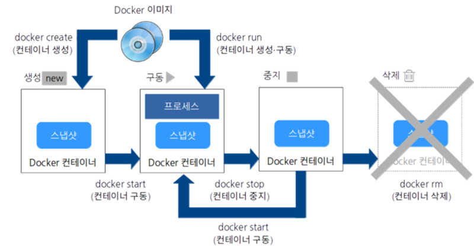

# 4. Docker 명령

## 4.1 Docker 이미지 조작
#### 1. 이미지 다운로드
`docker image pull [옵션] 이미지명[:태그명]`
	`docker image pull -a centos`
	* -a : 모든 태그를 취득(태그 지정 불가)
	`docker image pull gcr.io.tensorflow/tesorflow centos`
	* 'https://' 제외하고 취득할 이미지 URL 지정 가능

---
#### 2. 이미지 목록 표시
`docker image ls [옵션] [repository]`
	* 주요 옵션
	-all, -a : 모든 이미지 표시
	--digests : 다이제스트를 표시(이미지를 고유하게 식별하기 위해 존재)
	--no-turnc : 결과를 모두 표시
	--quiet, -q : Docker 이미지 ID만 표시
	* `docker images`도 사용 가능
```bash
REPOSITORY        TAG               IMAGE ID          CREATED           SIZE
nginx             latest            a1523e859360      5 days ago        127MB
ubuntu            latest            72300a873c2c      10 days ago       64.2MB
hello-world       latest            fce289e99eb9      14 months ago     1.84kB
```

Dcoker image 항목|설명
---|---
REPOSITORY	| 이미지 이름
TAG			| 이미지 태그명
IMAGE ID	| 이미지 ID    
CREATED		| 작성일
SIZE		| 이미지 크기


#### Docker Content Trust(DCT) on/off
* 서명 확인, 서명이 되어 있지 않은 이미지는 오류 발생
`exeport DOCKER_CONTENT_TRUST=1` - ON
`exeport DOCKER_CONTENT_TRUST=0` - OFF

---
#### 3. 이미지 상세 정보 확인
`docker image inspect 다운받은_이미지명[:태그명]
* JSON 형태로 출력
* 주요 정보
	항목 | 내용
	:---:|:-:
	이미지|"Id"
	작성일|"Created"
	Docker 버전|"DockerVersion"
	CPU 아키텍처|"Architecture"
* `--format` 옵션을 사용해 원하는 값을 출력 가능
	Ex)
	```bash
	root@Ubuntu:~# docker image inspect --format="{{.Os}}" nginx
	linux
	root@Ubuntu:~# docker image inspect --format="{{.ContainerConfig.Image}}" nginx
	sha256:b8ca01edcd68bd3819673fba5b097e71ad11875d0fd25008b63969fb115f5b46
	root@Ubuntu:~# docker image inspect --format="{{.Architecture}}" nginx
	amd64
	```

---
#### 4. 이미지 태그 설정
*Docker Hub 이미지 등록 규칙
`Docker_Hub_사용자명/이미지명[:태그명]`
	Ex)
	```bash
	root@Ubuntu:~# docker image tag nginx asashiho/webserver:1.0
	root@Ubuntu:~# docker images
	REPOSITORY           TAG                 IMAGE ID            CREATED             SIZE
	asashiho/webserver   1.0                 a1523e859360        6 days ago          127MB
	nginx                latest              a1523e859360        6 days ago          127MB
	ubuntu               latest              72300a873c2c        11 days ago         64.2MB
	```
* 이미지ID가 같음, 복사 또는 이름을 바꾼게 아니라, 링크 또는 별명을 붙인 거에 가까움

---
#### 5. 이미지 검색
`docker search [옵션] 검색_키워드`
	*주요 옵션
	--no-trunc			: 결과를 모두 표시
	--limit				: n건의 검색 결과를 표시
	--filter=starts=n	: 즐겨찾기의 수(n 이상)를 지정
*주요 항목
항목|설명
---|---
STARS		| 즐겨찾기 수
AUTOMATED	| Dockerfile을 바탕으로 자동 생성된 이미지 여부 확인
Ex)
```bash
root@Ubuntu:~# docker search nginx --filter=stars=100
NAME                      DESCRIPTION                                     STARS               OFFICIAL            AUTOMATED
nginx                     Official build of Nginx.                        12745               [OK]                
jwilder/nginx-proxy       Automated Nginx reverse proxy for docker con…   1748                                    [OK]
richarvey/nginx-php-fpm   Container running Nginx + PHP-FPM capable of…   758                                     [OK]
```
* 안전을 위해 공식 이미지 또는 Dockerfile이 제대로 공개된 것을 사용 권장

---
#### 6. 이미지 삭제
`docker image rm [옵션] 이미지명 [이미지명]`
	*주요 옵션
	--force, -f		: 이미지를 강제로 삭제
	--no-prune		: 중간 이미지를 삭제하니 않음
* 이미지명 : [REPOSITORY], [IMAGE ID]
* [IMAGE ID]는 앞3장리 정도만 지정해도 가능
* 1.10 이전 버전에는 '중간 이미지'가 존재했지만 현재는 '중간 이미지' 사용을 잘 안함

##### 사용하지 않는 이미지를 삭제 할때는 prune 명령 사용
`docker image prune [옵션]`
	*주요 옵션
	--force, -f		: 이미지를 강제로 삭제
	--all, -a		: 사용하지 않는 이미지 모두 삭제
* 디스크 용량을 위해 정기적으로 삭제 권장

---
#### 7. Docker Hub에 로그인
`docker login [옵션] [서버]`
	*주요 옵션
	--password, -p	: 비밀번호
	--username, -u	: 사용자명
* Docker Hub에 업로드 할려면 로그인 필요
* 로그인 중, '/root/.docker/config.json'에 암호화 되지 않는채로 비밀번호가 저장됨

##### 로그아웃
`docker logout [서버]`

---
#### 8. 이미지 업로드
`docker image push 이미지명[:태그명]`

* Docker Hub 및 'docker search'로 등록 확인 가능
* 업로드 하고 시간이 어느 정도 지나야 검색 가능것으로 보임

---
## 4.2 Dockerm 컨테이너 생성/시작/정지
* Docker 컨테이너의 라이프 사이클
[^라이프사이클]

### 컨테이너 조작 주요 기본 명령
#### 1. 컨테이너 생성
`docker container create`
* 이미지에 포함된 Linux디렉터리 및 파일 집합(/etc, /bin)을 스냅샷으로 만듬 -> 컨테이너 생성
* 컨테이너만 생성 -> 동작 준비 상태

#### 2. 컨테이너 생성 및 작동
`docker container run [옵션] 이미지명[:태그명] [인수]`
	* 주요 옵션
	-a					: 표준 입력, 표준 출력, 표준 오류 출력에 Attach
	-d	  				: 컨테이너 생성 및 백그라운드 실행
	-e	   				: 컨테이너에 환경 변수 전달
	-p	   				: 호스트와 컨테이너의 포트를 매핑
	--tty, -t			: 단말기 디바이스 사용
	--interactive, -i	: 컨테이너의 표준 입력을 오픈
	--cidfile			: 컨테이너 ID를 파일로 출력
	--name	   			: 컨테이너 이름 지정
	--restart			: 커맨드 실행 결과에 따라 컨테이너를 재구동
	--net	   			: 네트워크 설정(default로 호스트OS와 bridge 접속 사용)
	--cpu-share			: 제한 값 설정 가능
	<!-- 추가 옵션: http://pyrasis.com/book/DockerForTheReallyImpatient/Chapter20/28 -->
Ex) 1
```bash
root@Ubuntu:~# docker container run -it --name "test4" centos /bin/cal
	 March 2020     
Su Mo Tu We Th Fr Sa
 1  2  3  4  5  6  7
 8  9 10 11 12 13 14
15 16 17 18 19 20 21
22 23 24 25 26 27 28
29 30 31  
```
* `/bin/cal`	: 컨테이너에서 실행 할 명령
* `-it` 		: tty를 확보해, 표춘 출력을 오픈

Ex) 2
`Docker container run -it --name "test3" ubuntu /bin/bash`

##### 2.1 백그라운드 실행
`docker container run [실행 옵션] 이미지명[:태그명] [인수]`
	* 주요 옵션
	--detach, -d	  	: 컨테이너 생성 및 백그라운드 실행
	--user, -u	   		: 컨테이너에 환경 변수 전달	
	--rm   				: 명령 실행 완료 후 컨테이너 자동 삭제
	--restart=no		: 커맨드 실행 결과에 따라 컨테이너를 재구동
* `--restart` 옵션
설정값|설명
---|---
no					| 재시작하니 않음
no-failure			| 종료 스테이터스가 0이 아닐 때 재시작
on-failure:n(횟수)	| 종료 스테이터스가 0이 아닐 때 n번 재시작
always				| 항상 재시작
unless-stoped		| 최근 컨테이너가 정지 상태가 아니라면 항상 재시작
Ex) 1
```bash
root@Ubuntu:~# docker container run -d centos /bin/ping localhost
312e4fe737bccee9f70d94bdecb6c2bc94c9f037ee454c97190b5c7161ccadd6
root@Ubuntu:~# docker container logs -t 312e4
2020-03-04T05:42:27.179599844Z PING localhost (127.0.0.1) 56(84) bytes of data.
2020-03-04T05:42:27.179623121Z 64 bytes from localhost (127.0.0.1): icmp_seq=1 ttl=64 time=0.013 ms
2020-03-04T05:42:28.206352750Z 64 bytes from localhost (127.0.0.1): icmp_seq=2 ttl=64 time=0.065 ms
2020-03-04T05:42:29.230597384Z 64 bytes from localhost (127.0.0.1): icmp_seq=3 ttl=64 time=0.067 ms
2020-03-04T05:42:30.254860416Z 64 bytes from localhost (127.0.0.1): icmp_seq=4 ttl=64 time=0.066 ms
~
```
* 백그라운드(디태치 모드)에서  로컬호스트에 핑를 보냄
* `docker container logs`로 백그라운드 실행중인 로그 확인
* -t : 타임스탬프 표시
* __실행 후 컨테이너를 자동 삭제를 원하면 `-rm` 옵션을 사용__

Ex) 2
```bash
root@Ubuntu:~# docker container run -it --restart=always centos /bin/bash
[root@de4f120f04bf /]# exit
exit
root@Ubuntu:~# docker container ps
CONTAINER ID        IMAGE               COMMAND             CREATED             STATUS              PORTS               NAMES
de4f120f04bf        centos              "/bin/bash"         26 seconds ago      Up 15 seconds                           wizardly_cerf
```
* `exit`로 종료해도 컨테이너는 계속 작동됨
* __`--rm`와 `--restart` 옵션은 동시 사용 못함__

##### 2.2 네트워크 설정
`docker container run [실행 옵션] 이미지명[:태그명] [인수]`
	* 주요 옵션
	--add-host=[호스트명:IP 주소]      	: 컨테이너의 /etc/hosts에 호스트명과 IP주소를 정의
	--dns=[IP 주소]                 	: 컨테이너용 DNS서버의 IP주소 지정
	--expose	                 	: 지정한 범위의 포트 번호를 할당
	--mac-address=[MAC 주소]         : 컨테이너 MAC 주소를 지정
	--net=[bridge]					: 컨테이너 네트워크를 지정
	--hostname, -h               	: 컨테이너 자신의 호스트명을 지정
	--publish, -p[호스트의 포트 번호]:[컨테이너의 포트 번호]	: 호스트화 컨테이너의 포드 매핑
	--publish-all, -P              	: 호스트의 임의의 포트를 컨테이너에 할당
* `--net` 옵션
설정값|설명
---|---
bridge				| 브리지 연결(기본값)을 사용
none				| 네트워크 연결 안함
container:<name|id>	| 다른 컨테이너의 네트워크를 사용
host				| 컨테이너가 호스트OS의 네트워크를 사용
NETWORK				| 사용자 정의 네트워크 사용(docker network create)
Ex) 컨테이너 포트 매핑
```bash
root@Ubuntu:~# docker container run -d -p 8080:80 nginx
e00dfb7c85e545f798c894b4ea09d5328b3871dc5efdd9a755d82b619fe7dce3
root@Ubuntu:~# docker container ps
CONTAINER ID        IMAGE               COMMAND                  CREATED             STATUS              PORTS                  NAMES
e00dfb7c85e5        nginx               "nginx -g 'daemon of…"   2 minutes ago       Up 2 minutes        0.0.0.0:8080->80/tcp   stupefied_dubinsky
de4f120f04bf        centos              "/bin/bash"              51 minutes ago      Up 34 minutes                              wizardly_cerf
```
* `--expose` 옵션을 사용해 지정한 범위로 포트 번호 할당 가능

Ex) 컨테이너 DNS 서버 지정
```bash
root@Ubuntu:~# docker container run -d --dns 192.168.1.1 nginx
0487321845bad9378b6f317932e1cdef4a72d00751c046561af9d5d2e6effe6d
```

Ex) MAC 주소 지정
```bash
root@Ubuntu:~# docker container run -d --mac-address="92:d0:c5:0a:29:33" centos
a2f957625e5ddb0154c9b474618b06f57d32f3aa25a9cac925852ab272484bad
root@Ubuntu:~# docker container inspect --format="{{.Config.MacAddress}}" a2f957
92:d0:c5:0a:29:33
```

Ex) 호스트명과 IP주소 정의
```bash
root@Ubuntu:~# docker container run -it --add-host test.com:192.168.1.1 centos
[root@0c652777d00c /]# cat /etc/hosts 
127.0.0.1	localhost
::1	localhost ip6-localhost ip6-loopback
fe00::0	ip6-localnet
ff00::0	ip6-mcastprefix
ff02::1	ip6-allnodes
ff02::2	ip6-allrouters
192.168.1.1	test.com
172.17.0.5	0c652777d00c
```
* 컨테이너 안의 '/etc/hosts'에 호스트명과 IP주소를 정의함

Ex) 호스트명 설정
```bash
root@Ubuntu:~# docker container run -it --hostname www.test.com --add-host nodel.test.com:192.168.1.1 centos
[root@www /]# cat /etc/hosts
127.0.0.1	localhost
::1	localhost ip6-localhost ip6-loopback
fe00::0	ip6-localnet
ff00::0	ip6-mcastprefix
ff02::1	ip6-allnodes
ff02::2	ip6-allrouters
192.168.1.1	nodel.test.com
172.17.0.5	www.test.com www
[root@www /]# hostname
www.test.com
```

Ex) 사용자 정의 네트워크 작성
```bash
root@Ubuntu:~# docker network create -d bridge webapp-net
b85049d7235107416af9a8843dc98873690edada39bb3c07eed86ee3ef62d8a9
root@Ubuntu:~# docker container run --net=webapp-net -it centos
```
* 컨테이너가 동일한 멀티호스트 네크워크에 연결되어 있으면, 같은 네트워크를 통해 통신 가능

##### 2.3 자원 지정하여 생성 및 작동
`docker container run [자원 옵션] 이미지명[:태그명] [인수]`
	* 주요 옵션
	-c, --cpu-shares=0			: CPU자원 분배(비율), 기본값은 1024(각 값은 상대적으로 적용)
	-m, --memory=[크기]			: 메모리 한계를 설정(단위: b, k, m, g)
	-v, --volume=[호스트 디렉터리]:[컨테이너 디렉터리]	: 호스트와 컨테이너 디렉터리 공유
Ex) cpu 시간의 상대 비율과 메모리 사용량 지정
```bash

```
Ex) 디렉터리 공유
```bash

```	
##### 2.4 환경변수 설정하여 생성 및 작동
`docker container run [실행 옵션] 이미지명[:태그명] [인수]`

#### 3. 컨테이너 작동
`docker container start`

##### 컨테이너 재시작
`docker container restart`

#### 4. 컨테이너 중지
`docker container stop`

##### 컨테이너 일시 정지
`docker container restart`

#### 5. 컨데이너 삭제
`docker container rm`
* 삭제 전에는 컨테이너를 __중지__ 시켜야 함

#### 6. 컨테이너 상태 확인
`docker container ps`


---
[^라이프사이클]:https://racoonlotty.tistory.com/64
## 4.3 Docker 컨테이너 네트워크
## 4.4 가동 중인Docker 컨테이너 조작
## 4.5 Docker 이미지 생성