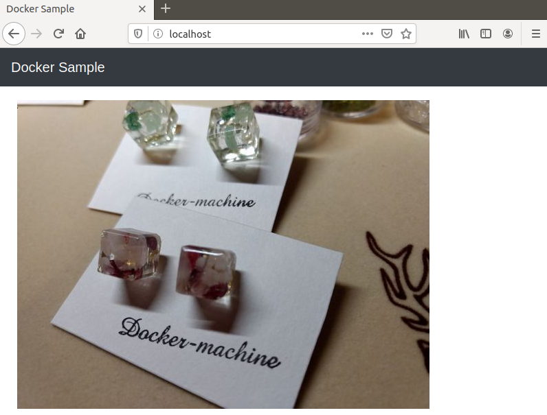

# 5. Dockerfile을 사용한 코드에 의한 서버 구축

## 5.1 Dokerfile을 사용한 구성 관리
#### 1. Dockerfile이란?
* Docker image -생성-> Docker container -수행-> OS설정, 미들웨어 설치, 파리미터의 설정 등 => 수동 수행
* 'container server'를 바탕으로 -생성-> Docker image  

* Dockerfile
	- Docker 상에서 작동시킬 컨테이너의 구성 정보를 기술하기 위한 파일
	- 쥬요 구성 정보
		+ 베이스가 될 Docker __이미지__
		+ Docker 컨테이너 안세서 수행한 조작__(명령)__
		+ 환경__변수__ 등의 설정
		+ Docker 컨테이너 안에서 작동시키켜둘 __데몬__ 실행

---
#### 2. Dockerfile의 기본 구문
* 'Dockerfile'에 인프라 구성 정보를 기술
* 다른 이름을 사용해도 되지만, 이미지를 빌드할 때 파일명을 명시적으로 지정 필요  

* 기본 서식
`명령 인수`  

* Dockerfile의 명령

명령|설명
---|---
FROM| 베이스 이미지를 지정, Ex) FROM ubuntu:14.04(latest도 가능하지만, 명시적 지정 권장)
RUN| 이미지상에서 명령 실행, Ex) RUN apt-get update && apt-get install -y fortune
CMD| 컨테이너 실행 명령, Ex) CMD ["nginx"] -> nginx 서버 구동
LABEL| 라벨 설정
EXPOSE| 컨테이너 공개 포트 설정
ENV| 환경변수, Ex) 'ENV NGINX_VERSION 버전명'
ADD| 파일/디렉터리 추가
COPY| 이미지상의 파일 복사, Ex) 'COPY jerkins.sh /user/local/bin/jenkins.sh' (압축풀기가 필요한 경우 ADD 사용)
WORKDIR| 작업 디렉터리
ARG| Dockerfile 안의 변수
ONBULID| 빌드 완료 후 실행되는 명령
ENTRYPOINT| 컨테이너 실행 명령(이미지 실행 명령을 다시 지정하기 위해 사용)
VOLUME| 볼륨 마운트, 컨테이너 자체는 stateless한 특성을 가짐
USER| 사용자 지정, (기본값 'docker')
STOPSIGNAL| 시스템 콜 시그널 설정
HEALTHCHECK| 컨테이너의 헬스 체크
SHELL| 기본 쉘 지정
* '#'을 사용해 주석 처리

---
#### 3. Dockerfile 작성
`FROM [이미지명]`  
`FROM [이미지명]:[태그명]`  
`FROM [이미지명]@[다이제스트]`  
* 태그명 생략시 최신 버전(latest)이 적용됨
* Digest를 사용하면 이미지를 고유하게 지정 가능

Ex) ContOS를 베이스 이미지한 Dockerfile
```dockerfile
# 베이스 이미지 설정
FROM centos:centos7
```

Ex) Digest를 사용한 Dockerfile
```bash
root@Ubuntu:~# docker image ls --digests
REPOSITORY          TAG                 DIGEST                                                                    IMAGE ID            CREATED             SIZE
nginx               latest              sha256:380eb808e2a3b0dd954f92c1cae2f845e6558a15037efefcabc5b4e03d666d03   a1523e859360        7 days ago          127MB
```
```dockerfile
# 베이스 이미지 설정
FROM nginx@sha256:380eb808e2a3b0dd954f92c1cae2f845e6558a15037efefcabc5b4e03d666d03
```

---
## 5.2 Dockerfile의 빌드와 이미지 레이어

---
#### 1. Dockerfile로부터 Docker 이미지 만들기
`docker build -t [생성할 이미지명]:[태그명] [Dockerfile의 위치]`  


Ex) Dockerfile 작성  
```bash
root@Ubuntu:~# mkdir sample && cd $_
root@Ubuntu:sample# touch Dockerfile
root@Ubuntu:sample# ls
Dockerfile
```

Ex) Dockerfile 내용   
```dockerfile
# 베이스 이미지 설정
FROM centos:centos7
```

Ex) docker build 명령의 실행
```bash
root@Ubuntu:sample# docker build -t sample:1.0 /root/sample
Sending build context to Docker daemon  2.048kB
Step 1/1 : FROM cetos:contos7
pull access denied for cetos, repository does not exist or may require 'docker login': denied: requested access to the resource is denied
root@Ubuntu:sample# vim Dockerfile 
root@Ubuntu:sample# docker logout
Removing login credentials for https://index.docker.io/v1/
root@Ubuntu:sample# docker build -t sample:1.0 /root/sample
Sending build context to Docker daemon  2.048kB
Step 1/1 : FROM centos:centos7
centos7: Pulling from library/centos
ab5ef0e58194: Pull complete 
Digest: sha256:4a701376d03f6b39b8c2a8f4a8e499441b0d567f9ab9d58e4991de4472fb813c
Status: Downloaded newer image for centos:centos7
 ---> 5e35e350aded
Successfully built 5e35e350aded
```
* 절대경로, 상대경로 모두 가능
* 처음은 로컬 환경에서 베이스 이미지를 찾고 없으면 Docker repository에서 다운로드 함


Ex) 이미지 확인  
```bash
root@Ubuntu:sample# docker images
REPOSITORY          TAG                 IMAGE ID            CREATED             SIZE
nginx               latest              a1523e859360        7 days ago          127MB
sample              1.0                 5e35e350aded        3 months ago        203MB
```

Ex) 새로운 이미지 작성  
```bash
root@Ubuntu:sample# docker build -t sample:2.0 /root/sample
Sending build context to Docker daemon  2.048kB
Step 1/1 : FROM centos:centos7
 ---> 5e35e350aded
Successfully built 5e35e350aded
Successfully tagged sample:2.0
```
* 다운로드 하지 않고 바로 이미지 작성

Ex) 새로운 이미지 확인  
```bash
root@Ubuntu:sample# docker images
REPOSITORY          TAG                 IMAGE ID            CREATED             SIZE
nginx               latest              a1523e859360        7 days ago          127MB
centos              centos7             5e35e350aded        3 months ago        203MB
sample              1.0                 5e35e350aded        3 months ago        203MB
sample              2.0                 5e35e350aded        3 months ago        203MB
```
* 베이스 이미지(centos)의  'IMAGE ID'가 같으며, 모두 동일한 이미지를 뜻함

Ex) 파일명을 지정해 Docker 빌드  
```bash
root@Ubuntu:sample# docker build -t sample -f Dockerfile.base .
Sending build context to Docker daemon  3.072kB
Step 1/1 : FROM centos:centos7
 ---> 5e35e350aded
Successfully built 5e35e350aded
Successfully tagged sample:latest
root@Ubuntu:sample# docker images
REPOSITORY          TAG                 IMAGE ID            CREATED             SIZE
nginx               latest              a1523e859360        7 days ago          127MB
centos              centos7             5e35e350aded        3 months ago        203MB
sample              1.0                 5e35e350aded        3 months ago        203MB
sample              2.0                 5e35e350aded        3 months ago        203MB
sample              latest              5e35e350aded        3 months ago        203MB
```
* '.' : 현재 디렉토리를 나타내니 빠트리지 말 것

Ex) 표준입력 방식 빌드  
```bash
root@Ubuntu:sample# docker build - < Dockerfile
Sending build context to Docker daemon  2.048kB
Step 1/1 : FROM centos:centos7
 ---> 5e35e350aded
Successfully built 5e35e350aded
```
* '-' : 표준 입력으로 내용을 받음
* 이 방법으로는 다른 필요 파일을 포함 시킬 수 없음

Ex) 압축 아카이브 이용 빌드  
```dockerfile
# base image config
FROM centos:centos7
ADD dummyfile /tmp/dummyfile
```
```bash
root@Ubuntu:sample# tar tfvz docker.tar.gz
-rw-r--r-- root/root        40 2020-03-05 16:26 Dockerfile
-rw-r--r-- root/root        29 2020-03-05 16:53 dummyfile
root@Ubuntu:sample# docker build - < docker.tar.gz
Sending build context to Docker daemon     204B
Step 1/2 : FROM centos:centos7
 ---> 5e35e350aded
Step 2/2 : ADD dummyfile /tmp/dummyfile
 ---> c5867e533600
Successfully built c5867e533600
```

---
#### 2. Docker 이미지 레이어 구조
* Docerfile은 명령별로 이미지 작성
* 여러개의 이미지는 레이어 구조도 되어 있음
[^레이어구조]
* 쉽게 설명하면, 계층적 구조처럼 이미지들이 'Stap:1`부터 쌓인다고 할 수 있음(이미지가 겹침)
* 상위 계층의 이미지는 `IMAGE ID`를 공유하여 사용해, 불필요한 용량을 줄임  


Ex) 4개의 명령을 갖는 Dockerfile  
```dockerfile
# base image config
# STEP:1 Ubuntu
FROM ubuntu:latest

# STEP:2 Nginx Install
RUN apt-get update && apt-get install -y -q nginx

# STEP:3 File Copy
COPY index.html /usr/share/nginx/html/

# Step:4 Ngins Start
CMD ["nginx", "-g", "daemmon off;"]
```
* 임의의 'index.html' 파일을 생성

Ex) 이미지 레이어 구조  
```bash
root@Ubuntu:sample# docker build -t wabapp .
Sending build context to Docker daemon  4.608kB
Step 1/4 : FROM ubuntu:latest
latest: Pulling from library/ubuntu
423ae2b273f4: Pull complete 
de83a2304fa1: Pull complete 
f9a83bce3af0: Pull complete 
b6b53be908de: Pull complete 
Digest: sha256:04d48df82c938587820d7b6006f5071dbbffceb7ca01d2814f81857c631d44df
Status: Downloaded newer image for ubuntu:latest
 ---> 72300a873c2c											# 첫번째 이미지 작성
Step 2/4 : RUN apt-get update && apt-get install -y -q nginx
 ---> Running in 2819fafa29b0
Get:1 http://archive.ubuntu.com/ubuntu bionic InRelease [242 kB]
~생략~
Removing intermediate container 2819fafa29b0
 ---> 2c7d1acb4d21											# 두번째 이미지 작성
Step 3/4 : COPY index.html /usr/share/nginx/html/
 ---> c6b394219c70											# 세번째 이미지 작성
Step 4/4 : CMD ["nginx", "-g", "daemmon off;"]
 ---> Running in c04f9ce3b639
Removing intermediate container c04f9ce3b639
 ---> c47fdf6dc79a											# 네번째 이미지 작성
Successfully built c47fdf6dc79a
Successfully tagged wabapp:late
```
* 이미지는 계층적으로 'Strp:1'부터 차례대로 쌓임
* 이래층에 있는 이미지는 상위 계층과 공유가 되어, 디스크 용량을 효율적으로 사용

##### Docker Hub도 이미지 관리
* Docker Hub도 이미지를 레이어로 겹여서 작성하여, 공통된 이미지를 공유 관리

---
## 5.3 멀티스테이지 빌드를 사용한 애플리케이션 개발
* '빌드 환경'(개발 환경)이 꼭 '제품 환경'과 같을 필요는 없음 
* 보안 관점 및 컴퓨팅 리소르를 효율적으로 활용하기 위해 '제품 환경용 이미지'가 따로 존재하는게 좋음
* '빌드 환경용 이미지'와 '제품 환경용 이미지' 따로 만드는 '멀티스테이지 빌드'를 사용  


* 샘플 앱의 복제
```bash
git clone https://github.com/asashiho/dockertext2
cd dockertext2/chap05/multi-stage/
```

---
#### 1. Dockerfile 만들기

Ex) Dockerfile  
```dockerfile
# 1. Build Image
FROM golang:1.13 AS builder

# Install dependencies
WORKDIR /go/src/github.com/asashiho/dockertext-greet
RUN go get -d -v github.com/urfave/cli

# Build modules
COPY main.go .
RUN GOOS=linux go build -a -o greet .

# ------------------------------
# 2. Production Image
FROM busybox  
WORKDIR /opt/greet/bin

# Deploy modules
COPY --from=builder /go/src/github.com/asashiho/dockertext-greet/ .
ENTRYPOINT ["./greet"]
```

###### 개발 환경용 Docker 이미지
1. Go의 버전 1.13를 베이스 이미지로 사용, 'builder`라는 별명을 붙임
2. 작업 디렉터리를 설정하고, 필요한 소스코드를 컨테이너(builder) 안으로 복사
3. go로 build하여 'greet'라는 바이너리 실행 파일 생성

###### 제품 환경용 Docker 이미지
1. busybox 	: 기본적인 Linux 명령들의 집합(Linux 쉘 환경 제공)
2. `--from` : 'builder'라는 이름(별명)의 이미지로부터 복사, 'greet'를 제품 환경용 Docker(busybox)로 복사
	* 'greet' 실행


---
#### 2. Docker 이미지의 빌드
* Dockerfile의 빌드  
```bssh
root@Ubuntu:multi-stage# docker build -t greet .
Sending build context to Docker daemon  3.584kB
Step 1/9 : FROM golang:1.13 AS builder
1.13: Pulling from library/golang
50e431f79093: Pull complete 
dd8c6d374ea5: Pull complete 
c85513200d84: Pull complete 
55769680e827: Pull complete 
15357f5e50c4: Pull complete 
e2d9b328fba5: Pull complete 
f8e0159fc852: Pull complete 
Digest: sha256:43f859b58af8c84c8aef288809204cfbd7cb88dbd4b0cf473dd4fb86693403ad
Status: Downloaded newer image for golang:1.13
 ---> 3a7408f53f79
Step 2/9 : WORKDIR /go/src/github.com/asashiho/dockertext-greet
 ---> Running in 57a997636b02
Removing intermediate container 57a997636b02
 ---> 7ec1448815f5
Step 3/9 : RUN go get -d -v github.com/urfave/cli
 ---> Running in 48a6d44d53c2
github.com/urfave/cli (download)
github.com/cpuguy83/go-md2man (download)
Removing intermediate container 48a6d44d53c2
 ---> d9057bb27847
Step 4/9 : COPY main.go .
 ---> dec1a3aa345f
Step 5/9 : RUN GOOS=linux go build -a -o greet .
 ---> Running in 59a1d3e94084
Removing intermediate container 59a1d3e94084
 ---> 5f313b24aa4e
Step 6/9 : FROM busybox
latest: Pulling from library/busybox
bdbbaa22dec6: Pull complete 
Digest: sha256:6915be4043561d64e0ab0f8f098dc2ac48e077fe23f488ac24b665166898115a
Status: Downloaded newer image for busybox:latest
 ---> 6d5fcfe5ff17
Step 7/9 : WORKDIR /opt/greet/bin
 ---> Running in 6d98fe9e9ef7
Removing intermediate container 6d98fe9e9ef7
 ---> ce6907869816
Step 8/9 : COPY --from=builder /go/src/github.com/asashiho/dockertext-greet/ .
 ---> 2b2fd1dbb67f
Step 9/9 : ENTRYPOINT ["./greet"]
 ---> Running in 87defb9cb234
Removing intermediate container 87defb9cb234
 ---> 95f7cc6749dc
Successfully built 95f7cc6749dc
Successfully tagged greet:latest
```

* 이미지 확인
```bash
root@Ubuntu:multi-stage# docker image ls
REPOSITORY          TAG                 IMAGE ID            CREATED             SIZE
greet               latest              95f7cc6749dc        4 minutes ago       6.02MB
golang              1.13                3a7408f53f79        7 days ago          803MB
busybox             latest              6d5fcfe5ff17        2 months ago        1.22MB
centos              centos7             5e35e350aded        3 months ago        203MB
```
* 개발 환경용 : golang:1.13, 803MB
* 제품 환경용 : greet:latest, 6.02MB
	- greet:latest : 베이스 이미지인 'busybox'에서 필요한 부분만 추출하여 만든 이미지
* 803MB -> 6.02MB로 리소스 효율 증대

---
#### 3. Docker 컨테이너의 시작
* Docker 컨테이너의 작동
```bash
root@Ubuntu:multi-stage# docker container run -it --rm greet asa
Hello asa
root@Ubuntu:multi-stage# docker container run -it --rm greet --lang=es asa
Hola asa
```
* --rm	: 컨테이너 종료시 자동 컨테이너 삭제


---
## 5.4 명령 및 데몬 실행
* 컨테이너를 생성하면, 서버 프로세스 등을 데몬으로 작동시킬 필요가 있음


---
#### 1. 명령 실행
`RUN [실행하고 싶은 명령]`
* 명령을 실행 할때 사용
* Docker 이미지를 생성할 때 실행

###### Shell 형식으로 기술

Ex) Shell 형식의 RUN 형식  
```dockerfile
# Nginx의 설치
RUN apt-get install -y nginx
```	
* `/bin/sh -c`를 사용하여 명령을 실행했을 때와 똑같이 동작
* 컨테이너에서 사용하는 기본 쉘 변경은 SHELL 명령 사용
	
###### Exec 형식으로 기술

Ex) Exec 형식의 RUN 형식  
* 쉘을 경유하지 않고 직접 실행
* $HOME과 같은 환경변수 사용 불가
* JSON 형식을 사용

```dockerfile
# Nginx의 설치
RUN ["/bin/bash", "-c", "apt-get install -y nginx"]
```

Ex) RUN 명령의 실행
```dockerfile
# 베이스 이미지 설정
FROM ubuntu:latest

# RUN 명령의 실행
RUN echo HeLLO shell type~
RUN ["echo", " HeLLO Exec type~"]
RUN ["/bin/bash", "-c", "echo 'HeLLO Exec type -> bash!!!!'"]
```
Ex) RUN 명령의 실행 로그
```bash
root@Ubuntu:test# docker build -t run-sample .
Sending build context to Docker daemon  2.048kB
Step 1/4 : FROM ubuntu:latest
 ---> 72300a873c2c
Step 2/4 : RUN echo HeLLO shell type~
 ---> Using cache
 ---> 8fa180269397
Step 3/4 : RUN ["echo", " HeLLO Exec type~"]
 ---> Using cache
 ---> 4cbe97a99fcf
Step 4/4 : RUN ["/bin/bash", "-c", "echo 'HeLLO Exec type -> bash!!!!'"]
 ---> Running in 33c32b4451ef
HeLLO Exec type -> bash!!!!
Removing intermediate container 33c32b4451ef
 ---> 58bef0cf1a80
Successfully built 58bef0cf1a80
Successfully tagged run-sample:latest
```
* 명령 한 줄마다(한 Step마다) 이미지를 생성

Ex) 이미지 구성
```bash  
root@Ubuntu:test# docker history run-sample:latest 
IMAGE               CREATED              CREATED BY                                      SIZE                COMMENT
58bef0cf1a80        About a minute ago   /bin/bash -c echo 'HeLLO Exec type -> bash!!…   0B                  
4cbe97a99fcf        6 minutes ago        echo  HeLLO Exec type~                          0B                  
8fa180269397        6 minutes ago        /bin/sh -c echo HeLLO shell type~               0B                  
~생략~
```
* shell형식은 '/bin/sh' 실행
* exec형식은 쉘을 통하지 않고 실행
* exec형식으로 명시적으로 지정된 '/bin/bash' 실행

###### RUN 명령의 줄 바꿈
* 명령마다 내부 이미지가 하나씩 작성됨
* '&&', '\'를 사용하여 명령을 한줄로 줄이는 것을 권장


---
#### 2. 데몬 실행 CMD
`CMD [실행하고 싶은 명령]`  
* 컨테이너 안에서 명령을 실행
* Dockerfile 내에서 하나의 CMD만 기술 가능

###### Shell 형식으로 기술

Ex) Shell 형식의 CMD 명령  
```dockerfile
CMD nginx -g 'daemon off;'
```
	
###### Exec 형식으로 기술  

Ex) Exec 형식의 CMD 명령  
```dockerfile
CMD ["nginx", "-g", "daemon off;"]
```
* Nginx를 포그라운드에서 실행

###### ENTRYPOINT 명령의 파라미터로 기술 
* ENTRYPOINT 명령의 인수로 CMD 사용 가능

Ex) CMD 명령  
```dockerfile
# 베이스 이미지 설정
FROM ubuntu:16.04

# Nginx 설치
RUN apt-get -y update && apt-get -y upgrade
RUN apt-get -y install nginx

# 포트 지정
EXPOSE 80

# 서버 실행
CMD ["nginx", "-g", "daemon off;"]
```

Ex) Docker 이미지 작성
```bash
root@Ubuntu:test# docker build -t cmd-sample . 
Sending build context to Docker daemon  2.048kB
Step 1/5 : FROM ubuntu:16.04
16.04: Pulling from library/ubuntu
fe703b657a32: Pull complete 
f9df1fafd224: Pull complete 
a645a4b887f9: Pull complete 
57db7fe0b522: Pull complete 
Digest: sha256:e9938f45e51d9ff46e2b05a62e0546d0f07489b7f22fbc5288defe760599e38a
Status: Downloaded newer image for ubuntu:16.04
 ---> 77be327e4b63
~생략~
Step 5/5 : CMD ["nginx", "-g", "daemon off;"]
 ---> Running in 22e21558011b
Removing intermediate container 22e21558011b
 ---> 7e9ddd4e5428
Successfully built 7e9ddd4e5428
Successfully tagged cmd-sample:latest

```
Ex) 컨테이너 실행  
```bash
root@Ubuntu:test# docker container run -p 80:80 -d cmd-sample
dcbbf11716f5b84b39654357f82bd95737b97824dc175e4f6862cf956ba3ea48
root@Ubuntu:test# docker container ls
CONTAINER ID        IMAGE               COMMAND                  CREATED             STATUS              PORTS                NAMES
dcbbf11716f5        cmd-sample          "nginx -g 'daemon of…"   17 seconds ago      Up 16 seconds       0.0.0.0:80->80/tcp   zen_banach
```

---
#### 3. 데몬 실행 ENTRYPOINT
`ENTRYPOINT [실행하고 싶은 명령]`  
* `docker container run` 명령을 실행했을 때 실행

###### Shell 형식으로 기술

Ex) Shell 형식의 ENTRYPOINT 명령  
```dockerfile
ENTRYPOINT nginx -g 'daemon off;'
```	
	
###### Exec 형식으로 기술  

Ex) Exec 형식의 ENTRYPOINT 명령  
```dockerfile
ENTRYPOINT ["nginx", "-g", "daemon off;"]
```
* Nginx를 포그라운드에서 실행


##### ENTRYPOINT 명령과 CMD 명령의 차이
CMD : 컨테이너 시작 시 실행, `docker container run` 명령에서 새로운 인수 지정시 우선 실행
	- `docker container run` 명령(인수의 명령)이 CMD 명령을 덮어씌움	
ENTRYPOINT : 명령은 반드시 컨테이너에서 실행됨
	- CMD를 조합(인수로) 사용 가능

Ex) ENTRYPOINT 명령과 CMD 명령 조합
```dockerfile
# Docker 이미지 취득
FROM ubuntu:16.04

# top 실행
ENTRYPOINT ["top"]
CMD ["-d", "10"]
```

Ex) docker container run 명령  
```bash
root@Ubuntu:test# docker build -t sample .

# CMD 명령에서 지정한 10초 간격으로 갱신
root@Ubuntu:test# docker run -it sample
# 2초 간격으로 갱신
root@Ubuntu:test# docker run -it sample -d 2
```


---
#### 4. 빌드 완료 후에 실행되는 명령
`ONBUILD [실행하고 싶은 명령]`  
*생성한 이미지를 기반으로 다른 이미지가 생성될 때 명령을 실행(trigger)
* 'ONBUILD' -builed-> 베이스 이미지 생성('ONBUILD' 아무 동작도 하지 않음) -builed-> 새로운 이미지('ONBUILD' 동작)
* OS설치 및 환경 설정, 미들웨어(웹서버, 각종 플러그인) 설치 등과 같은 환경 구축은 '베이스 이미지'로 작성
* 이미지 안에 개발한 프로그램 전개는 `ONBUILD`로 `ADD, COCY` 명령 사용

* 샘플 앱 복제 및 사용 - 이전 실습에서 다운로드 하였으면 생략 가능
```bash
git clone https://github.com/asashiho/dockertext2
cd dockertext2/chap05/onbuild/
```

##### 4.1 베이스 이미지 작성
* 웹서버 실행 환경 작성

Ex) 베이스 이미지 작성(Dockerfile.base)
```dockerfile
# 베이스 이미지 설정
FROM ubuntu:latest

# Nginx 설치
RUN apt-get -y update && apt-get -y upgrade 
RUN apt-get -y install nginx

# 포트 지정
EXPOSE 80

# Web 콘텐츠 배치
ONBUILD ADD website.tar /var/www/html/

# Nginx 실행
CMD ["nginx", "-g", "daemon off;"]
```
* 'ubuntu:17.10'로 builed할 예정이었으나, repository를 에러로 인해 'ubuntu:latest' 사용

Ex) 베이스 이미지 빌드
```bash
root@Ubuntu:web_base# docker build -t web-base -f Dockerfile.base .
Sending build context to Docker daemon  2.048kB
Step 1/6 : FROM ubuntu:latest
 ---> 72300a873c2c
Step 2/6 : RUN apt-get -y update && apt-get -y upgrade
 ---> Running in b98781b2776e
~생략~
Step 5/6 : ONBUILD ADD website.tar /var/www/html/
 ---> Running in 9c89251fd0f0
~생략~
Successfully tagged web-base:latest
```
* 'Dockerfile.base'만 사용

##### 4.2 웹 콘텐츠 개발
* 웹 콘텐츠인 샘플 HTML, CSS, 그림 파일 등을 'website.tar'로 만듬
* 디렉터리 구성을 포함해도 상관 없음

##### 4.3 웹 서버용 이미지 작성

Ex) 웹 서버용 이미지 작성(Dockerfile)
```dockerfile
# Docker 이미지 취득
FROM web-base
```


Ex) 웹 서버용 이미지 빌드
```bash
root@Ubuntu:onbuild# docker build -t photoview-image .
Sending build context to Docker daemon  358.9kB
Step 1/1 : FROM web-base
# Executing 1 build trigger
 ---> a0573e223e97
Successfully built a0573e223e97
Successfully tagged photoview-image:latest
```
* 'Dockerfile'와 'website.tar' 사용
* 'Dockerfile'을 builed하면 `ONBUILD` 명령이 실행

##### 4.4 웹 서버용 컨테이너 시작
Ex) 웹 서버용 컨테이너 시작  
```bash
root@Ubuntu:onbuild# docker run -p 80:80 -d photoview-image
96144a9d5435dc1abd92176d175dc02e675f4c58227e4e84d66cb897299d8870
```
* WEB : http://localhost/



##### docker image inspect로 ONBUILD 명령 확인 가능
Ex) 이미지 상세 정보 확인  
```bash
root@Ubuntu:onbuild# docker image inspect --format="{{.Config.OnBuild}}" web-base
[ADD website.tar /var/www/html/]
```

---
#### 5. 시스템 콜 시그널의 설정  
`STOPSIGNAL [시그널]`  
* 컨테이너를 종료 할때 송신하는 시그널 설정
* 시그널 번호(9 등) 또는 시그널명(SIGKILL 등) 사용 가능
---
#### 6. 컨테이너의 헬스 체크 명령  
`HEALTHCHECK [옵션] CMD 실행할 명령`  
* 컨테이너 안의 프로세스가 정상적으로 작동하고 있는지 체크
	* 주요 옵션  
	--interval=n	: 헬스 체크 간격(기본값:30s)  
	--timeout=n		: 헬스 체크 타임 아웃(기본값:30s)  
	--retries=N		: 타임 아웃 횟수(기본값:3)  


Ex) HEALTHCHECK 명령  
```dockerfile
# Docker 이미지 취득
FROM web-base

# 헬스 체크
HEALTHCHECK --interval=5m --timeout=3s CMD curl -f http://localhost/ || exit 1
```
* 5분마다 웹 서버 메인 페이지를 3초안에 표시할 수 있는지 없는지 확인

Ex) HEALTHCHECK 확인  
```bash
root@Ubuntu:~# docker container inspect  webapp |more
[
    {
        "Id": "30a4132d9df63fc2c8065e7d40133855b2d5652f4ee3c692fde3c82477658ef2",
        "Created": "2020-03-06T05:58:34.876963343Z",
~생략~
            "Health": {
                "Status": "healthy",
                "FailingStreak": 0,
                "Log": [
                    {
                        "Start": "2020-03-06T15:03:35.247173734+09:00",
                        "End": "2020-03-06T15:03:35.461842398+09:00",
                        "ExitCode": 1,
                        "Output": "/bin/sh: 1: curl: not found\n"
                    },
                    {
                        "Start": "2020-03-06T15:08:35.465462116+09:00",
                        "End": "2020-03-06T15:08:35.650126582+09:00",
                        "ExitCode": 1,
                        "Output": "/bin/sh: 1: curl: not found\n"
                    },
                    {
                        "Start": "2020-03-06T15:13:35.652115289+09:00",
                        "End": "2020-03-06T15:13:35.877451144+09:00",
                        "ExitCode": 0,
                        "Output": "  % Total    % Received % Xferd  Average Speed   Time    Time     Time  Current\
~생략~
    }
]
```
* 컨테이너 내부에 'curl' 명령어가 있어야 재대로 작동, 필요시 컨테이너 내부에 설치

---
## 5.5 환경 및 네트워크 설정

---
#### 1. 환경변수 설정  
`ENV [key] [value]`  
`ENV [key]=[value]`  

###### key value 형식

*환경변수 설정

키 명| 값
---|---
myName| "Shiho ASA"
myOrder| Gin Whisky Calvados
myNickName|	miya


Ex) key value로 지정하는 경우 ENV  
```dockerfile
ENV myName "Shiho ASA"
ENV myOrder Gin Whisky Calvados
ENV myNickName	miya
```
* 3개의 Docker 이미지를 겹쳐서 만들게 됨

###### key=value 형식

Ex) key=value로 지정하는 경우 ENV  
```dockerfile
ENV myName="Shiho ASA" \
	myOrder=Gin\ Whisky\ Calvados \
	myNickName=miya
```
* 변수 앞에 `\`추가시 이스케이프 처리
* `docker container run`명령의 --env 옵션으로 수정 가능


---
#### 2. 작업디렉터리 지정  
`WORKDIR [작업 디렉터리 경로]`  
* 지정한 디렉터리가 없으면 새로 만듬
* 여러번 사용 가능 명령
* 명령을 실행하기 위한 작업용 디렉터리 지정
	- RUN, CMD, ENTRYPOINT, COPY, ADD

Ex) 절대 경로/상대 경로를 사용한 WORKDIR 명령  
```dockerfile
WORKDIR /first
WORKDIR second
WORKDIR third
RUN ["pwd"]
```
* '/first/second/third' 출력

Ex) WORKDIR 명령으로 환경변수 사용  
```dockerfile
ENV DIRPATH /first
ENV DIRNAME second
WORKDIR $DIRPATH/$DIRNAME
RUN ["pwd"]
```
* '/first/second' 출력


---
#### 3. 사용자 지정  
`USER [사용자명/UID]`  
* RUN 명령 사용하여 사용자는 미리 작성
* 명령을 실행하는 사용자 지정
	- RUN, CMD, ENTRYPOINT
	
Ex) USER 명령  
```dockerfile
RUN ["adduser", "asa"]
RUN ["whoami"]
USER asa
RUN ["whoami"]
```

---
#### 4. 라벨 지정  
`LABEL key=value` 
 * 이미지 버전 정보, 작성자 정보, 코멘트 등과 같은 정보 제공용 명령
 
 Ex) LABEL 명령  
```dockerfile
FROM nginx:latest
LABEL maintainer "Shiho ASA<xxxxx@mail.asa.seoul>"
LABEL title="WebAP"
LABEL version="1.0"
LABEL description="This iamge is WebapplicationServer"
```

Ex) 이미지 상세 정보  
```bash
root@Ubuntu:sample# docker image inspect --format="{{.Config.Labels}}" label-sample
map[description:This iamge is WebapplicationServer maintainer:Shiho ASA<xxxxx@mail.asa.seoul> title:WebAP version:1.0]
```

---
#### 5. 포트 설정  
`EXPOSE 포트_번호` 
* EXPOSE는 호스트와 연결할 포트 번호를 설정
* 호스트와 연결만 할 뿐 외부에 노출은 되지 않음
* 노출을 원하면 'docker run' 명령의 -p, -P 옵션을 사용

 Ex) EXPOSE 명령 
```dockerfile
EXPOSE 80 403
```

---
#### 6. Docker 내 변수 설정  
`ARG <이름>[=기본값]`  
* 환경 변수인 ENV와 달리, Dockerfile 안에서만 사용 가능 변수 설정

Ex) ARG 명령  
```dockerfile
FROM nginx:latest
ARG YOURNAME='asa'
RUN echo $YOURNAME
```

Ex) ARG 명령 실행 1  
```bash
root@Ubuntu:sample# docker build .
Sending build context to Docker daemon  2.048kB
Step 1/3 : FROM nginx:latest
latest: Pulling from library/nginx
68ced04f60ab: Pull complete 
28252775b295: Pull complete 
a616aa3b0bf2: Pull complete 
Digest: sha256:2539d4344dd18e1df02be842ffc435f8e1f699cfc55516e2cf2cb16b7a9aea0b
Status: Downloaded newer image for nginx:latest
 ---> 6678c7c2e56c
Step 2/3 : ARG YOURNAME='asa'
 ---> Running in 4be14dc2bcaf
Removing intermediate container 4be14dc2bcaf
 ---> dc0b848687f7
Step 3/3 : RUN echo $YOURNAME
 ---> Running in 184fa4bd802e
asa
Removing intermediate container 184fa4bd802e
 ---> eeba6eabcd2a
Successfully built eeba6eabcd2a
```

Ex) ARG 명령 실행 2  
```bash
root@Ubuntu:sample# docker build . --build-arg YOURNAME=shiho
Sending build context to Docker daemon  2.048kB
Step 1/3 : FROM nginx:latest
 ---> 6678c7c2e56c
Step 2/3 : ARG YOURNAME='asa'
 ---> Using cache
 ---> dc0b848687f7
Step 3/3 : RUN echo $YOURNAME
 ---> Running in 27a058ceb376
shiho
Removing intermediate container 27a058ceb376
 ---> ddd4dba1bfaf
Successfully built ddd4dba1bfaf
```
* `--build-arg` 옵션을 사용, 변수값 변경 가능


---
#### 7. 기본 쉘 설정  
`shell ["쉘의 경로", "파라미터"]`  

Ex)  
```dockerfile
# 기본 쉘 지정
SHELL ["/bin/bash", "-c"]

# RUN 명령 실행
RUN echo Hello
```


---
## 5.6 파일 설정

---
#### 1. 파일 및 디렉터리 추가  
`ADD <호스트_파일_경로> <Docker_이미지_파일_경로>`  
`ADD ["<호스트_파일_경로>" "<Docker_이미지_파일_경로>"]`  
* 이미지에 호스트 상의 파일이나 디렉터리 추가

Ex) ADD 명령 1  
```dockerfile
ADD host.html /docker_dir/
```
* 호스트상의 'host.html'파일을 '/docker_dir/'로 추가

Ex) ADD 명령 2  
```dockerfile
# [hos]로 시작하는 모든 파일을 추가
ADD hos* /docker_dir/

# [hos]+임의의 한 문자 룰에 해당하는 파일을 추가
ADD hos?.txt /docker_dir/
```
* 와일드카드, Go언어의 filepath.Match 룰과 일치하는 패턴 사용 가능

Ex) WORKDIR 명령과 ADD 명령 
```dockerfile
WORKDIR /docker_dir
ADD host.html web/
```
* '/docker_dir/web/host.html'로 복사(추가)
* `pwd`는 '/docker_dir'

Ex) ADD 명령으로 원격 파일 추가  
```dockerfile
FROM nginx:latest
ADD http://www.wings.msn.to/index.php /docker_dir/web/
```
* 추가한 파일 퍼미션 : 600
* 인증 절차 없음, 필요시 RUN으로 wget, curl 사용 필요
* 원격 파일에 'HTTP Last-Modified' 헤더 존재시, 추가파일의 mtime값으로 사용

Ex) ADD 명령으로 원격 파일 추가한 실행 결과  
```bash
root@Ubuntu:sample# docker build -t sample .
Sending build context to Docker daemon  2.048kB
Step 1/2 : FROM nginx:latest
 ---> 6678c7c2e56c
Step 2/2 : ADD http://www.wings.msn.to/index.php /docker_dir/web/
Downloading  51.76kB

 ---> 73297ff765df
Successfully built 73297ff765df
Successfully tagged sample:latest
```
* 경로에 파일명을 지정하지 않으면, URL에서 지정한 파일명이 됨
* 압축 아카이브는 자동적으로 디렉터리에 압축을 품
	- URL로부터 다운로드한 리소스는 압축이 풀리지 않음

##### build시 제외 파일 설정
* '.dockerignore'라는 파일 생성
* 줄 바꿈을 하면서, 제외 파일 기술

Ex) 제외 파일 지정  
```bash
root@Ubuntu:sample# ls -la
합계 20
drwxr-xr-x  2 root root 4096  3월  6 17:16 .
drwx------ 11 root root 4096  3월  6 17:15 ..
-rw-r--r--  1 root root   10  3월  6 17:15 .dockerignore
-rw-r--r--  1 root root   73  3월  6 17:09 Dockerfile
-rw-r--r--  1 root root   12  3월  6 17:16 dummyfile
root@Ubuntu:sample# cat .dockerignore 
dummyfile
```

Ex) Dockerfile 작성   
```dockerfile
# base image
FROM ubuntu:latest

# dmmyfile add
ADD dummyfile /tmp/dummyfile
```

Ex) Dockerfile build 
```bash
root@Ubuntu:sample# docker build -t sample .
Sending build context to Docker daemon  3.072kB
Step 1/2 : FROM ubuntu:latest
latest: Pulling from library/ubuntu
423ae2b273f4: Pull complete 
de83a2304fa1: Pull complete 
f9a83bce3af0: Pull complete 
b6b53be908de: Pull complete 
Digest: sha256:04d48df82c938587820d7b6006f5071dbbffceb7ca01d2814f81857c631d44df
Status: Downloaded newer image for ubuntu:latest
 ---> 72300a873c2c
Step 2/2 : ADD dummyfile /tmp/dummyfile
ADD failed: stat /var/lib/docker/tmp/docker-builder122158974/dummyfile: no such file or directory
```
* 'dummyfile'이 build 당시 제외됐기 때문에, ADD 명령이 실패함


---
#### 2. 파일 복사  
`COPY <호스트_파일_경로> <Docker_이미지_파일_경로>`  
`COPY ["<호스트_파일_경로>" "<Docker_이미지_파일_경로>"]`  
* 호스트상의 파일을 이미지 안으로 __복사만__ 가능
* 원격 파일 다운로드 및 아카이브 압축 해제 미지원

---
#### 4. 볼륨 마운트  
`VOLUME ["/마운트 포인트"]`  
* 호스트나 그 외 다른 컨테이너로부터 볼륨의 외부 마운트 수행
EX)  
`VOLUME ["/var/log/"]`  
`VOLUME /var/log`  
`VOLUME /var/log /var/db`  

---
[^레이어구조]:https://adeeshfulay.wordpress.com/2017/09/08/understanding-docker-images-and-layers/