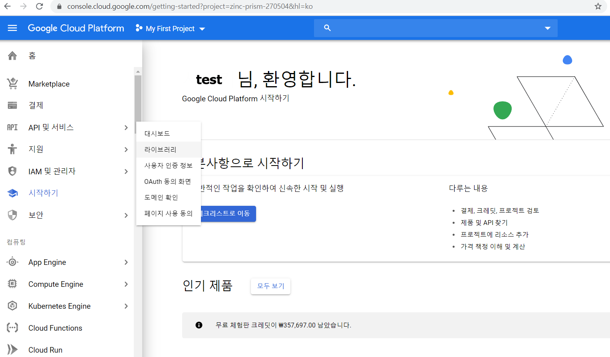

# 6. Docker 이미지 공개


### Docker Registry
* Docker 이미지를 공유하는 장치를 제공하는 것
	Ex) Docker Hub, 프라이빗 Registry
	
---
## 6.1 Docker 이미지의 자동 생성 및 공개

---
#### 1. Automated Build의 흐름
* Automated Build
	- GitHub 및 bitbucket 계정과 Docker Hub 계정을 연결하여 자동으로 이미지 빌드 가능
	- Dockerfile 기반

---
#### 2. GitHub에 공개하기
 * 어플리케이션의 소스코드 관리와 똑같은 절차로 repository를 만들어 Dockerfile을 공개

---
#### 3. Docker Hub의 링크 설정
* Docker Hub에 로그인 -> [Account Settings] -> [Linked Accounts] -> GitHub [Connect] -> 로그인


---
#### 4. Dockerfile의 빌드
* Docker Hub에 로그인한 상태에서 [Create Repository] 클릭 -> 'Build Settings`탭에서 자신이 사용할 'GitHub'선택 -> [Create]

* Repository Name은 필수(소문자, 숫자, _, -, . 사용가능)


Ex) test용 Dockerfile  
```dockerfile
# Docker 이미지 취득
FROM ubuntu:16.04

# top 실행
ENTRYPOINT ["top"]
CMD ["-d", "10"]
```


* [Builds] -> [Configure Automated Builds] -> 'BUILD RULES' 내용 설정 후 -> [Save and Build]

* 태그는 여거 개 포함 가능, 1.0 같이 버전을 붙이는 것을 권장
* 이미지 빌드는 몇 분에서 몇 십분 걸림


---
#### 5. Docker 이미지 확인
* Docker 이미지 확인 및 다운로드

```bash
latest: Pulling from test/github_docker
fe703b657a32: Pull complete 
f9df1fafd224: Pull complete 
a645a4b887f9: Pull complete 
57db7fe0b522: Pull complete 
Digest: sha256:6c24e8539e7d291a33590423306c14c9cca4c4a9e8339f1be2ee3fa9d72ff7bf
Status: Downloaded newer image for test/github_docker:latest
docker.io/test/github_docker:latest
```
* 'test'부분은 자신의 Docker Hub 계정 아이디
* `docker imase ls` 및 `docker image inspect --format="{{.RepoTag}}"`를 이용해 이미지 확인
---
## 6.2 Docker Registry를 사용한 프라이빗 레지스트리 구축
* 인터넷상에 공개하지 않고, Docker 이미지 일원 관리
* 로컬 환경에 Registry 구축
* 여러 개의 Raspberry Pi를 사용한 Kubernetes 클러스터 구축도 가능

---
#### 1. 로컬 환경에 Docker 레지스트리 구축하기
* Docker Hub의 공식 이미지 'registry' 사용
	 - Version 0 : Pyrhon
	 - Version 2 : Go 언어
	 - 특별한 경우가 아니면 Version 2 계열 사용

```zsh
$ docker image pull registry
Using default tag: latest
latest: Pulling from library/registry
486039affc0a: Pull complete
ba51a3b098e6: Pull complete
8bb4c43d6c8e: Pull complete
6f5f453e5f2d: Pull complete
42bc10b72f42: Pull complete
Digest: sha256:7d081088e4bfd632a88e3f3bcd9e007ef44a796fddfe3261407a3f9f04abe1e7
Status: Downloaded newer image for registry:latest
docker.io/library/registry:latest
```
* `docker image ls registry`로 이미지 확인

```zsh
$ docker container run -d -p 5000:5000 --name registry registry
f5cb7197150935caeda77724f107b2ac4b8190bab15d7085f8ef1016098cd5f6
$ docker container ls
CONTAINER ID        IMAGE               COMMAND                  CREATED             STATUS              PORTS                    NAMES
f5cb71971509        registry            "/entrypoint.sh /etc…"   19 seconds ago      Up 17 seconds       0.0.0.0:5000->5000/tcp   registry
```

---
#### 2. Docker 이미지 업로드
* 전에 받은 샘플 파일 사용
```bash
git clone https://github.com/asashiho/dockertext2
cd dockertext2/chap06/
```

Ex) 샘플 Dockerfile  
```dockerfile
# Base Image
FROM jupyter/base-notebook

# Maintainer
LABEL maintainer "Shiho ASA"

# Configure environment
ENV CONDA_DIR=/opt/conda \
	NB_USER=jovyan

# Install Jupyter Notebook and Hub
RUN conda install --quiet --yes \
    'numpy=1.13.*' \
	#'numpy=1.13.*' \
    'scipy=0.19.*' \
	#'scipy=0.19.*' \
    'sympy=1.1.*' \
	#'sympy=1.1.*' \
    'matplotlib=2.1.*' \
	#'matplotlib=2.1.*' \
    && conda clean -tipsy && \
    fix-permissions $CONDA_DIR

# Install Sample Notebook
COPY sample_notebook/CavityFlow_with_Navier-Stokes.ipynb /home/$NB_USER/
```
* Step 4/5 단계서 버전별 호환성 문제인지 failed 발생
* 최신 버전을 사용하기 위해, 버전 정보가 없게 수정하여 사용!


Ex) Dockerfile build  
```zsh
 % docker build -t docker-science .                   dockertext2/chap06 (master ⚡) Ubuntu
Sending build context to Docker daemon  420.4kB
Step 1/5 : FROM jupyter/base-notebook
 ---> 0da4d46f38de
Step 2/5 : LABEL maintainer "Shiho ASA"
 ---> Using cache
 ---> a741c8791d1e
Step 3/5 : ENV CONDA_DIR=/opt/conda     NB_USER=jovyan
 ---> Using cache
 ---> 4da5a553bff2
Step 4/5 : RUN conda install --quiet --yes     'numpy'     'scipy'     'sympy'     'matplotlib'     && conda clean -tipsy &&     fix-permissions $CONDA_DIR
 ---> Running in 2447e1098a8b
Collecting package metadata (current_repodata.json): ...working... done
Solving environment: ...working... done
~생략~
WARNING: 'conda clean --source-cache' is deprecated.
    Use 'conda build purge-all' to remove source cache files.
Removing intermediate container 2447e1098a8b
 ---> 95d2b794f3ee
Step 5/5 : COPY sample_notebook/CavityFlow_with_Navier-Stokes.ipynb /home/$NB_USER/
 ---> 419ceb66e7d6
Successfully built 419ceb66e7d6
Successfully tagged docker-science:latest
```
* 'WARNING'이 발생하였지만 이미지 생성 완료  

##### 이미지에 __태그__를 붙여 프라이빗 Docker registry에 업로드
`docker image tag [로컬의 이미지명] [업로드할 레지스트리의 주소:포트번호]/[이미지명]

Ex) 태그 설정
```
root@Ubuntu:~ # docker image tag docker-science localhost:5000/docker-jupyter
root@Ubuntu:~ # docker image ls
REPOSITORY                      TAG                 IMAGE ID            CREATED             SIZE
localhost:5000/docker-jupyter   latest              419ceb66e7d6        15 minutes ago      1.58GB
docker-science                  latest              419ceb66e7d6        15 minutes ago      1.58GB
nginx                           latest              6678c7c2e56c        2 days ago          127MB
jupyter/base-notebook           latest              0da4d46f38de        4 days ago          622MB
ubuntu                          latest              72300a873c2c        2 weeks ago         64.2MB
registry                        latest              708bc6af7e5e        6 weeks ago         25.8MB
```
* localhost의 5000포트에서 작동하는 registry에 업로드하기 위해
	- 'docker-science' -> localhost:5000/docker-jupyter로 만듬
* 구별 및 업로드 경로를 위해 태그를 설정하는 것
	- 결국 'IMAGE ID'가 같은 동일 이미지

Ex) 이미지 업로드  
```zsh
root@Ubuntu:~ # docker image push localhost:5000/docker-jupyter
The push refers to repository [localhost:5000/docker-jupyter]
541fa3b29f7c: Pushed
~생략~
43c67172d1d1: Pushed
latest: digest: sha256:5f1ae699b7d39c386a71ecb6a5915cc9ceeceb181c86621871c5f144fa29da63 size: 4291
```
* localhost:5000에 업로드 -> 동작중인 'registry' 컨테이너

Ex) 이미지 삭제
```zsh
root@Ubuntu:~ # docker image rm localhost:5000/docker-jupyter
Untagged: localhost:5000/docker-jupyter:latest
Untagged: localhost:5000/docker-jupyter@sha256:5f1ae699b7d39c386a71ecb6a5915cc9ceeceb181c86621871c5f144fa29da63
root@Ubuntu:~ # docker image rm docker-science
Untagged: docker-science:latest
root@Ubuntu:~ # docker images
REPOSITORY              TAG                 IMAGE ID            CREATED             SIZE
nginx                   latest              6678c7c2e56c        2 days ago          127MB
jupyter/base-notebook   latest              0da4d46f38de        4 days ago          622MB
ubuntu                  latest              72300a873c2c        2 weeks ago         64.2MB
registry                latest              708bc6af7e5e        6 weeks ago         25.8MB
```
* 로컬 환경에서 이미지 삭제, localhost:5000의 registy에 이미지 등록된 상태

---
#### 3. Docker 이미지의 다운로드와 작동 확인
`docker build -t [생성할 이미지명]:[태그명] [Dockerfile의 위치]`  

Ex) 이미지 다운로드 및 확인
```zsh
root@Ubuntu:~ # docker image pull localhost:5000/docker-jupyter                                     1 ↵
Using default tag: latest
~생략~
Digest: sha256:5f1ae699b7d39c386a71ecb6a5915cc9ceeceb181c86621871c5f144fa29da63
Status: Downloaded newer image for localhost:5000/docker-jupyter:latest
localhost:5000/docker-jupyter:latest
root@Ubuntu:~ # docker image ls
REPOSITORY                      TAG                 IMAGE ID            CREATED             SIZE
localhost:5000/docker-jupyter   latest              419ceb66e7d6        46 minutes ago      1.58GB
nginx                           latest              6678c7c2e56c        2 days ago          127MB
jupyter/base-notebook           latest              0da4d46f38de        4 days ago          622MB
ubuntu                          latest              72300a873c2c        2 weeks ago         64.2MB
registry  
```

Ex) 동작 확인   
```zsh
root@Ubuntu:~ # docker container run -p 8888:8888 localhost:5000/docker-jupyter
Executing the command: jupyter notebook
[I 13:35:05.669 NotebookApp] Writing notebook server cookie secret to /home/jovyan/.local/share/jupyter/runtime/notebook_cookie_secret
[I 13:35:06.031 NotebookApp] JupyterLab extension loaded from /opt/conda/lib/python3.7/site-packages/jupyterlab
[I 13:35:06.031 NotebookApp] JupyterLab application directory is /opt/conda/share/jupyter/lab
[I 13:35:06.217 NotebookApp] Serving notebooks from local directory: /home/jovyan
[I 13:35:06.218 NotebookApp] The Jupyter Notebook is running at:
[I 13:35:06.218 NotebookApp] http://29323d0e53da:8888/?token=1e4358ef91d4d4c729d932e4772ebaa4d2161a2a1a92d477
[I 13:35:06.218 NotebookApp]  or http://127.0.0.1:8888/?token=1e4358ef91d4d4c729d932e4772ebaa4d2161a2a1a92d477
[I 13:35:06.218 NotebookApp] Use Control-C to stop this server and shut down all kernels (twice to skip confirmation).
[C 13:35:06.221 NotebookApp]

    To access the notebook, open this file in a browser:
        file:///home/jovyan/.local/share/jupyter/runtime/nbserver-6-open.html
    Or copy and paste one of these URLs:
        http://29323d0e53da:8888/?token=1e4358ef91d4d4c729d932e4772ebaa4d2161a2a1a92d477
     or http://127.0.0.1:8888/?token=1e4358ef91d4d4c729d932e4772ebaa4d2161a2a1a92d477
```
* 브라우저를 통해 'http://127.0.0.1:8888/?token=1e4358ef91d4d4c729d932e4772ebaa4d2161a2a1a92d477'로 접속


* 프라이빗 registry는 Docker 이미지를 영구 테이터로 관리할 필요가 있음
	- 정기적 데이터 백업, 서버 감시 등 관리/운용 필요

---
## 6.3 클리우드 서비스를 사용한 프라이빗 레지스트리 구축
* Docker 이미지는 인프라 구성 요소, 어플리케이션 걔발 환경 및 실행 모듈 등을 포함에 용량이 클 수 있음
	- 개발용 클라언트PC 또는 온프레미스 환경에서 관리 비용 및 시간이 많이 듬
* 퍼블릭 클라우드에서 Docker 이미지를 프라이빗으로 관리 가능
* 똑같은 환경에서 계산 처리 수행 가능, 이미지 공유
 
### Google Cloud Platform(GCP)
* Google Cloud Platform(GCP)에서 Google Container Registry 제공
* 구글 계정이 필요하며, 최초 등록은 12개월 동안 및 300달러 그레딧을 사용 가능  

---
#### 1. Google Container Registry 준비하기

* [API 및 서비스] -> [라이브러리]


* 'Google Container Registry' 검색
* [사용 설정] 클릭


* 기본적으로 하나의 프로젝트가 생성되어 있음
* 프로젝트 ID를 확인함('MY First Profect' 옆 [아래 화살표])
	- '새 프로젝트' 작성은 '완벽한 IT 인프라 구축을 위한 Docker'의 '부록 Google Cloud Platform 사용법' 참조

---
#### 2. Docker 이미지의 업로드
`docker tag [로컬의 이미지명] [Google Container Registry의 호스트명]/[프로젝트 ID]/[이미지명]`  
* Google Container Registry(GCR)'에 Docker 이미지를 업로드하기 위해 태그 설정 필요
* Cloud shell : 웹 브라우저에서 gcloud나 doker 등과 같은 명령 실행 가능 제공


##### 저장 위치(서버)
* us.gcr.io 미국
* eu.gcr.io 유럽
* asia.gcr.io 아시아

Ex) 태그설정  
```zsh
╰─➤  docker tag localhost:5000/docker-jupyter asia.gcr.io/zinc-prism-270504/docker-juyter
╭─root@Ubuntu ~/dockertext2/chap06  ‹master*›
╰─➤  docker image ls
REPOSITORY                                    TAG                 IMAGE ID            CREATED             SIZE
asia.gcr.io/zinc-prism-270504/docker-juyter   latest              419ceb66e7d6        17 hours ago        1.58GB
localhost:5000/docker-jupyter                 latest              419ceb66e7d6        17 hours ago        1.58GB
nginx                                         latest              6678c7c2e56c        3 days ago          127MB
jupyter/base-notebook                         latest              0da4d46f38de        5 days ago          622MB
ubuntu                                        latest              72300a873c2c        2 weeks ago         64.2MB
registry                                      latest              708bc6af7e5e        6 weeks ago         25.8MB
```
* 'localhost:5000/docker-jupyter'를 태그를 사용해 'asia.gcr.io/zinc-prism-270504/docker-juyter'로 변경
* 아시아 서버(asia.gcr.io)이며 GCR 프로젝트 ID 'zinc-prism-270504'인 곳에 이름은 'docker-juyter'로 업로드
* 'localhost:5000/docker-jupyter'대신 이전에 만든 'docker-science`를 사용해도 무방함
* 'IMAGE ID' = 'docker-science` = 'localhost:5000/docker-jupyter' = 'asia.gcr.io/zinc-prism-270504/docker-juyter'


Ex) 이미지 업로드  
```zsh
╭─root@Ubuntu /snap/google-cloud-sdk/120
╰─➤  gcloud docker -- push asia.gcr.io/zinc-prism-270504/docker-juyter
WARNING: `gcloud docker` will not be supported for Docker client versions above 18.03.
~생략~
latest: digest: sha256:5f1ae699b7d39c386a71ecb6a5915cc9ceeceb181c86621871c5f144fa29da63 size: 4291
```
* 'Google Cloud SDK' 설치 필요
	- `snap install google-cloud-sdk --classic`
	- 인증 철차도 필요하기에, '부록 Google Cloud Platform 사용법'의 cloud SDK 설치하기' 참조
	- `./google-cloud-sdk/install.sh` -> `gcloud init` -> `gcloud auth login`
* gcloud 사용시 '--' 필요 


* GCP의 웹 콘솔에서 [홈] -> [Container Registry] 클릭

Ex) 이미지 삭제  
```zsh
╰─➤  docker image rm localhost:5000/docker-jupyter                                                  2 ↵
Untagged: localhost:5000/docker-jupyter:latest
Untagged: localhost:5000/docker-jupyter@sha256:5f1ae699b7d39c386a71ecb6a5915cc9ceeceb181c86621871c5f144fa29da63
╭─root@Ubuntu /snap/google-cloud-sdk/120
╰─➤  docker image rm asia.gcr.io/zinc-prism-270504/docker-juyter
Untagged: asia.gcr.io/zinc-prism-270504/docker-juyter:latest
Untagged: asia.gcr.io/zinc-prism-270504/docker-juyter@sha256:5f1ae699b7d39c386a71ecb6a5915cc9ceeceb181c86621871c5f144fa29da63
Deleted: sha256:419ceb66e7d6d35bb33af86f0f49a6749d8e5baa93be01843df6367994e47b49
Deleted: sha256:b43efc86fa1cd7d282bdb6e2bd1032857e0251b25a63c6fb840e67ed1261207d
Deleted: sha256:c639ff1f48e00c1f42f98479f2fd711ab35c924cc897b2bd80eceebd036cebe7
```

---
#### 3. Docker 이미지의 다운로드와 작동 확인
`docker build -t [생성할 이미지명]:[태그명] [Dockerfile의 위치]`  

Ex) 이미지 다운로드 및 확인  
```zsh
╰─➤  gcloud docker -- pull asia.gcr.io/zinc-prism-270504/docker-juyter
WARNING: `gcloud docker` will not be supported for Docker client versions above 18.03.
~생략~
Digest: sha256:5f1ae699b7d39c386a71ecb6a5915cc9ceeceb181c86621871c5f144fa29da63
Status: Downloaded newer image for asia.gcr.io/zinc-prism-270504/docker-juyter:latest
asia.gcr.io/zinc-prism-270504/docker-juyter:latest
╭─root@Ubuntu /snap/google-cloud-sdk/120
╰─➤  docker images                                                                                  1 ↵
REPOSITORY                                    TAG                 IMAGE ID            CREATED             SIZE
asia.gcr.io/zinc-prism-270504/docker-juyter   latest              419ceb66e7d6        18 hours ago        1.58GB
nginx                                         latest              6678c7c2e56c        3 days ago          127MB
jupyter/base-notebook                         latest              0da4d46f38de        5 days ago          622MB
ubuntu                                        latest              72300a873c2c        2 weeks ago         64.2MB
registry                                      latest              708bc6af7e5e        6 weeks ago         25.8MB
```


Ex) 작동 확인  
```zsh
╭─root@Ubuntu /snap/google-cloud-sdk/120
╰─➤  docker container run -it -p 8888:8888 asia.gcr.io/zinc-prism-270504/docker-juyter            130 ↵
Executing the command: jupyter notebook
~생략~
     or http://127.0.0.1:8888/?token=d79c5d10bf100d4e8deb1a22fc7ba957fb86fe6c11cbb940
[I 06:52:20.579 NotebookApp] 302 GET /?token=d79c5d10bf100d4e8deb1a22fc7ba957fb86fe6c11cbb940 (172.17.0.1) 1.09ms
```
* 웹 브라우저를 통하여 확인

---
