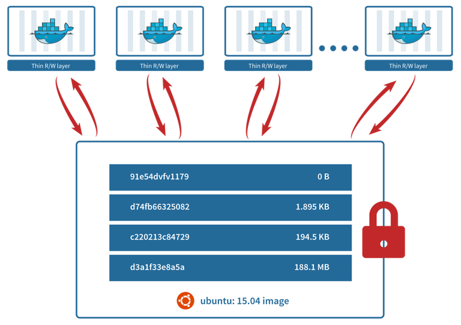

# 1. 시스템 기반의 기초 지식

## 기존의 모델
	애플리케이션 엔지니어/인프라 엔지니어 [구분]
	=> 클라우드 [통합]

## 클라우드와 온프레미스
* 온프레미스 : 자사가 데이터센터 및 시스템 구축 운영 관리 모두 함
* 퍼블릭 클라우드 : 불특정 다수에게 제공 
* 프라이빗 클라우드 : 그룹 기업 내에서 데이터 센터를 공동으로 보유

## 대표적인 인프라 구성 관리 툴
* OS의 __시작__를 자동화 하는 툴 : KickStart(RedHat)
* OS나 미들웨어의 __설정__을 자동화하는 툴 : Chef(Ruby), Ansible(Python)
* 여러 서버를 __관리__를 자동화하는 툴 : Kubernetes

## 요약
온프레미스 <-> 클라우드(자사 환경에 맞춰서 설정) => 수동 관리의 한계 -> 자동화 => 자동화 코드(Docker, Kubernetes)
=> CI-지속적 인티그레이션(인프라 환경을 자동/코드로 관리 앱 테스트 및 버전업)
=> CD-지속적 딜리버리 가능(이용자의 피드백에 즉각적인 개발, 테스트 환경과 제품환경 호환 전개 가능)

---
# 2. 컨테이너 기술과 Docker의 개요 
## 컨테이너
* 호스트 OS상의 논리적인 구획(컨테이터)
* 어플리케이션의 실행 환경 묶음 - 확장성, 이식성 목적
    - 장점 : 오버해드가 적음, 가벼고 고속
[^VM, Docker 비교]

## Docker의 개요
* 어플리케이션의 실행 환경의 모음
	- 하나의 이미지로 만듦
## Docker의 기능
1. Build - 이미지 만들기
2. Ship - 이미지 공유
3. Run - 컨테이너 작동

## Docker 컴포넌트
* Docker Engine(Docker의 핵심 기능)
* Docker Registry(이미지 공개 및 공유)
* Docker Compose(컨테이너 일원 관리)
    - 여러 개의 컨테이너 구성 정보를 코드로 정의하고, 명령을 실행함으로써 애플리케이션의 실행 환경을 구성하는 컨테이너들을 관리하기 위한 툴
* Docker Machine(Docker 실행 환경 구축)
    - VirtualBox, Amazon Web Services EC2나 Azure와 같은 클라우드 환경에 Docker의 실행 환경을 명령으로 자동 생성하기 위한 툴
* Docker Swarm(클러스터 관리)
    - Swarm은 여러 Docker 호스트를 클러스터링하기 위한 툴
    - Manager : 클러스터를 관리하거나 API를 제공하는 역할
    - Node : 컨테이너를 실행하는 역할
	
## Docker 작동 구조

### Namespace(컨테이너를 구획화하는 장치)
* 컨테이너를 구획화하여 어플리케이션의 실행 환경을 만듬(독립된 환경)
	- 이름을 붙여 분할, 쉽게 참조
### cgroups(릴리스 관리 창치)
* 자원을 관리
    - 계층 구조로 프로세스를 그룹화하여 관리
	
## Doker 이미지의 데이터 관리 장치 
* 'Copy on Write'방식으로 컨테이너 이미지를 관리함
	
## 요약
* 컨테이너의 정의
* Docker의 개요, 기능, 컴포넌트, 작동 구조	

---
# 3. [Lab] Docker 설치와 튜토리얼
## Docker for Windows 설치
* Windows용 Docker 설치
	- https://hub.docker.com/editions/community/docker-ce-desktop-windows/
	- Hyper-V를 유효화할 것, Windows10 pro 또는 Enterprise(64bit) 단말기
## Linux 설치
*  https://docs.docker.com/install/
## 작동 테스트
1. Docker 명령어 확인  
`docker container run ubuntu:latest /bin/echo 'Hello world'`
	* 관리자 또는 Docker 그룹에 추가한 User만 사용 가능
2. Docker 버전 확인  
`sudo docker version`
3. Docker 실행환경 확인  
`sudo docker system info`
4. Docker 디스크 이용 상황  
`sudo docker system df`

## 요약
* Docker의 설치 및 작동 확인
	- 웹 서버 작동

---
# 4. Docker 명령

## 4.1 Docker 이미지 조작
1. 이미지 다운로드
`docker image pull [옵션] 이미지명[:태그명]`  
2. 이미지 목록 표시
`docker image ls [옵션] [repository]`
3. 이미지 상세 정보 확인
`docker image inspect 다운받은_이미지명[:태그명]`
	- JSON 형태로 출력
4. 이미지 태그 설정 
`docker image tag 원본이미지[:태그명] 타켓이미지(Docker_Hub_사용자명/이미지명)[:태그명]` 
	- Docker Hub 이미지 등록 규칙 
5. 이미지 검색
`docker search [옵션] 검색_키워드`  
6. 이미지 삭제
`docker image rm [옵션] 이미지명 [이미지명]`  
`docker image prune [옵션]`  
	- 사용하지 않은 이미지 삭제
7. Docker Hub에 로그인
`docker login [옵션] [서버]`  
8. 이미지 업로드
`docker image push 이미지명[:태그명]`

## 4.2 Docker 컨테이너 생성/시작/정지
1. 컨테이너 생성
`docker container create`
2. 컨테이너 생성 및 작동
`docker container run [옵션] 이미지명[:태그명] [인수]`  
	* 주요 옵션 : -t, -i, -d, -e, --name, --restart 등
3. 컨테이너 목록 표시
`docker container ls [옵션]`  
4. 컨테이너 가동 확인
`docker container stats [컨테이너 식별자]`
5. 컨테이너 작동
`docker container start [옵션] 컨테이너_식별자 [컨테이너_식별자]`  
`docker container restart [옵션] 컨테이너_식별자 [컨테이너_식별자]`
6. 컨테이너 중지
`docker container stop [옵션] 컨테이너_식별자 [컨테이너_식별자]`  
`docker container kill`  
7. 컨테이너 일시 정지/재개
`docker container pause 컨테이너_식별자`  
`docker container unpause 컨테이너_식별자` 
8. 컨데이너 삭제
`docker container rm [옵션] 컨테이너_식별자 [컨테이너_식별자]`  
`docker container prune` 
9. 컨테이너 상태 확인
`docker container ps [옵션]`

## 4.3 Docker 컨테이너 네트워크
1. 네트워크 목록 표시
`docker network ls [옵션]`  
2. 네트워크 작성
`docker network create [옵션] 네트워크`  
3. 네트워크 연결/해제
`docker network connect [옵션] 네트워크 컨테이너`  
`docker network disconnect [옵션] 네트워크 컨테이너`
4. 네트워크 상세 정보 확인
`docker network inspect [옵션] 네트워크`
5. 네트워크 삭제
`docker network rm [옵션] 네트워크`  

## 4.4 가동 중인 Docker 컨테이너 조작
1. 가동 컨테이너 연결
    `docker container attach 컨테이너_식별자` 

2. 가동 컨테이너에서 프로세스 실행
    `docker container exec [옵션] <컨테이너_식별자> <실행할_명령> [인수]` 

3. 가동 컨테이너에서 프로세스 확인
    `docker container top 컨테이너_식별자`  

4. 가동 컨테이너 포트 전송 확인
    `docker container port 컨테이너_식별자`

5. 컨테이너 이름 변경
    `docker container renmae <이전_컨테이너_식별자> <새로운_컨테이너_식별자>`  

6. 컨테이너 안의 파일 복사
    `docker container cp <컨테이너_식별자>:<컨테이너_안의_파일_경로> <호스트_디렉터리_경로>`  
    `docker container cp <호스트_파일> <컨테이너_식별자>:<컨테이너_안의_파일_경로>`  

7. 컨테이너 조작의 차분 확인
    `docker container diff 컨테이너_식별자`
    
| 구분 |   변경    |
| :--: | :-------: |
|  A   | 파일 추가 |
|  B   | 파일 삭제 |
|  C   | 파일 수정 |

## 4.5 Docker 이미지 생성
1. 컨테이너로부터 이미지 작성
`docker container commit [옵션] <컨테이너_식별자> [이미지명[:태그명]]` 
2. 컨테이너를 tar 파일로 출력
`docker container export 컨테이너_식별자 > 이름.tar`  
3. tar 파일로부터 이미지 작성
`docker image <파일 또는 URL> | - [이미지[:태그명]]`  
	- Ex) cat latest.tar | docker image import - root/wevfront:1.1
4. 이미지 저장
`docker image save [옵션] 저장_파일명 [이미지명]`  
	- Ex) docker image save -o export.tar nginx
5. 이미지 읽어 들이기
`docker image load [옵션]`
	- Ex) docker image load -i export.tar
6. 불필요한 이미지/컨테이너를 일괄 삭제
`docker system prune [옵션]` 

## export/import와 save/load의 차이
* save/load		: 컨테이너 압축 아카이브(이미지 레이어 구조 포함)
* export/import	: 이미지 압축 아카이브
* 내부적인 디렉터리와 파일 구조가 다름

## 요약
* Docker 명령 사용
	- '--help' 옵션을 잘 사용할 것

---
# 5. Dockerfile을 사용한 코드에 의한 서버 구축

## 5.1 Dokerfile을 사용한 구성 관리
1. Dockerfile이란?
* Dockerfile
    - Docker 상에서 작동시킬 컨테이너의 구성 정보를 기술하기 위한 파일
	- 주요 구성 정보 : 이미지, 수행할 조작(명령), 환경변수, 데몬
2. Dockerfile의 기본 구문
* 'Dockerfile'에 인프라 구성 정보를 기술
    - 기본 서식 : `명령 인수`  
* Dockerfile의 명령

| 명령        | 설명                                                         |
| --- | ---|
| FROM        | 베이스 이미지를 지정, Ex) FROM ubuntu:14.04(latest도 가능하지만, 명시적 지정 권장) |
| RUN         | 이미지상에서 명령 실행, Ex) RUN apt-get update && apt-get install -y fortune |
| CMD         | 컨테이너 실행 명령, Ex) CMD ["nginx"] -> nginx 서버 구동     |
| LABEL       | 라벨 설정                                                    |
| EXPOSE      | 컨테이너 공개 포트 설정                                      |
| ENV         | 환경변수, Ex) 'ENV NGINX_VERSION 버전명'                     |
| ADD         | 파일/디렉터리 추가                                           |
| COPY        | 이미지상의 파일 복사, Ex) 'COPY jerkins.sh /user/local/bin/jenkins.sh' (압축풀기가 필요한 경우 ADD 사용) |
| WORKDIR     | 작업 디렉터리                                                |
| ARG         | Dockerfile 안의 변수                                         |
| ONBULID     | 빌드 완료 후 실행되는 명령                                   |
| ENTRYPOINT  | 컨테이너 실행 명령(이미지 실행 명령을 다시 지정하기 위해 사용) |
| VOLUME      | 볼륨 마운트, 컨테이너 자체는 stateless한 특성을 가짐         |
| USER        | 사용자 지정, (기본값 'docker')                               |
| STOPSIGNAL  | 시스템 콜 시그널 설정                                        |
| HEALTHCHECK | 컨테이너의 헬스 체크                                         |
| SHELL       | 기본 쉘 지정                                                 |

## 5.2 Dockerfile의 빌드와 이미지 레이어
1. Dockerfile로부터 Docker 이미지 만들기
`docker build -t [생성할 이미지명]:[태그명] [Dockerfile의 위치]`  

2. Docker 이미지 레이어 구조
* Docerfile은 명령별로 이미지 작성
* 여러개의 이미지는 레이어 구조도 되어 있음
	- 이미지는 `IMAGE ID`를 공유하여 사용해, 불필요한 용량을 줄임 

## 5.3 멀티스테이지 빌드를 사용한 애플리케이션 개발
* '빌드 환경'(개발 환경)이 꼭 '제품 환경'과 같을 필요는 없음 
* 보안 관점 및 컴퓨팅 리소르를 효율적으로 활용하기 위해 '제품 환경용 이미지'가 따로 존재하는게 좋음
* '빌드 환경용 이미지'와 '제품 환경용 이미지' 따로 만드는 '멀티스테이지 빌드'를 사용 
	- '빌드 환경용 이미지'로 '실행 파일 생성' 후, '제품 환경용 이미지'로 '실행 파일 작동'
	
## 5.4 명령 및 데몬 실행
* 컨테이너를 생성하면, 서버 프로세스 등을 데몬으로 작동시킬 필요가 있음
1. 명령 실행
`RUN [실행하고 싶은 명령]`
	- 이미지상에서 명령 실행
	- Shell형식과 Exec 형식(["", ""])이 존재
	
2. 데몬 실행 CMD
    `CMD [실행하고 싶은 명령]`
	- 컨테이너 실행 명령
	- Shell형식과 Exec 형식(["", ""])이 존재

3. 데몬 실행 ENTRYPOINT
    `ENTRYPOINT [실행하고 싶은 명령]`  
	- Shell형식과 Exec 형식(["", ""])이 존재

### ENTRYPOINT 명령과 CMD 명령의 차이
CMD : 컨테이너 시작 시 실행, `docker container run` 명령에서 새로운 인수 지정시 우선 실행 	
ENTRYPOINT : 명령은 반드시 컨테이너에서 실행됨	
4. 빌드 완료 후에 실행되는 명령
`ONBUILD [실행하고 싶은 명령]`  	
	- 생성한 이미지를 기반으로 다른 이미지가 생성될 때 명령을 실행(trigger)
5. 시스템 콜 시그널의 설정  
`STOPSIGNAL [시그널]` 
6. 컨테이너의 헬스 체크 명령  
`HEALTHCHECK [옵션] CMD 실행할 명령`  
	- 'docker container inspect'로 확인
	
## 5.5 환경 및 네트워크 설정
1. 환경변수 설정  
`ENV [key] [value]`  
`ENV [key]=[value]`	
2. 작업디렉터리 지정  
`WORKDIR [작업 디렉터리 경로]` 
3. 사용자 지정  
`USER [사용자명/UID]`
4. 라벨 지정  
`LABEL key=value` 
	- 이미지 버전 정보, 작성자 정보, 코멘트 등과 같은 정보 제공용 명령
5. 포트 설정  
`EXPOSE 포트_번호` 
6. Docker 내 변수 설정  
`ARG <이름>[=기본값]`  
	- 환경 변수인 ENV와 달리, Dockerfile 안에서만 사용 가능 변수 설정
7. 기본 쉘 설정  
`shell ["쉘의 경로", "파라미터"]`  

## 5.6 파일 설정
 1. 파일 및 디렉터리 추가  
`ADD <호스트_파일_경로> <Docker_이미지_파일_경로>`  
`ADD ["<호스트_파일_경로>" "<Docker_이미지_파일_경로>"]`  
2. 파일 복사  
`COPY <호스트_파일_경로> <Docker_이미지_파일_경로>`  
`COPY ["<호스트_파일_경로>" "<Docker_이미지_파일_경로>"]`  
	- 호스트상의 파일을 이미지 안으로 __복사만__ 가능
	- 원격 파일 다운로드 및 아카이브 압축 해제 미지원
3. 볼륨 마운트  
`VOLUME ["/마운트 포인트"]`

## 요약
* Dockerfile 작성 및 명령어 실습

---
# 6. Docker 이미지 공개
## Docker Registry
* Docker 이미지를 공유하는 장치를 제공하는 것
    Ex) Docker Hub, 프라이빗 Registry
	
## 6.1 Docker 이미지의 자동 생성 및 공개
* GitHub와 Docker Hub를 연동해 Docker 이미지 공개
	- Docker Hub가 Dockerfile을 가지고 빌드해 줌 -> 이미지 생성
## 6.2 Docker Registry를 사용한 프라이빗 레지스트리 구축
* Docker Hub의 공식 이미지 'registry' 사용

## 6.3 클리우드 서비스를 사용한 프라이빗 레지스트리 구축
* GCP의 GCR를 사용
	- 'Google Cloud SDK' 또는 'Cloud Shell' 사용

## 요약
* GitHub, Docker Hub 등으로 외부에 Docker 이미지 공개(퍼블릭)
* 로컬 환경에 Docker Registry 구축(프라이빗)
* GCP의 GCR로 Docker 이미지 공개(프라이빗)

---
# 7. 여러 컨테이너의 운용 관리
* Docker에서 웹 어플리케이션을 환경 제품으로 운용할 때는 어플리케이션 서버, 로그 서버, 프록시 서버 등 여러 개의 컨테이너를 연계하여 작동

## 7.1 여러 컨테이너 관리의 개요
### 웹 3계층 시스템 아키텍처
1. 프론트 서버
* 클라이언트에게 HTTP 요청/응답을 하는 서버 기능을 가짐
2. 어플리케이션 서버
* 서버의 업무를 처리를 실행
3. 데이터베이스(DB) 서버
* 영구 데이터를 관리하기 위한 서버
### 영구 데이터 관리
* 영구 데이터는 적절히 관리할 필요함
1. 데이터 백업 및 복원
* 적절한 보안 대책이나 운영 규칙에 따라 데이터 백업
* 클라우드 서비스를 이용한 해외 저가의 데이터센터에 백업 가능
2. 로그 수집
* 여러 개의 서버로 된 분산 환경에서는 로그 수집 전용 서버를 권장
### Docker Compose
* 여러 컨테이너를 모아서 일괄적으로 관리할 수 있는 툴
* 'docker-compose.yml'라는 파일에 컨테이너의 구성 정보를 정의
    - 웹 어플리케이션의 의존관계(DB, 큐, 캐시, 어플리케이션 등)를 모아서 설정
    - 여러 개의 컨테이너를 모아서 시작/정지 가능

## 7.2 웹 어플리케이션을 로컬에서 움직여 보자
* Docker Compose : 이미지 다운로드나 빌드를 하나의 명령으로 모두 실행
	- 'docker-compos' 설치

## 7.3 Docker Compose를 사용한 여러 컨테이너의 구성 관리
1. Compose 정의 파일
	* 시스템 안에서 가동하는 여러 서버들의 구성을 모아서 정의
	* YAML 형식으로 기술

~ 정의 파일 명령어 생략 ~
2.6 서비스 의존관계 정의
* depends_on : 여러 서비스의 의존관계를 정의
	- __시작 순서만 제어할 뿐, 어플리케이션이 이용 가능 할 때까지 기다리는 제어 없음__
		- 즉, 의존관계에 있는 'db' 서비스의 준비가 끝날 때까지 기다리지 않음
		- 어플리케이션 측에서 이에 대한 대책이 필요
~ 정의 파일 명령어 생략 ~

## 7.4 Docker Compose를 사용한 여러 컨테이너의 운용

### Docker Compose
* `docker-compose` 명령 사용을 위해서는 'docker-compose.yml' 또는 'docker-compose.yaml' 파일이 필요(같은 디렉터리내에 존재)
    - '-f' 옵션을 사용해 정의 파일명 지정 가능
* Docker Compose의 주요 서브 명령

| 서브 명령 | 설명                        |
| --- | --- |
| up        | 컨테이너 생성/시작          |
| ps        | 컨테이너 목록 표시          |
| logs      | 컨테이너 로그 출력          |
| run       | 컨테이너 실행               |
| start     | 컨테이너 시작               |
| stop      | 컨테이너 정지               |
| restart   | 컨테이너 재시작             |
| pause     | 컨테이너 일시정지           |
| unpause   | 컨테이너 재가동             |
| port      | 공개 포트 번호 표시         |
| config    | 구성확인                    |
| kill      | 실행중인 컨테이너 강제 중지 |
| rm        | 컨테이너 삭제               |
| down      | 리소스 삭제                 |

##### Docker Compose 명령
https://docs.docker.com/compose/reference/

~ docker-compose 명령어 생략 ~

## 요약
* 여러 컨테이너 관리하기 위한 개요(사전 지식)
* 'docker-compse.yaml'의 정의 파일 작성 및 실습
* 'docker-compose'사용 및 실습
	- '--help' 옵션을 잘 사용할 것

---
# 8. 멀티호스트 환경에서 Docker 실행 환경 구축

## 8.1 멀티호스트 환경에서 컨테이너 관리의 개요
1. 멀티호스트 환경과 클러스터링
* 웹 시스템 실행 환경은 웹 서버, 프록시 서버, 데이터 스토어 등 역할이 다른 여러 서버들이 연계되어 작동
    - 물리 서버 또는 가상 머신(VM)으로 구성된 멀티호스트 환경으로 서비스를 제공하는게 일반적
* Docker를 멀티호스트 환경에서 운영 관리
* 서비스 이용자가 항상 이용할 수 있도록 운영관리

*__클러스터링__
	- 여러 대의 서버나 하드웨어를 모아 한 대처럼 보이게 하는 기술
	- 가용성(Availabilty), 확장성(Scalability)
* Docker 멀티호스트
	- 컨테이너 오케스트레니션 툴
	- 멀티호스트 환경에서 컨테이너들의 클러스터링을 수행
2. Docker Machine이란?
* 호스트 머신/클라우드/가상 환경 등에 Docker의 실행 환경을 만들 수 있는 __'커맨트라인 툴'__
* Docker Machine을 사용하면 어디서든 명령 하나로 Docker의 실행 환경 구축 가능
	- Docker Machine : https://docs.docker.com/machine/
	- VM 인스턴스 생성 및 웹 어플리케이션 전개 가능
	- 여러 개의 가상 머신 생성 및 관리 가능

## 8.2 웹 어플리케이션을 서비스 공개해 보자
* Google Cloud Platform(GCP)의 Google Compute Engine(GCE)을 사용하여 인터넷 상에 웹 어플리케이션 서비스 공개
	- GCR도 사용
* Docker Machine을 사용하여 Docker 실행 환경 구축	
	- Docker Machine 설치 : https://docs.docker.com/machine/install-machine/

## 8.3. Docker Machine을 사용한 실행 환경 구축
1. Docker Machine의 명령어

| 서브 명령 | 설명                       |
| :---: | --- |
|  create   | 실행 환경 작성              |
|    ls     | 실행 환경 목록 표시         |
|  status   | 실행 환경 상태 표시         |
|    url    | 실행 환경 URL 표시          |
|    ssh    | 실행 환경에 대한 SSH 연결   |
|   start   | 실행 환경 시작              |
|   stop    | 실행 환경 정지              |
|  restart  | 실행 환경 재시작            |
|    scp    | 실행 환경에서 파일 다운로드 |
|    rm     | 실행 환경 삭제              |
|   kill    | 실행 환경 강제 정지         |
|    ip     | 실행 환경 IP 주소 확인      |
|  inspect  | 실행 환경 정보 확인         |

~ Docker Machine 명령어 생략 ~

## 요약
* 멀티호스트 및 클러스터링이란?
* Docker Machine을 사용해 GCP에 서비스(컨테이너) 전개
* Docker Machine 명령어 및 실습

---
# 9. 클라우드를 사용한 Docker 실행 환경 구축

## 9.1 클라우드 환경에서 Docker 오케스트레이션하기
1. 분산 환경에서의 컨테이너 운용 관리
* 스케줄링
    - 하나의 머신 : 컨테이너의 시작 및 정지
    - 멀티호스트 : 컨테이너의 시작 및 정시, 호스트 간 네트워크 연결, 스토리지 관리, 컨테이너를 어떤 호스트에서 가동시킬지 결정
    - 멀티호스트에서 필요한 다양 관리 기능 '스케줄링' 
* 대표적인 오케스트레이션 툴
- Kubernetes
- Docker Engine(Swarm 모드)
- Apache Mesos, Marathon
2. 퍼블릭 클라우드가 제공하는 매니지드 서비스
* 온프레미스 환경에 도입 -> 하드웨어나 네트워크에 대한 지식이 필요
* 클라우드의 가상 머신 인스턴트 구축 -> 인프라 환경 구축, 오케스트레이션 툴, 감시 툴 사용법, 시스템 운용 밑 장애 대응 등 지식이 필요
* 퍼블릭 클라우드가 제공하는 '매니지드 서비스' 이용

## 9.2 Kubernetes의 개요
* 여러 개의 호스트를 하나로 묶어 Docker를 이용하기 위한 오케스트레이션 툴
* 주요 기능	
	- 여러 서버들에서의 컨테이너 관리
	- 컨테이너 간 네트워크 관리
	- 컨테이너의 부하분산
	- 컨테이너의 감시
	- 무정지로 업데이트
1. Kubernetes의 서버 구성
### 마스터 서버(Kubernetes Master)
* Kubernetes 클러스터 전체를 컨트롤 하는 시스템, Kubernetes 클러스터 안의 컨테이너를 조작하기 위한 서버
### 노드
* 실제로 Docker 컨테이너를 작동시키는 서버
5. Kubernetes의 구조
[^출처]

### 5.1 마스터(Master)
#### API 서버(API Server)
* Kubernetes의 리소스 정보를 관리하기 위한 프론트엔드 REST API
#### 스케쥴러(Scheduler)
* Pod, 서비스 등 각 리소스들을 적절한 노드에 할당하는 역할(노드의 Pod 확인)
###### 컨트롤러 매니져(Controller Manger)
* Kubernetes 클러스터의 __상태를 항상 감시__하는 백엔드 컨포넌트
##### 5.2 데이터 스토어(etcd)
* Kubernetes 클러스터 구성을 유지 관리하는 KVS
    - Key-Value 형태로 데이터를 관리
    - 어떤 Pod를 어떻게 배치할지와 같은 구성 정보를 가짐
    - API Server 참조
##### 5.3 노드(Node)
* 노드는 다음과 같은 컴포넌트로 구성됨
###### kubelet
* Pod의 정의 파일에 따라 Docker 컨네이너 실행 및 스토리지 마운트하는 기능을 가짐
###### Kube-proxy
* 노드로 들어오는 네트워크 트래픽을 적절한 컨테이너로 라우팅하고, 로드밸런싱 등 노드로 들어오고 나가는 네트워크 트래픽을 프록시하고, 노드와 마스터간의 네트워크 통신을 관리 
###### Kubernetes 정의 파일(매니페스트 - manifest)
* 클러스터의 구성정보는 YAML 또는 JSON 형식의 정의 파일로 관리(텍스트 형식)

## 9.3 GCP를 사용한 Docker 어플리케이션 개발
* Cloud Container Builder 사용하여 이미지 준비
	- Cloud Source Repositories에 업로드

## 9.4 GCP를 사용한 Docker 어플리케이션 실행 환경 구축
* GKE을 사용하여 사용하여 실행 환경 구축, 어플리케이션 전개

## 요약
* 클라우드 환경(GCP)에서 Docker 오케스트레이션(Kubernetes) 실습
* Kubernetes의 개요 및 구성 요소, 매니페스트 정의 파일

---
# 10. 클라우드를 사용한 Docker 실행 환경의 운용 관리

## 9.1 시스템 운용의 기초 지식
1. 가용성 관리
	* 시스템을 계속 가동시킬 수 있는 능력
2. 수용성 관리
	* 시스템이 제공하는 서비스의 수요를 예측, 감시, 평가하고, 수요를 만족시키기 위한 최적의 시스템 리소스를 제공할 수 있도록 관히하는 것
3. 시스템 감시
	* 안적적인 시스템 가동을 위해서는 감시 및 관리 필요

## 9.2 GKE를 사용한 Docker 실행 환경 이용
* GKE는 Kubernetes의 매니지드 서비스

## 요약 
* 시스템 운용의 기초 지식
* GKE를 사용한 Docker 실행 환경을 관리(gcloud 및 kubectl 사용)

---
[^VM, Docker 비교]:https://subicura.com/2017/01/19/docker-guide-for-beginners-1.html
