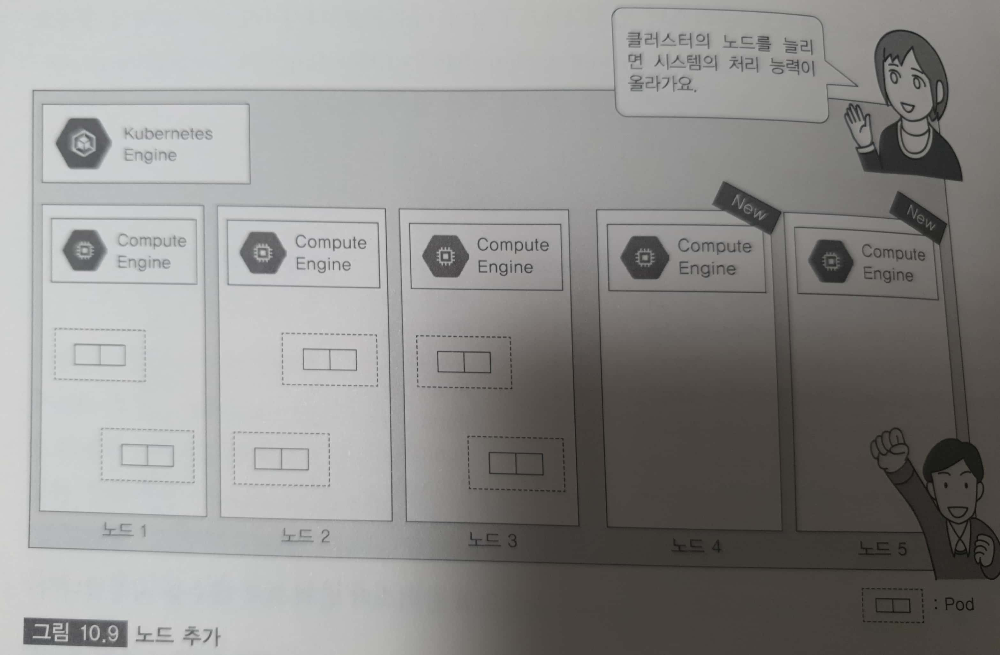

# 10. 클라우드를 사용한 Docker 실행 환경의 운용 관리

---
## 9.1 시스템 운용의 기초 지식

---
#### 1. 가용성 관리
* 시스템을 계속 가동시킬 수 있는 능력
	- 대표적인 기술 : 다중화

* 콜드 스탠바이 방식
	- 구성이나 설정이 똑같은 서버나 네트워크 기기를 미리 백업 기기로 마련해 두고, 실제 환경과 가까운 장소에 설치하여 '전원을 꺼둔 상태로 대기'
	- 장애 발생시 전원을 키고, 실제 환경의 기기와 통째로 교체
	- 소규모 온프레미스 환경 등에 자주 쓰임
	
* 핫 스탠바이 방식
	- 동일한 구성의 서버를 2대를 동시에 가동, 메인 서버에 장애 발생시 대기중인 서버(전원 ON상태)가 대신 처리받는 구성
	- 2대의 서버의 데이터 갱신이 실시간, 장애 발생시 전환도 빠름
	- 자동으로 전환하는 것을 페일오버(failover)라고 함
	
* 헬스 체크
	- 장애 시 신속한 전환을 위해 서버(액티브 기기)의 장애 발생을 감지하는 장치
	- 서버에 대해 일정한 간격의 응답과 요청으로 정상 가동 확인

* 헬스 체크 종류
항목| 설명
---|---
ICMP 감시(레이어3) | ping 등의 응답 확인
포트 감시(레이어4) | 웹 서비스의 경우는 80번 포트로부터의 응답을 확인
서비스 감시(레이어7) | HTTP 통신을 확인하는 경우 특정 페이지가 올바르게 표시되는지 확인


* 로드 밸런싱(부하분산)
	- 다중화 구성은 시스템 가용성 향상 -> 하지만, 단지 대기 서버의 보유는 리소스 낭비
	- 가용성과 처리 속도 향상
	- 로드 밸런서라는 전용 기기 사용, 다양한 알고리즘 존재
		+ '로드 밸런서'는 단일 장애점(SPOF)이 됨 -> 로드 밸런서의 다중화 필요
		+ SPOF : 한 장소에 장애가 발생하면 시스템을 이용할 수 없게 되는 부분
		
###### 재해 복구 시스템(Disaster Recovery System)
* 자연 재해 등 피해를 입은 시스템을 효율적적으로 복구 및 수리하는 체제
* RTO(Recovery Time Obejctive)
	- 재해 등으로 기업 시스템이 정지된 이후, 서비스 복할 때 까지 필요한 경과 시간
* RPO(Recovery Point Obejctive)
	- 재해 등으로 시스템이 정지되었을 때 어떤 시점까지 거슬러 올라가서 데이터를 복구시킬지에 대한 지표
	
---
#### 2. 수용성 관리
* 시스템이 제공하는 서비스의 수요를 예측, 감시, 평가하고, 수요를 만족시키기 위한 최적의 시스템 리소스를 제공할 수 있도록 관히하는 것
	- 서비스의 수요를 정확하게 예측하는 것은 어려움 -> 클라우드 시스템을 사용하면 부하에 따라 동적으로 변경 가능
	- 영구 데이터 관리 -> 데이터 백업과 복구 및 보안 대첵 -> 클라우드의 저가 스토리지 서비스 사용 및 다른 고장 영역(리전)에 보관
	- 로그 수집 밀 보관 관리 필요

---
#### 3. 시스템 감시
* 안적적인 시스템 가동을 위해서는 감시 및 관리 필요
	- 머신의 활동 감시
		+ 하드웨어, 네트워크 장애 확인, 클라우드 서비스 자체가 정지되지 않았는지 확인
	- 서비스의 가동 감시 
	- 서버/네트워크의 리소스 감시
		+ 수용성 관리의 일환으로 리소스(CPU, 메모리 스토리지 등) 사용량, 네트워크 대역, 병목 현상 확인
		+ 클라우드에 남아있는 리소스가 없는지 감시 
	- 잡 감시
	- 장애 대응
		+ 오류의 원인을 제거하고 시스템을 정상 상태로 되돌리는 것
		+ 오류 발생시 엔드 유저의 시스템에 영향이 가지 않도록 오류발생 부분 분리 -> 장애 발생 원인 조사 ->장애가 발생하지 않도록 영구 대책을 세움
		+ 원인 조사 : 어플리케이션, 미들웨어, 서버, 네트워크 기기가 출력하는 로그 파일 해석 또한 관련 노드 및 네트워크 기기 로그

* 퍼포먼스 튜닝
	- 시스템의 처리 중 병목이 일어나는 장소를 찾아내고 최적의 작동이 되도록 각종 파라미터를 조정하는 작업
	- 처리 시간 계측으로 판단
	

---
## 9.2 GKE를 사용한 Docker 실행 환경 이용
* GKE는 Kubernetes의 매니지드 서비스

---
#### 1. Kubernetes의 스테이터스 확인
* 클러스터 'imageview'를 삭제했다면 다시 생성

##### 클러스터의 상태 확인
Ex) 클러스터의 상태 확인  
```bash
test@cloudshell:~ (docker-kubernetes-9724)$ gcloud container clusters list
NAME       LOCATION           MASTER_VERSION  MASTER_IP      MACHINE_TYPE   NODE_VERSION    NUM_NODES  STATUS
imageview  asia-northeast3-a  1.14.10-gke.17  34.64.215.107  n1-standard-1  1.14.10-gke.17  3          RUNNING
```
* 'gcloud'명령을 사용해 실행 중인 클러스터의 이름, 작동하고 있는 리전, Kubernetes의 버전, 노드의 수와 버전 등 확인 가능

Ex) 컴포넌트의 액세스 확인  
```bash
test@cloudshell:~ (docker-kubernetes-9724)$ kubectl cluster-info
Kubernetes master is running at https://34.64.215.107
GLBCDefaultBackend is running at https://34.64.215.107/api/v1/namespaces/kube-system/services/default-http-backend:http/proxy
Heapster is running at https://34.64.215.107/api/v1/namespaces/kube-system/services/heapster/proxy
KubeDNS is running at https://34.64.215.107/api/v1/namespaces/kube-system/services/kube-dns:dns/proxy
Metrics-server is running at https://34.64.215.107/api/v1/namespaces/kube-system/services/https:metrics-server:/proxy

To further debug and diagnose cluster problems, use 'kubectl cluster-info dump'.
```
* `kubectl cluster-info` 명령을 사용하여 'Kubernetes Master' 등과 같은 컴포넌트의 액세스처를 확인 가능

##### 노드의 스테이터스 확인

Ex) 노드의 스테이터스 확인  
```bash
test@cloudshell:~ (docker-kubernetes-9724)$ kubectl get nodes
NAME                                       STATUS   ROLES    AGE   VERSION
gke-imageview-default-pool-2aab8a5d-bx7r   Ready    <none>   36m   v1.14.10-gke.17
gke-imageview-default-pool-2aab8a5d-krx3   Ready    <none>   36m   v1.14.10-gke.17
gke-imageview-default-pool-2aab8a5d-scjr   Ready    <none>   36m   v1.14.10-gke.17

```
* `kubectl get`를 사용해 노드의 스테이터스 확인
* [STATUS]는 'Ready'로 문제없이 작동하고 있는다는 걸 확인
* Cloud Console에서 'GCP의 [탐색 메뉴] -> [Kubernetes Engine] -> [클러스터] 클릭'로 확인 가능

###### GCP의 Kubernetes
* GKE에서 제공하는 노드 풀을 사용하면 클러스터안에 다른 구성을 가진 '가상 머신'의 풀을 만들 수 있음
* 멀티존 구성 가능 -> 가용성 향상
	+ `gcloud container clusters create`에 `--additional-zones` 옵션 사용
* 'Kubernetes Cluster Federation'을 사용하여 GCP의 리전 또는 다른 클라우드나 온프레미스에 걸친 클러스터를 구성 가능
* 롤베이스 액세스 제어(RBAC)를 사용 가능

##### Pod의 상태 확인

Ex) Pod의 상태 확인  
```bash
test@cloudshell:~/dockertext2/chap09 (docker-kubernetes-9724)$ kubectl get pods
NAME                               READY   STATUS    RESTARTS   AGE
webserver-blue-5557854749-7zdk4    1/1     Running   0          2m8s
webserver-blue-5557854749-8bzwz    1/1     Running   0          2m8s
webserver-blue-5557854749-s2wq8    1/1     Running   0          2m7s
webserver-green-6db544bfdc-478p2   1/1     Running   0          112s
webserver-green-6db544bfdc-gm2fr   1/1     Running   0          112s
webserver-green-6db544bfdc-vbb9d   1/1     Running   0          112s
```
* `kubectl get`를 사용해 노드안에서 움직이는 Pod의 스테이터스 확인
* [STATUS]는 'Running'로 문제없이 작동하고 있는다는 걸 확인

Ex) Pod의 상세 정보 확인  
```bash
test@cloudshell:~/dockertext2/chap09 (docker-kubernetes-9724)$ kubectl describe pods webserver-green-6db544bfdc-vbb9d
Name:               webserver-green-6db544bfdc-vbb9d
Namespace:          default
Priority:           0
PriorityClassName:  <none>
Node:               gke-imageview-default-pool-2aab8a5d-krx3/10.178.0.7
Start Time:         Sat, 14 Mar 2020 11:42:46 +0900
Labels:             color=green
                    pod-template-hash=6db544bfdc
                    type=webserver
Annotations:        kubernetes.io/limit-ranger: LimitRanger plugin set: cpu request for container webserver-container
~생략~
```
* `kubectl describe pods`를 사용하여 Pod의 상세정보 확인
* GKE의 웹 콘솔에서 'GCP의 [탐색 메뉴] -> [Kubernetes Engine] -> [작업 부하] 클릭'로 확인 가능


Ex) 서비스 확인  
```bash
test@cloudshell:~/dockertext2/chap09 (docker-kubernetes-9724)$ kubectl get service
NAME         TYPE           CLUSTER-IP   EXTERNAL-IP    PORT(S)        AGE
kubernetes   ClusterIP      10.68.0.1    <none>         443/TCP        125m
webserver    LoadBalancer   10.68.8.73   34.64.150.68   80:31510/TCP   8m18s
```
* `kubectl get`를 사용해 서비스에 할당된 IP 주소 확인
* 'webserver'라는 이름, 로드 밸런서 타입, 액세스하기 위한 글로벌 IP주소가 '34.64.150.68'라는 것을 확인
* Cloud Console에서 'GCP의 [탐색 메뉴] -> [Kubernetes Engine] -> [서비스 및 수신] 클릭'로 확인 가능

##### Kubernetes
* kubectl 명령으로 Kubernetes 클러스터 조작 가능
* `kubectl config view`로 클러스터에 대한 '연결에 필요한 정보' 및 '인증 정보' 확인 가능
* `~./kube/config`에 연결 정보 저장

---
#### 2. Kubernetes의 Pod 관리
* 'kubectl scale'로 작동중인 Kubernetes 클러스터의 Pod 수 늘리기 가능
* `--replicas` 옵션으로 Pod의 수 지정

Ex) pod의 상태 확인 1  
```bash
test@cloudshell:~/dockertext2/chap09 (docker-kubernetes-9724)$ kubectl get pods
NAME                               READY   STATUS    RESTARTS   AGE
webserver-blue-5557854749-7zdk4    1/1     Running   0          46m
webserver-blue-5557854749-8bzwz    1/1     Running   0          46m
webserver-blue-5557854749-s2wq8    1/1     Running   0          46m
webserver-green-6db544bfdc-478p2   1/1     Running   0          46m
webserver-green-6db544bfdc-gm2fr   1/1     Running   0          46m
webserver-green-6db544bfdc-vbb9d   1/1     Running   0          46m
```

Ex) Pod의 수 지정  
```bash
test@cloudshell:~/dockertext2/chap09 (docker-kubernetes-9724)$ kubectl scale --replicas=5 -f config/deployment-green.yaml
deployment.extensions/webserver-green scaled
```
* `--replicas`은 Kubernetes 클러스터에서 실행시켜 두고 싶은 Pod 수이지, 추가하고 싶은 갯수가 아님
* 이 Pod는 'onfig/deployment-green.yaml'에서 구성 정보를 관리하기에 '-f' 옵션을 사용하여 파일명 지정

Ex) pod의 상태 확인 2  
```bash
test@cloudshell:~/dockertext2/chap09 (docker-kubernetes-9724)$ kubectl get pods
NAME                               READY   STATUS    RESTARTS   AGE
webserver-blue-5557854749-7zdk4    1/1     Running   0          53m
webserver-blue-5557854749-8bzwz    1/1     Running   0          53m
webserver-blue-5557854749-s2wq8    1/1     Running   0          53m
webserver-green-6db544bfdc-478p2   1/1     Running   0          52m
webserver-green-6db544bfdc-gm2fr   1/1     Running   0          52m
webserver-green-6db544bfdc-kz4vv   1/1     Running   0          4m53s
webserver-green-6db544bfdc-vbb9d   1/1     Running   0          52m
webserver-green-6db544bfdc-zx2sx   1/1     Running   0          4m53s
```
* 추가된 'webserver-green-6db544bfdc-zx2sx', 'webserver-green-6db544bfdc-kz4vv' Pod 확인
* Pod를 줄이는 것도 `--replicas` 옵션 사용

---
#### 3. Kubernetes의 노드 관리
* 액세스 부하에 맞춰 클러스터를 구성하는 노드를 증감 가능
* GKE를 사용하여 클러스터 구성을 변경할 때는 __gcloud__명령을 사용

Ex) 노드 추가  
```bash
test@cloudshell:~/dockertext2/chap09 (docker-kubernetes-9724)$ gcloud container clusters resize imageview --size 5 --zone asia-northeast3-a
WARNING: The --size flag is now deprecated. Please use `--num-nodes` instead.
Pool [default-pool] for [imageview] will be resized to 5.

Do you want to continue (Y/n)?  y

Resizing imageview...done.
Updated [https://container.googleapis.com/v1/projects/docker-kubernetes-9724/zones/asia-northeast3-a/clusters/imageview].
```
* 명령 실행 당시에는 '--size'대신 '--num-nodes' 사용하라고 나옴



Ex) 노드 확인  
```bash
test@cloudshell:~/dockertext2/chap09 (docker-kubernetes-9724)$ kubectl get node
NAME                                       STATUS   ROLES    AGE    VERSION
gke-imageview-default-pool-2aab8a5d-55h7   Ready    <none>   7m5s   v1.14.10-gke.17
gke-imageview-default-pool-2aab8a5d-bx7r   Ready    <none>   156m   v1.14.10-gke.17
gke-imageview-default-pool-2aab8a5d-krx3   Ready    <none>   156m   v1.14.10-gke.17
gke-imageview-default-pool-2aab8a5d-sbqx   Ready    <none>   7m7s   v1.14.10-gke.17
gke-imageview-default-pool-2aab8a5d-scjr   Ready    <none>   156m   v1.14.10-gke.17
```
* 새로운 노드 2대 추가
* 가동 중인 노드의 대수만큰 GCE 인스턴스의 사용료가 부과됨
* GKE의 'Cluster Autoscaler' 기능을 사용하면 리소스 사용량의 변화에 따라 노드를 자동으로 크기 변경 가능
* 'NodePool'을 사용하면 클러스터 안에 다른 구성을 가진 노드 풀을 만들 수 있음

###### 컨테이너 클러스터의 사이즈 변경
참고 : https://cloud.google.com/kubernetes-engine/docs/resize-cluster

---
#### 4. Kubernetes의 리소스 작성/삭제/변경
* Kubernetes에서는 Pod나 서비스 같은 '리소스 구성 관리'는 __정의 파일__을 사용
* YAML 또는 JSON 형식으로 기술

Ex) 리소스 작성  
```bash
test@cloudshell:~/dockertext2/chap09 (docker-kubernetes-9724)$ kubectl create -f config/secrets.yaml
Error from server (AlreadyExists): error when creating "config/secrets.yaml": secrets "apikey" already exists
```
* 이미 작성하여 에러 출력

Ex) 여러 리소스 일과 작성  
```bash
test@cloudshell:~/dockertext2/chap09 (docker-kubernetes-9724)$ kubectl create -f config/
cronjob.batch/showdate created
~생략~
```
* 이미 작성 된 것은 에러를 출력하고, 아닌 것은 작성됨
* 작동중인 상태에서 덮어 쓸때는 'kubectl apply' 명령 사용


Ex) 리소스 삭제  
```bash
test@cloudshell:~/dockertext2/chap09 (docker-kubernetes-9724)$ kubectl delete -f config/cronjob.yaml
cronjob.batch "showdate" deleted
```


Ex) 리소스 변경  
```bash
$ kubectl edit -f config/secrets.yaml
```

---
#### 5. Kubernetes의 업그레이트/다운그레이드
* 머스터의 버전 관리는 GKE가 자동으로 관리
* 노드에서 작동하는 Kubernetes의 버전은 수동으로 업데이트할 필요 있음

Ex) 노드 확인  
```bash
kyj9724@cloudshell:~/dockertext2/chap09 (docker-kubernetes-9724)$ gcloud container get-server-config --zone=asia-northeast3-a
Fetching server config for asia-northeast3-a
defaultClusterVersion: 1.14.10-gke.17
defaultImageType: COS
validImageTypes:
- WINDOWS_SAC
- WINDOWS_LTSC
- COS
- UBUNTU
- COS_CONTAINERD
- UBUNTU_CONTAINERD
validMasterVersions:
- 1.15.9-gke.22
- 1.15.9-gke.12
~생략~
validNodeVersions:
- 1.15.9-gke.22
- 1.15.9-gke.12
~생략~
```
* 업그레이드 지원 대상이 되는 Kubernetes의 버전을 조사
* 존에 따라 다르므로 '--zone'옵션으로 'asia-northeast3-a'를 지정

Ex) 노드 다운그레이드  
```bash
kyj9724@cloudshell:~/dockertext2/chap09 (docker-kubernetes-9724)$ gcloud container clusters upgrade imageview --cluster-version=1.14.9-gke.23 --zone=asia-northeast3-a
All nodes (3 nodes) of cluster [imageview] will be upgraded from
version [1.14.10-gke.17] to version [1.14.9-gke.23]. This operation is
 long-running and will block other operations on the cluster
(including delete) until it has run to completion.

Do you want to continue (Y/n)?  y
```
* Kubernetes 노드는 마스터보다 새로운 버전으로 업그레이드하는 것은 불가능
* 다운그레이드 지원 대상이 되는 것은 마스터의 버전보다 2개 이전의 마이너 버전까지 가능

###### kubectl 명령
참고 : https://kubernetes.io/docs/reference/generated/kubectl/kubectl

---
#### 6. Stakdriver에서 로그 확인
* Stakdriver
	- 클라우드 상에서 가동하는 어플리케이션에 대한 퍼포먼스만 업타임 같은 작동 상황을 감시하는 GCP의 서비스
	- 다양한 서비스의 가동 활동을 GUI 대시보드로 확인 가능
	- 이벤트나 메타데이터 수집
	- 감시 항목의 한계 값 체크, 경고 발생 -> 담당자에게 통지


* GCP의 [탐색 메뉴] -> [로그 기록] -> [로그 뷰어] 클릭
* 로그 종휴 'kubernetes 클러스터' 선택, 필터링도 가능

###### Stackdriver
참고 : https://cloud.google.com/stackdriver

---
 