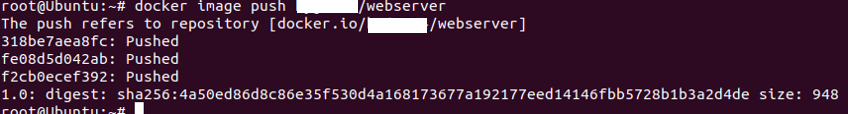

# 4. Docker 명령

## 4.1 Docker 이미지 조작
#### 1. 이미지 다운로드
`docker image pull [옵션] 이미지명[:태그명]`  
	`docker image pull -a centos`  

	* -a : 모든 태그를 취득(태그 지정 불가)  
	`docker image pull gcr.io.tensorflow/tesorflow centos`  
	* 'https://' 제외하고 취득할 이미지 URL 지정 가능 

---
#### 2. 이미지 목록 표시
`docker image ls [옵션] [repository]`  
	* 주요 옵션  
	-all, -a : 모든 이미지 표시  
	--digests : 다이제스트를 표시(이미지를 고유하게 식별하기 위해 존재)  
	--no-turnc : 결과를 모두 표시  
	--quiet, -q : Docker 이미지 ID만 표시  
	* `docker images`도 사용 가능  

```bash
REPOSITORY        TAG               IMAGE ID          CREATED           SIZE
nginx             latest            a1523e859360      5 days ago        127MB
ubuntu            latest            72300a873c2c      10 days ago       64.2MB
hello-world       latest            fce289e99eb9      14 months ago     1.84kB
```

Dcoker image 항목|설명
---|---
REPOSITORY	| 이미지 이름
TAG			| 이미지 태그명
IMAGE ID	| 이미지 ID    
CREATED		| 작성일
SIZE		| 이미지 크기


#### Docker Content Trust(DCT) on/off
* 서명 확인, 서명이 되어 있지 않은 이미지는 오류 발생  
`exeport DOCKER_CONTENT_TRUST=1` - ON  
`exeport DOCKER_CONTENT_TRUST=0` - OFF  

---
#### 3. 이미지 상세 정보 확인
`docker image inspect 다운받은_이미지명[:태그명]`

* JSON 형태로 출력
* 주요 항목  
항목 | 내용
:---:|:-:
이미지|"Id"
작성일|"Created"
Docker 버전|"DockerVersion"
CPU 아키텍처|"Architecture"

* `--format` 옵션을 사용해 원하는 값을 출력 가능  
Ex)
```bash
root@Ubuntu:~# docker image inspect --format="{{.Os}}" nginx
linux
root@Ubuntu:~# docker image inspect --format="{{.ContainerConfig.Image}}" nginx
sha256:b8ca01edcd68bd3819673fba5b097e71ad11875d0fd25008b63969fb115f5b46
root@Ubuntu:~# docker image inspect --format="{{.Architecture}}" nginx
amd64
```

---
#### 4. 이미지 태그 설정
* Docker Hub 이미지 등록 규칙  
    `Docker_Hub_사용자명/이미지명[:태그명]`  
`docker image tag 원본이미지[:태그명] 타켓이미지[:태그명]`  
Ex)
```bash
root@Ubuntu:~# docker image tag nginx asashiho/webserver:1.0
root@Ubuntu:~# docker images
REPOSITORY           TAG                 IMAGE ID            CREATED             SIZE
asashiho/webserver   1.0                 a1523e859360        6 days ago          127MB
nginx                latest              a1523e859360        6 days ago          127MB
ubuntu               latest              72300a873c2c        11 days ago         64.2MB
```
* 이미지ID가 같음, 복사 또는 이름을 바꾼게 아니라, 링크 또는 별명을 붙인 거에 가까움

---
#### 5. 이미지 검색
`docker search [옵션] 검색_키워드`  
	*주요 옵션  
	--no-trunc			: 결과를 모두 표시  
	--limit				: n건의 검색 결과를 표시  
	--filter=starts=n	: 즐겨찾기의 수(n 이상)를 지정  
*주요 항목  
항목|설명
---|---
STARS		| 즐겨찾기 수
AUTOMATED	| Dockerfile을 바탕으로 자동 생성된 이미지 여부 확인

Ex)  
```bash
root@Ubuntu:~# docker search nginx --filter=stars=100
NAME                      DESCRIPTION                                     STARS               OFFICIAL            AUTOMATED
nginx                     Official build of Nginx.                        12745               [OK]                
jwilder/nginx-proxy       Automated Nginx reverse proxy for docker con…   1748                                    [OK]
richarvey/nginx-php-fpm   Container running Nginx + PHP-FPM capable of…   758                                     [OK]
```
* 안전을 위해 공식 이미지 또는 Dockerfile이 제대로 공개된 것을 사용 권장

---
#### 6. 이미지 삭제
`docker image rm [옵션] 이미지명 [이미지명]`  
	*주요 옵션  
	--force, -f		: 이미지를 강제로 삭제  
	--no-prune		: 중간 이미지를 삭제하니 않음  

* 이미지명 : [REPOSITORY], [IMAGE ID]
* [IMAGE ID]는 앞3장리 정도만 지정해도 가능
* 1.10 이전 버전에는 '중간 이미지'가 존재했지만 현재는 '중간 이미지' 사용을 잘 안함

##### 사용하지 않는 이미지를 삭제 할때는 prune 명령 사용
`docker image prune [옵션]`  
	*주요 옵션  
	--force, -f		: 이미지를 강제로 삭제  
	--all, -a		: 사용하지 않는 이미지 모두 삭제  

* 디스크 용량을 위해 정기적으로 삭제 권장

---
#### 7. Docker Hub에 로그인
`docker login [옵션] [서버]`  
	*주요 옵션  
	--password, -p	: 비밀번호  
	--username, -u	: 사용자명  

* Docker Hub에 업로드 할려면 로그인 필요
* 로그인 중, '/root/.docker/config.json'에 암호화 되지 않는채로 비밀번호가 저장됨

##### 로그아웃
`docker logout [서버]`  

---
#### 8. 이미지 업로드
`docker image push 이미지명[:태그명]`  

* Docker Hub 및 'docker search'로 등록 확인 가능
* 업로드 하고 시간이 어느 정도 지나야 검색 가능것으로 보임

---
## 4.2 Dockerm 컨테이너 생성/시작/정지
* Docker 컨테이너의 라이프 사이클
[^라이프사이클]


### 컨테이너 조작 주요 기본 명령

---
#### 1. 컨테이너 생성
`docker container create`

* 이미지에 포함된 Linux디렉터리 및 파일 집합(/etc, /bin)을 스냅샷으로 만듬 -> 컨테이너 생성
* 컨테이너만 생성 -> 동작 준비 상태

---
#### 2. 컨테이너 생성 및 작동
`docker container run [옵션] 이미지명[:태그명] [인수]`  
	* 주요 옵션  
	-a					: 표준 입력, 표준 출력, 표준 오류 출력에 Attach  
	-d	  				: 컨테이너 생성 및 백그라운드 실행  
	-e	   				: 컨테이너에 환경 변수 전달  
	-p	   				: 호스트와 컨테이너의 포트를 매핑  
	--tty, -t			: 단말기 디바이스 사용  
	--interactive, -i	: 컨테이너의 표준 입력을 오픈  
	--cidfile			: 컨테이너 ID를 파일로 출력  
	--name	   			: 컨테이너 이름 지정  
	--restart			: 커맨드 실행 결과에 따라 컨테이너를 재구동  
	--net	   			: 네트워크 설정(default로 호스트OS와 bridge 접속 사용)  
	--cpu-share			: 제한 값 설정 가능  
	<!-- 추가 옵션: http://pyrasis.com/book/DockerForTheReallyImpatient/Chapter20/28 -->  
Ex) 1  

```bash
root@Ubuntu:~# docker container run -it --name "test4" centos /bin/cal
	 March 2020     
Su Mo Tu We Th Fr Sa
 1  2  3  4  5  6  7
 8  9 10 11 12 13 14
15 16 17 18 19 20 21
22 23 24 25 26 27 28
29 30 31  
```
* `/bin/cal`	: 컨테이너에서 실행 할 명령
* `-it` 		: tty를 확보해, 표춘 출력을 오픈

Ex) 2  
```bash
Docker container run -it --name "test3" ubuntu /bin/bash
```

##### 2.1 백그라운드 실행
`docker container run [실행 옵션] 이미지명[:태그명] [인수]`  
	* 주요 옵션  
	--detach, -d	  	: 컨테이너 생성 및 백그라운드 실행  
	--user, -u	   		: 컨테이너에 환경 변수 전달  	
	--rm   				: 명령 실행 완료 후 컨테이너 자동 삭제  
	--restart=no		: 커맨드 실행 결과에 따라 컨테이너를 재구동  
* `--restart` 옵션
설정값|설명
---|---
no					| 재시작하니 않음
no-failure			| 종료 스테이터스가 0이 아닐 때 재시작
on-failure:n(횟수)	| 종료 스테이터스가 0이 아닐 때 n번 재시작
always				| 항상 재시작
unless-stoped		| 최근 컨테이너가 정지 상태가 아니라면 항상 재시작

Ex) 1    
```bash
root@Ubuntu:~# docker container run -d centos /bin/ping localhost
312e4fe737bccee9f70d94bdecb6c2bc94c9f037ee454c97190b5c7161ccadd6
root@Ubuntu:~# docker container logs -t 312e4
2020-03-04T05:42:27.179599844Z PING localhost (127.0.0.1) 56(84) bytes of data.
2020-03-04T05:42:27.179623121Z 64 bytes from localhost (127.0.0.1): icmp_seq=1 ttl=64 time=0.013 ms
2020-03-04T05:42:28.206352750Z 64 bytes from localhost (127.0.0.1): icmp_seq=2 ttl=64 time=0.065 ms
2020-03-04T05:42:29.230597384Z 64 bytes from localhost (127.0.0.1): icmp_seq=3 ttl=64 time=0.067 ms
2020-03-04T05:42:30.254860416Z 64 bytes from localhost (127.0.0.1): icmp_seq=4 ttl=64 time=0.066 ms
~
```
* 백그라운드(디태치 모드)에서  로컬호스트에 핑를 보냄
* `docker container logs`로 백그라운드 실행중인 로그 확인
* -t : 타임스탬프 표시
* __실행 후 컨테이너를 자동 삭제를 원하면 `-rm` 옵션을 사용__

Ex) 2  
```bash
root@Ubuntu:~# docker container run -it --restart=always centos /bin/bash
[root@de4f120f04bf /]# exit
exit
root@Ubuntu:~# docker container ps
CONTAINER ID        IMAGE               COMMAND             CREATED             STATUS              PORTS               NAMES
de4f120f04bf        centos              "/bin/bash"         26 seconds ago      Up 15 seconds                           wizardly_cerf
```
* `exit`로 종료해도 컨테이너는 계속 작동됨
* __`--rm`와 `--restart` 옵션은 동시 사용 못함__

##### 2.2 네트워크 설정
`docker container run [실행 옵션] 이미지명[:태그명] [인수]`  
	* 주요 옵션  
	--add-host=[호스트명:IP 주소]      	: 컨테이너의 /etc/hosts에 호스트명과 IP주소를 정의  
	--dns=[IP 주소]                 	: 컨테이너용 DNS서버의 IP주소 지정  
	--expose	                 	: 지정한 범위의 포트 번호를 할당  
	--mac-address=[MAC 주소]         : 컨테이너 MAC 주소를 지정  
	--net=[bridge]					: 컨테이너 네트워크를 지정  
	--hostname, -h               	: 컨테이너 자신의 호스트명을 지정  
	--publish, -p[호스트의 포트 번호]:[컨테이너의 포트 번호]	: 호스트화 컨테이너의 포드 매핑  
	--publish-all, -P              	: 호스트의 임의의 포트를 컨테이너에 할당  
* `--net` 옵션  
설정값|설명
---|---
bridge				| 브리지 연결(기본값)을 사용
none				| 네트워크 연결 안함
container:<name/id>	| 다른 컨테이너의 네트워크를 사용
host				| 컨테이너가 호스트OS의 네트워크를 사용
NETWORK				| 사용자 정의 네트워크 사용(docker network create)

Ex) 컨테이너 포트 매핑  
```bash
root@Ubuntu:~# docker container run -d -p 8080:80 nginx
e00dfb7c85e545f798c894b4ea09d5328b3871dc5efdd9a755d82b619fe7dce3
root@Ubuntu:~# docker container ps
CONTAINER ID        IMAGE               COMMAND                  CREATED             STATUS              PORTS                  NAMES
e00dfb7c85e5        nginx               "nginx -g 'daemon of…"   2 minutes ago       Up 2 minutes        0.0.0.0:8080->80/tcp   stupefied_dubinsky
de4f120f04bf        centos              "/bin/bash"              51 minutes ago      Up 34 minutes                              wizardly_cerf
```
* `--expose` 옵션을 사용해 지정한 범위로 포트 번호 할당 가능

Ex) 컨테이너 DNS 서버 지정  
```bash
root@Ubuntu:~# docker container run -d --dns 192.168.1.1 nginx
0487321845bad9378b6f317932e1cdef4a72d00751c046561af9d5d2e6effe6d
```

Ex) MAC 주소 지정  
```bash
root@Ubuntu:~# docker container run -d --mac-address="92:d0:c5:0a:29:33" centos
a2f957625e5ddb0154c9b474618b06f57d32f3aa25a9cac925852ab272484bad
root@Ubuntu:~# docker container inspect --format="{{.Config.MacAddress}}" a2f957
92:d0:c5:0a:29:33
```

Ex) 호스트명과 IP주소 정의  
```bash
root@Ubuntu:~# docker container run -it --add-host test.com:192.168.1.1 centos
[root@0c652777d00c /]# cat /etc/hosts 
127.0.0.1	localhost
::1	localhost ip6-localhost ip6-loopback
fe00::0	ip6-localnet
ff00::0	ip6-mcastprefix
ff02::1	ip6-allnodes
ff02::2	ip6-allrouters
192.168.1.1	test.com
172.17.0.5	0c652777d00c
```
* 컨테이너 안의 '/etc/hosts'에 호스트명과 IP주소를 정의함

Ex) 호스트명 설정  
```bash
root@Ubuntu:~# docker container run -it --hostname www.test.com --add-host nodel.test.com:192.168.1.1 centos
[root@www /]# cat /etc/hosts
127.0.0.1	localhost
::1	localhost ip6-localhost ip6-loopback
fe00::0	ip6-localnet
ff00::0	ip6-mcastprefix
ff02::1	ip6-allnodes
ff02::2	ip6-allrouters
192.168.1.1	nodel.test.com
172.17.0.5	www.test.com www
[root@www /]# hostname
www.test.com
```

Ex) 사용자 정의 네트워크 작성  
```bash
root@Ubuntu:~# docker network create -d bridge webapp-net
b85049d7235107416af9a8843dc98873690edada39bb3c07eed86ee3ef62d8a9
root@Ubuntu:~# docker container run --net=webapp-net -it centos
```
* 컨테이너가 동일한 멀티호스트 네크워크에 연결되어 있으면, 같은 네트워크를 통해 통신 가능

##### 2.3 자원 지정하여 생성 및 작동
`docker container run [자원 옵션] 이미지명[:태그명] [인수]`  
	* 주요 옵션  
	-c, --cpu-shares=0			: CPU자원 분배(비율), 기본값은 1024(각 값은 상대적으로 적용)  
	-m, --memory=[크기]			: 메모리 한계를 설정(단위: b, k, m, g)  
	-v, --volume=[호스트 디렉터리]:[컨테이너 디렉터리]	: 호스트와 컨테이너 디렉터리 공유  
Ex) cpu 시간의 상대 비율과 메모리 사용량 지정  
```bash
docker container run --cpu-shares=512 --memory=1g centos
```
* `--memory` 옵션을 줄 때 경고가 뜨는 경우  
`WARNING: Your kernel does not support swap limit capabilities or the cgroup is not mounted. Memory limited without swap.`
	
	- 아래와 같이 설정 변경
	```
	# vi /etc/default/grub
	...
	GRUB_CMDLINE_LINUX_DEFAULT="cgroup_enable=memory swapaccount=1"
	# sudo update-grub 
	# sudo reboot 
	```
	참고 링크 : https://eyeballs.tistory.com/29

Ex) 디렉터리 공유  <!-- 작동확인 필요 -->  
```bash
docker container run -v /User/asa/webapp:/usr/share/nginx/html nginx
```
호스트 폴더	: /User/asa/webapp  
컨테이너 폴더	: /usr/share/nginx/html  


##### 2.4 환경변수 설정하여 생성 및 작동
`docker container run [실행 옵션] 이미지명[:태그명] [인수]`  
	* 주요 옵션  
	-e, --env=[환경변수]		: 컨테이너에 환경 변수를 설정  
	--env-file=[파일명]		: 컨테이너에 환경 변수가 설정된 파일을 적용  
	--read-only=[true|false]: 컨테이너의 파일 시스템을 읽기 전용으로 설정  	
	-w, --workdir=[경로]		: 컨테이너의 작업 디렉터리 설정  
	-u, --user=[사용자명]		: 컨테이너의 사용자 계정명 또는 UID를 설정  
	

Ex) 환경변수 설정  

```bash
root@Ubuntu:~# docker container run -it -e foo=bar centos /bin/bash
[root@b2b46b234023 /]# set |grep foo
foo=bar
```

Ex) 환경변수의 일괄 설정  
```bash
root@Ubuntu:~# cat env_list 
hoge=fuga
foo=bar
root@Ubuntu:~# docker container run -it --env-file=env_list centos /bin/bash
[root@3c3e75f0d888 /]# set |egrep 'hoge|foo'
foo=bar
hoge=fuga
```

Ex) 작업디렉터리 설정  
```bash
root@Ubuntu:~# docker container run -it -w=/tensorflow centos /bin/bash
[root@c5d65760bcd4 tensorflow]# pwd
/tensorflow

```

##### 컨테이너 목록 표시
`docker container ls [옵션]`  

* 가동 중인 컨테이너의 상태가 목록으로 표시
	* 주요 옵션  
	--all , -a		: 실행 및 정지 중인 것도 모두 포함하여 컨테이너 표시  
	--filter , -f	: 표시 컨테이너 필터링  
	--format		: 표시 포맷 지정  
	--last , -n		: 마지막으로 실행된 n건의 컨테이너만 표시  
	--latest , -l	: S마지막으로 실행된 컨테이너만 표시  
	--no-trunc		: 정보를 생략하지 않고 표시  
	--quiet , -q	: 컨테이너 ID만 표시  
	--size , -s		: 파일 크기 표시  
Dcoker container ls 항목|설명
---|---
CONTAINER ID	| 컨테이너 ID
IMAGE			| 컨테이너 바탕이 된 이미지
COMMAND			| 컨테이너 안에서 실행되고 있는 명령
CREATED			| 컨테이너 작성 후 경과 시간
STATUS			| 컨테이너 상태(restarting | runnig | paused | exited)
PORTS			| 할당된 포트
NAMES			| 컨테이너 이름

Ex) 컨테이너 목록 필터링 1(컨테이너명 'test1')  
```bash
root@Ubuntu:~# docker container ls -a -f name=test1
CONTAINER ID        IMAGE               COMMAND             CREATED             STATUS                      PORTS               NAMES
a42828cac988        centos              "/bin/cal"          23 minutes ago      Exited (0) 23 minutes ago                       test1
```

Ex) 컨테이너 목록 필터링 2(STATUS에 종료 코드가 0)  
```bash
root@Ubuntu:~# docker container ls -a -f exited=0
CONTAINER ID        IMAGE               COMMAND                  CREATED             STATUS                      PORTS               NAMES
a42828cac988        centos              "/bin/cal"               24 minutes ago      Exited (0) 24 minutes ago                       test1
c5d65760bcd4        centos              "/bin/bash"              42 minutes ago      Exited (0) 38 minutes ago                       friendly_shockley
3c3e75f0d888        centos              "/bin/bash"              43 minutes ago      Exited (0) 42 minutes ago                       competent_cartwright
b2b46b234023        centos              "/bin/bash"              49 minutes ago      Exited (0) 48 minutes ago                       angry_morse
561d6c037943        centos              "/bin/bash"              51 minutes ago      Exited (0) 51 minutes ago                       stoic_agnesi
85bba90c64e8        nginx               "nginx -g 'daemon of…"   About an hour ago   Exited (0) 52 minutes ago                       beautiful_noyce
```

* '--format' 출력 형식  
플레이스 홀더|설명
---|---
.ID				| 컨테이너 ID
.Image			| 이미지 ID
.Command		| 실행 명령
.CreatedAt		| 컨테이너가 작성된 시간
.RunnigFor 		| 컨테이너 가동 시간
.Ports			| 공개 포트
.Status			| 컨테이너 상태
.Size			| 컨테이너 디스크 크기
.Names			| 컨테이너명
.Mounts			| 볼륨 마운트
.Networks		| 네트워크명

Ex) 컨테이너 목록의 출력 형식 지정  
```bash
root@Ubuntu:~# docker container ls -a --format "{{.Names}} : {{.Status}}"
test1 : Exited (0) 26 minutes ago
friendly_shockley : Exited (0) 40 minutes ago
competent_cartwright : Exited (0) 44 minutes ago
loving_swanson : Exited (1) 46 minutes ago
angry_morse : Exited (0) 50 minutes ago
stoic_agnesi : Exited (0) 53 minutes ago
beautiful_noyce : Exited (0) 54 minutes ago
```

Ex) 컨테이너 목록 표형식으로 출력  
```bash
root@Ubuntu:~# docker container ls -a --format "table {{.Names}}\t{{.Status}}\t{{.Mounts}}"
NAMES                  STATUS                      MOUNTS
test1                  Exited (0) 27 minutes ago   
friendly_shockley      Exited (0) 41 minutes ago   
competent_cartwright   Exited (0) 45 minutes ago   
loving_swanson         Exited (1) 46 minutes ago   
angry_morse            Exited (0) 51 minutes ago   
stoic_agnesi           Exited (0) 54 minutes ago   
beautiful_noyce        Exited (0) 55 minutes ago   /test
```

##### 컨테이너 가동 확인
`docker container stats [컨테이너 식별자]`  
* 컨테이너 가동 상태가 목록으로 표시

Docker container stats 항목|설명
---|---
CONTAINER ID	| 컨테이너 식별자
NAME			| 컨테이너명
CPU %		| CPU 사용률
MEM USAGE/LIMIT	| 메모리 사용량/컨터이너에서 사용할수 있는 메모리 한계(제한)
MEM %	| 메모리 사용률
NET I/O	| 네트워크 I/O
BLOCK I/O	| 블록 I/O
PIDS		| PID(WINDOWS 컨테이너 제외)
* 실시간 표시(출력), [Ctr + C]로 명령 종료
* 컨테이너 안에서 실행중인 프로세스 확인은 `docker container top` 명령 사용

Ex) 컨테이너 가동 확인  
```bash
root@Ubuntu:~# docker container status webserver

CONTAINER ID        NAME                CPU %               MEM USAGE / LIMIT     MEM %               NET I/O             BLOCK I/O           PIDS
856b5f5ce142        webserver           0.00%               3.863MiB / 1.913GiB   0.20%               3.06kB / 0B         8MB / 0B            2
```

Ex) 프로세스 확인  
```bash
root@Ubuntu:~# docker container top webserver
UID                 PID                 PPID                C                   STIME               TTY                 TIME                CMD
root                6053                6022                0                   18:50               ?                   00:00:00            nginx: master process nginx -g daemon off;
systemd+            6099                6053                0                   18:50               ?                   00:00:00            nginx: worker process
```

---
#### 3. 컨테이너 작동
`docker container start [옵션] 컨테이너_식별자 [컨테이너_식별자]`  
	* 주요 옵션  
	--attach, -a		: 표준 입력, 표준 출력, 표준 오류 출력에 Attach  
	--interactive, -i	: 컨테이너의 표준 입력을 오픈  
	

Ex) 컨테이너 시작  

```bash
root@Ubuntu:~# docker container ls -a
CONTAINER ID        IMAGE               COMMAND                  CREATED             STATUS                         PORTS               NAMES
856b5f5ce142        nginx               "nginx -g 'daemon of…"   12 minutes ago      Up 12 minutes                  80/tcp              webserver
a42828cac988        centos              "/bin/cal"               53 minutes ago      Exited (0) 53 minutes ago                          test1
c5d65760bcd4        centos              "/bin/bash"              About an hour ago   Exited (0) About an hour ago                       friendly_shockley
...
root@Ubuntu:~# docker container start -ia a42828cac988 
     March 2020     
Su Mo Tu We Th Fr Sa
 1  2  3  4  5  6  7
 8  9 10 11 12 13 14
15 16 17 18 19 20 21
22 23 24 25 26 27 28
29 30 31   
```

##### 컨테이너 재시작
`docker container restart [옵션] 컨테이너_식별자 [컨테이너_식별자]`  

	* 주요 옵션  
	--time, -t		: 컨테이너의 재시작 시간을 지정(기본값 10초)  <!-- 테스트 할 시 안됨, 작동확인 필요 -->  

* 자동으로 재시작을 원할 시 `docker container run --restart=[always]`등을 사용  

---
#### 4. 컨테이너 중지
`docker container stop [옵션] 컨테이너_식별자 [컨테이너_식별자]`  
	* 주요 옵션  
	--time, -t		: 컨테이너의 정지 시간을 지정(기본값 10초)  <!-- 테스트 할 시 안됨, 작동확인 필요 --> 
* 강제적 정지 `docker container kill` 명령 사용

##### 컨테이너 일시 정지/재개
`docker container pause 컨테이너_식별자`  
`docker container unpause 컨테이너_식별자`  

---
#### 5. 컨데이너 삭제
`docker container rm [옵션] 컨테이너_식별자 [컨테이너_식별자]`  
	 * 주요 옵션  
	--force, -f		: 실행중인 컨테이너 강제로 삭제  
	--Volumes, -v	: 할당한 볼륨을 삭제  

* 삭제 전에는 컨테이너를 __중지__ 시켜야 함  
* `docker container prune`를 사용해, 정지중인 모든 컨테이너 삭제 가능  
	- "docker rm \`docker ps -a -q\`"도 같은 효과  

Ex) 'docker container prune' 사용  
```bash
root@Ubuntu:~# docker container prune
WARNING! This will remove all stopped containers.
Are you sure you want to continue? [y/N] y
Deleted Containers:
856b5f5ce14271a19238ee48b6abfeb5e9604a5c516f90d2e17668de322ad6d1
a42828cac98848543b186749532a3482b9d2c147e3369d9e0b1380d3017beb42
c5d65760bcd43f362bd3c3bc6921a9c3a7b0386ac030b17cf0313dcd27a2fff5
3c3e75f0d8889a340f73264cb25c7714abbb54aa114e37d5dd7d04b73547b6be
f2b7c13c7858c941289ff3d56172a4e97cf6f3e58dd7b980ed81e3acad3c3ca2
b2b46b2340239bcfd2ee30594f0ce1b8995a78c5d444290dc74a12db71523d2e
561d6c037943aa23ed524a9dd85b3134168b02404b4c2eac1eb846c72679bad4
85bba90c64e8056752b10758675827940d99100475aeb7c03f09ca8233acfa3a

Total reclaimed space: 212B
```

Ex) 특정 컨테이너명만 삭제  
```zsh
docker container rm `docker container ls -a -f name=server -q`
```
* 'NAMES'의 항목에 'server'라는 이름이 들어가는 모든 컨테이너 삭제

---
#### 6. 컨테이너 상태 확인
`docker container ps [옵션]`  
* `docker container ls [옵션]`와 같은 기능을 함

---
[^라이프사이클]:https://racoonlotty.tistory.com/64

---
## 4.3 Docker 컨테이너 네트워크

---
#### 1. 네트워크 목록 표시
`docker network ls [옵션]`  
	* 주요 옵션  
	--filter [key=value], -f	: 출력을 필터링  
	--no-trunc		: 상세 정보 출력  
	--quiet, -q		: 네트워크 ID만 표시
	

* 필터링에서 이용할 수 있는 키
값 | 설명
---|---
driver	| 드라이버 지정
id		| 네트워크 ID
label	| 네트워크에 설정된 라벨(labal=<key> 또는 labal=<key>=<value>로 지정
name	| 네트워크명
scope	| 네트워크 스코프(swarm/gloval/local)
type	| 네트워크 타입(사용자 정의 네트워크 coustom/정의 완료 네트워크 builtin)

Ex) 네트워크 목록 표시 필터링  
```bash
root@Ubuntu:~# docker network ls
NETWORK ID          NAME                DRIVER              SCOPE
820da3ec9d06        bridge              bridge              local
4d7739281bb0        host                host                local
48f3cb6afef3        none                null                local
b85049d72351        webapp-net          bridge              local
```

Ex) 네트워크 목록 표시 
```bash
root@Ubuntu:~# docker network ls -q --filter driver=bridge
820da3ec9d06
b85049d72351
```

Ex) 컨테이너 시작 및 컨테이너 네트워크 확인  
```bash
root@Ubuntu:~# docker container run -itd --name=sample ubuntu:latest
4bec046af7f8d8dc7856aeb32865adf645491bc4937b4171b96ccb3aa579e77c
root@Ubuntu:~# docker container inspect sample
[
    {
 ~ 중략 ~
            "Networks": {
                "bridge": {
                    "IPAMConfig": null,
                    "Links": null,
                    "Aliases": null,
                    "NetworkID": "820da3ec9d061eca3657399e7255f83294fe12647cfe89a04d0d9c8972b36e05",
                    "EndpointID": "d1fd132b08f9c4145e9352fa4b53783c0492d459b4bc53a6979ca2997e4a2566",
                    "Gateway": "172.17.0.1",
                    "IPAddress": "172.17.0.2",
                    "IPPrefixLen": 16,
                    "IPv6Gateway": "",
                    "GlobalIPv6Address": "",
                    "GlobalIPv6PrefixLen": 0,
                    "MacAddress": "02:42:ac:11:00:02",
                    "DriverOpts": null
~ 중략 ~
    }
]
```
* Docker 컨테이너 시작시 네트워크를 지정하지 않으면 기본값인 'bridge'로 작동
* 네트워크 ID가 '820da3ec9d06'로 시작해 기본값인 'bridge'와 같음

---
#### 2. 네트워크 작성
`docker network create [옵션] 네트워크`  
	* 주요 옵션   
	--driver, -d 	: 네트워크 브리지 또는 오버레이 설정(기본값:bridge)  
	--ip-range		: 컨테이너에 할당하는 IP주소의 범위를 지정  
	--subnet		: 서브넷을 CIDR 형식으로 지정  
	--ipv6			: IPv6 네트워크를 유효화 설정(true/false)
	--labal			: 네트워크에 설정하는 라벨

* 사용자 정의 네트워크를 사용하는 편이 보다 유연하고 쉽게 네트워크 구성 관리 가능
<! -- 컨네이너의 이름 해결이란? -->
Ex) 브리지 네트워크 작성 및 확인
```bash
root@Ubuntu:~# docker network create --driver=bridge web-network
cb2c2f09bce6656d4b7e67a169dcad07ae7f9fb21b02593bf8b30befdcb29d35
root@Ubuntu:~# docker network ls
NETWORK ID          NAME                DRIVER              SCOPE
820da3ec9d06        bridge              bridge              local
4d7739281bb0        host                host                local
48f3cb6afef3        none                null                local
cb2c2f09bce6        web-network         bridge              local
b85049d72351        webapp-net          bridge              local
```

---
#### 3. 네트워크 연결/해제
`docker network connect [옵션] <네트워크> <컨테이너>`  
	* 주요 옵션  
	--ip	: IPv4 주소
	--ip6	: IPv6 주소
	--alias	: 알리어스명
	--link	: 다른 컨테이너에 대한 링크

Ex) 네트워크에 대한 연결 및 확인  
```bash
root@Ubuntu:~# docker network connect web-network webfront
root@Ubuntu:~# docker container inspect webfront 
[
    {
~생략~
            "Networks": {
                "bridge": {
                    "IPAMConfig": null,
                    "Links": null,
                    "Aliases": null,
                    "NetworkID": "4a1fc23017579350918de02fa440d8008fe730be59c4936fc52f81785836cbc4",
                    "EndpointID": "c24cf87b36571d2023af9d6c5e26d5c9ac418f618bc7bdc66ad669f195dc2499",
                    "Gateway": "172.17.0.1",
                    "IPAddress": "172.17.0.2",
                    "IPPrefixLen": 16,
                    "IPv6Gateway": "",
                    "GlobalIPv6Address": "",
                    "GlobalIPv6PrefixLen": 0,
                    "MacAddress": "02:42:ac:11:00:02",
                    "DriverOpts": null
                },
                "web-network": {
                    "IPAMConfig": {},
                    "Links": null,
                    "Aliases": [
                        "f0e24e113a6f"
                    ],
                    "NetworkID": "cb2c2f09bce6656d4b7e67a169dcad07ae7f9fb21b02593bf8b30befdcb29d35",
                    "EndpointID": "411c6d6546929086be4b30aeb35a2f551ac90cef5614ca15b522da37dd0516e7",
                    "Gateway": "172.19.0.1",
                    "IPAddress": "172.19.0.3",
                    "IPPrefixLen": 16,
                    "IPv6Gateway": "",
                    "GlobalIPv6Address": "",
                    "GlobalIPv6PrefixLen": 0,
                    "MacAddress": "02:42:ac:13:00:03",
                    "DriverOpts": {}
~중략
    }
]
```
* 재부팅하였기에 기본값인 'bridge'의 'NETWORK ID'이 바뀜

Ex) 네트워크를 지정한 컨테이너 시작  
```bash
root@Ubuntu:~# docker container run -itd --name=webap --net=web-network nginx
0463ec97c9a8f52569083d1833e08dbf6dfa8ef4fa81eb9924cacd489bd70790
root@Ubuntu:Share# docker container inspect webap 
[
    {
        "Id": "0463ec97c9a8f52569083d1833e08dbf6dfa8ef4fa81eb9924cacd489bd70790",
        "Created": "2020-03-05T03:33:23.98142959Z",
        "Path": "nginx",
~생략~
                "web-network": {
                    "IPAMConfig": null,
                    "Links": null,
                    "Aliases": [
                        "0463ec97c9a8"
                    ],
                    "NetworkID": "cb2c2f09bce6656d4b7e67a169dcad07ae7f9fb21b02593bf8b30befdcb29d35",
                    "EndpointID": "ed5af074d053c41e8ff7da0132cc042e2118a846e61cb385b935b62a50a9c0c8",
                    "Gateway": "172.19.0.1",
                    "IPAddress": "172.19.0.2",
                    "IPPrefixLen": 16,
                    "IPv6Gateway": "",
                    "GlobalIPv6Address": "",
                    "GlobalIPv6PrefixLen": 0,
                    "MacAddress": "02:42:ac:13:00:02",
                    "DriverOpts": null
~생략~
    }
]
```

Ex) 네트워크 연결 해제
`docker network disconnect web-network webfront`

---
#### 4. 네트워크 상세 정보 확인
`docker network inspect [옵션] 네트워크`  
Ex) 네트워크 상세 정보 표시  

```bash
root@Ubuntu:~# docker network inspect web-network 
[
    {
        "Name": "web-network",
        "Id": "cb2c2f09bce6656d4b7e67a169dcad07ae7f9fb21b02593bf8b30befdcb29d35",
        "Created": "2020-03-05T11:29:45.165306856+09:00",
        "Scope": "local",
        "Driver": "bridge",
        "EnableIPv6": false,
        "IPAM": {
            "Driver": "default",
            "Options": {},
            "Config": [
                {
                    "Subnet": "172.19.0.0/16",
                    "Gateway": "172.19.0.1"
                }
            ]
        },
        "Internal": false,
        "Attachable": false,
        "Ingress": false,
        "ConfigFrom": {
            "Network": ""
        },
        "ConfigOnly": false,
        "Containers": {
            "0463ec97c9a8f52569083d1833e08dbf6dfa8ef4fa81eb9924cacd489bd70790": {
                "Name": "webap",
                "EndpointID": "ed5af074d053c41e8ff7da0132cc042e2118a846e61cb385b935b62a50a9c0c8",
                "MacAddress": "02:42:ac:13:00:02",
                "IPv4Address": "172.19.0.2/16",
                "IPv6Address": ""
            },
            "f0e24e113a6fc06ff4edbc046e1616cc07bfe804bae313b78ab0159c7871117f": {
                "Name": "webfront",
                "EndpointID": "411c6d6546929086be4b30aeb35a2f551ac90cef5614ca15b522da37dd0516e7",
                "MacAddress": "02:42:ac:13:00:03",
                "IPv4Address": "172.19.0.3/16",
                "IPv6Address": ""
            }
        },
        "Options": {},
        "Labels": {}
    }
]
```
* 네트워크 정보 및 연결된 컨테이너 정보 확인 가능

---
#### 5. 네트워크 삭제
`docker network rm [옵션] 네트워크`  
Ex) 네트워크 삭제  
`docker network rm web-work`  
* 네트워크 삭제 전, `docker network disconnect`로 연결 중인 모든 컨테이너와 연결을 해제 필요

---
## 4.4 가동 중인 Docker 컨테이너 조작

---
#### 1. 가동 컨테이너 연결
`docker container attach 컨테이너_식별자`  
Ex) 컨테이너 연결하기  

```bash
root@Ubuntu:~# docker container ls -a
CONTAINER ID        IMAGE               COMMAND                  CREATED             STATUS                     PORTS                NAMES
1971b3c166df        ubuntu              "/bin/bash"              28 seconds ago      Up 1 second                                     sample2
95ea4a553b08        ubuntu              "/bin/bash"              6 minutes ago       Exited (0) 2 minutes ago                        sample
fe96346f4993        nginx               "nginx -g 'daemon of…"   About an hour ago   Up About an hour           0.0.0.0:80->80/tcp   webserver
root@Ubuntu:~# docker container attach sample2 
root@1971b3c166df:/# read escape sequence
root@Ubuntu:~# docker container ls
CONTAINER ID        IMAGE               COMMAND                  CREATED             STATUS              PORTS                NAMES
1971b3c166df        ubuntu              "/bin/bash"              3 minutes ago       Up 3 minutes                             sample2
fe96346f4993        nginx               "nginx -g 'daemon of…"   About an hour ago   Up About an hour    0.0.0.0:80->80/tcp   webserver
```
* 가동중이고, `/bin/bash`가 실행중인 'sample2' 컨테이너 확인
* [Ctrl + P], [Ctrl + Q] 입력시 연결이 __분리__ 됨
* [Ctrl + C]는 컨테이너 __종료__ (shell은 [Ctrl + D]로 빠져나옴) 

---
#### 2. 가동 컨테이너에서 프로세스 실행
`docker container exec [옵션] <컨테이너_식별자> <실행할_명령> [인수]`  
	* 주요 옵션  
	--detach, -d		: 명령을 백그라운드에서 실행  
	--interactive, -i	: 컨테이너 표준 입력을 오픈
	--tty, -t			: false, tty를 사용
	--user, -u			: 사용자명을 지정 
	

Ex) 컨테이너에서 bash 실행  

```bash
root@Ubuntu:~# docker ps
CONTAINER ID        IMAGE               COMMAND                  CREATED             STATUS              PORTS                NAMES
eb108e0fc566        nginx               "nginx -g 'daemon of…"   2 minutes ago       Up 15 seconds       0.0.0.0:80->80/tcp   webserver
root@Ubuntu:Share# docker container exec -it webserver /bin/bash
root@eb108e0fc566:/# echo "hello world"
hello world
```
* 몇 몇 명령어는 생략이 가능(docker [container] ps)

Ex) 컨테이너에서 echo 실행  
```bash
root@Ubuntu:~# docker container exec -it webserver /bin/echo "hello world"
hello world
```

---
#### 3. 가동 컨테이너에서 프로세스 확인
`docker container top 컨테이너_식별자`  

Ex) 프로세스 확인  
```bash
root@Ubuntu:~# docker container top webserver
UID                 PID                 PPID                C                   STIME               TTY                 TIME                CMD
root                7554                7532                0                   13:08               ?                   00:00:00            nginx: master process nginx -g daemon off;
systemd+            7601                7554                0                   13:08               ?                   00:00:00            nginx: worker process
```

---
#### 4. 가동 컨테이너 포트 전송 확인
`docker container port 컨테이너_식별자`  

Ex) 컨테이너에서 포트 전송  
```bash
root@Ubuntu:~# docker container port webserver 
80/tcp -> 0.0.0.0:8
```

---
#### 5. 컨테이너 이름 변경
`docker container renmae <이전_컨테이너_식별자> <새로운_컨테이너_식별자>`  

Ex) 컨테이너 이름 변경  
```bash
root@Ubuntu:~# docker container rename webserver new_webserver
root@Ubuntu:~# docker container ls
CONTAINER ID        IMAGE               COMMAND                  CREATED             STATUS              PORTS                NAMES
eb108e0fc566        nginx               "nginx -g 'daemon of…"   11 minutes ago      Up 8 minutes        0.0.0.0:80->80/tcp   new_webserver
```

---
#### 6. 컨테이너 안의 파일 복사
`docker container cp <컨테이너_식별자>:<컨테이너_안의_파일_경로> <호스트_디렉터리_경로>`  
`docker container cp <호스트_파일> <컨테이너_식별자>:<컨테이너_안의_파일_경로>`  

Ex) 컨테이너에서 호스트로 파일 복사  
```bash
root@Ubuntu:~# docker container rename wevserver webserver
root@Ubuntu:~# docker container cp webserver:/etc/nginx/nginx.conf /tmp/nginx.conf
root@Ubuntu:~# ls -al /tmp/nginx.conf 
-rw-r--r-- 1 root root 643  1월 21 22:36 /tmp/nginx.conf
```

Ex) 호스트로에서 컨테이너로 파일 복사  
```bash
root@Ubuntu:~# echo "hello World" > test
root@Ubuntu:~# docker container cp ./test webserver:/tmp/test 
root@Ubuntu:~# docker exec -it webserver cat /tmp/test
hello World
```

---
#### 7. 컨테이너 조작의 차분 확인
`docker container diff 컨테이너_식별자`  

* 차분 확인 : 컨테이너가 처음 이미지로부터 생성된 이후, 현재 컨테이너와 달라진점(변경점)을 확인 

구분|변경
:-:|:-:
A	| 파일 추가
B	| 파일 삭제
C	| 파일 수정

Ex) 컨테이너에서 신규 사용자 작성 후 변경 부분 확인
```bash
root@Ubuntu:~# docker container exec webserver useradd newuser
root@Ubuntu:~# docker container diff webserver 
C /tmp
A /tmp/test
C /etc
C /etc/group-
C /etc/shadow
C /etc/gshadow-
C /etc/subuid
C /etc/group
C /etc/passwd-
C /etc/passwd
A /etc/subgid-
A /etc/subuid-
C /etc/subgid
C /etc/gshadow
~생략~
A /root/.bash_history
```
* 'newuser'의 생성으로 컨테이너 안의 /etc/passwd, /etc/shadow 등 수정을 확인

---
## 4.5 Docker 이미지 생성

---
#### 1. 컨테이너로부터 이미지 작성
`docker container commit [옵션] <컨테이너_식별자> [이미지명[:태그명]]`  

	* 주요 옵션  
	--author, -a 	: 작성자를 지정 Ex)Hong ShiHo<ShiHo@hong.seoul>  
	--message, -m 	: 메시지 지정  
	--change, -c 	: 커미트 시 Dockerfile 명령을 지정  
	--pause, -p		: 컨테이너를 일시정지하고 커미트

Ex) 컨테이너로부터 이미지 작성 및 확인

```bash
root@Ubuntu:~# docker container commit -a "Hong ShiHo" webserver hongshiho/webfront:1.0
sha256:c871cb1df5b3662926c323d56a99e0442df971e247aa779dbae1ed6a7f0b1254
root@Ubuntu:~# docker images
REPOSITORY           TAG                 IMAGE ID            CREATED             SIZE
hongshiho/webfront   1.0                 c871cb1df5b3        9 seconds ago       127MB
nginx                latest              a1523e859360        7 days ago          127MB
root@Ubuntu:~# docker image inspect hongshiho/webfront:1.0 
[
    {
        "Id": "sha256:c871cb1df5b3662926c323d56a99e0442df971e247aa779dbae1ed6a7f0b1254",
        "RepoTags": [
            "hongshiho/webfront:1.0"
~생략~
        "DockerVersion": "19.03.6",
        "Author": "Hong ShiHo",
        "Config": {
~생략~
	}
]
```

---
#### 2. 컨테이너를 tar 파일로 출력
`docker container export 컨테이너_식별자`  

Ex) tar 파일의 생성 및 상세 정보 확인
```bash
root@Ubuntu:~# docker container export webserver > latest.tar
root@Ubuntu:~# tar tfv latest.tar |more
-rwxr-xr-x root/root         0 2020-03-05 13:06 .dockerenv
drwxr-xr-x root/root         0 2020-02-24 09:00 bin/
-rwxr-xr-x root/root   1168776 2019-04-18 13:12 bin/bash
-rwxr-xr-x root/root     43744 2019-03-01 00:30 bin/cat
-rwxr-xr-x root/root     64320 2019-03-01 00:30 bin/chgrp
-rwxr-xr-x root/root     64288 2019-03-01 00:30 bin/chmod
-rwxr-xr-x root/root     72512 2019-03-01 00:30 bin/chown
-rwxr-xr-x root/root    146880 2019-03-01 00:30 bin/cp
~생략~
```

---
#### 3. tar 파일로부터 이미지 작성
`docker image <파일 또는 URL> | - [이미지[:태그명]]`  

* 'root' 사용자로 실행 권장
* 사용가능 아카이브 파일
	- tar, tar.gz, tga, bzip, tar.xz, txz

Ex) 이미지 작성 및 확인
```bash
root@Ubuntu:~# cat latest.tar | docker image import - root/wevfront:1.1
sha256:ff482a88aa10b8067b69bc6eda9d6bf77fe199c8cc896370490181b9725cc3ca
root@Ubuntu:~# docker image ls
REPOSITORY           TAG                 IMAGE ID            CREATED             SIZE
root/wevfront        1.1                 ff482a88aa10        14 seconds ago      125MB
hongshiho/webfront   1.0                 c871cb1df5b3        28 minutes ago      127MB
nginx                latest              a1523e859360        7 days ago          127MB
ubuntu               latest              72300a873c2c        12 days ago         64.2MB
centos               latest              470671670cac        6 weeks ago         237MB
```

---
#### 4. 이미지 저장
`docker image save [옵션] 저장_파일명 [이미지명]`  
* -o : 저장할 파일명

Ex) 이미지 저장
```bash
root@Ubuntu:~# docker image save -o export.tar nginx
root@Ubuntu:~# ls -l export.tar 
-rw------- 1 root root 130548224  3월  5 14:21 export.tar
```

---
#### 5. 이미지 읽어 들이기
`docker image load [옵션]`  
* -o : 읽어 들일 파일명

Ex) 이미지 읽어 들이기
```bash
root@Ubuntu:~# docker image load -i export.tar 
Loaded image: nginx:latest
```

### export/import와 save/load의 차이
* save/load		: 컨테이너 압축 아카이브(이미지 레이어 구조 포함)
* export/import	: 이미지 압축 아카이브
* 내부적인 디렉터리와 파일 구조가 다름

---
#### 6. 불필요한 이미지/컨테이너를 일괄 삭제
`docker system prune [옵션]`  
	* 주요 옵션  
	--all, -a	: 사용하지 않는 모든 리소스 삭제  
	--force, -f	: 강제적 삭제  
	
Ex) 불필요한 리소스 삭제  
```bash
root@Ubuntu:~# docker system  prune -a
WARNING! This will remove:
  - all stopped containers
  - all networks not used by at least one container
  - all images without at least one container associated to them
  - all build cache

Are you sure you want to continue? [y/N] y
Deleted Containers:
4bec046af7f8d8dc7856aeb32865adf645491bc4937b4171b96ccb3aa579e77c

Deleted Images:
untagged: ubuntu:latest
untagged: ubuntu@sha256:04d48df82c938587820d7b6006f5071dbbffceb7ca01d2814f81857c631d44df
deleted: sha256:72300a873c2ca11c70d0c8642177ce76ff69ae04d61a5813ef58d40ff66e3e7c
deleted: sha256:d3991ad41f89923dac46b632e2b9869067e94fcdffa3ef56cd2d35b26dd9bce7
deleted: sha256:2e533c5c9cc8936671e2012d79fc6ec6a3c8ed432aa81164289056c71ed5f539
deleted: sha256:282c79e973cf51d330b99d2a90e6d25863388f66b1433ae5163ded929ea7e64b
deleted: sha256:cc4590d6a7187ce8879dd8ea931ffaa18bc52a1c1df702c9d538b2f0c927709d
untagged: hongshiho/webfront:1.0
deleted: sha256:c871cb1df5b3662926c323d56a99e0442df971e247aa779dbae1ed6a7f0b1254
deleted: sha256:1006098333038bc17777487e574704f6801dd007cf996a3a48cefb0b534bab13
untagged: root/wevfront:1.1
deleted: sha256:ff482a88aa10b8067b69bc6eda9d6bf77fe199c8cc896370490181b9725cc3ca
deleted: sha256:cceaca6fcc88ffe4e32f7e702ffbaefcc80fa916a69865216e5daee284537b9b
untagged: centos:latest
untagged: centos@sha256:fe8d824220415eed5477b63addf40fb06c3b049404242b31982106ac204f6700
deleted: sha256:470671670cac686c7cf0081e0b37da2e9f4f768ddc5f6a26102ccd1c6954c1ee
deleted: sha256:0683de2821778aa9546bf3d3e6944df779daba1582631b7ea3517bb36f9e4007

Total reclaimed space: 427MB
```

## Docker는 기계학습(ML)에도 유용함