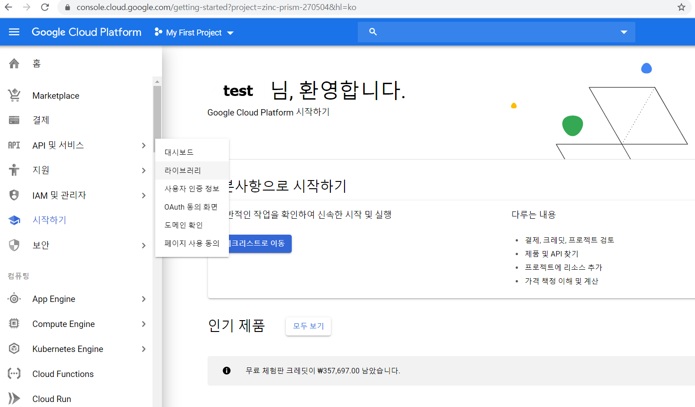
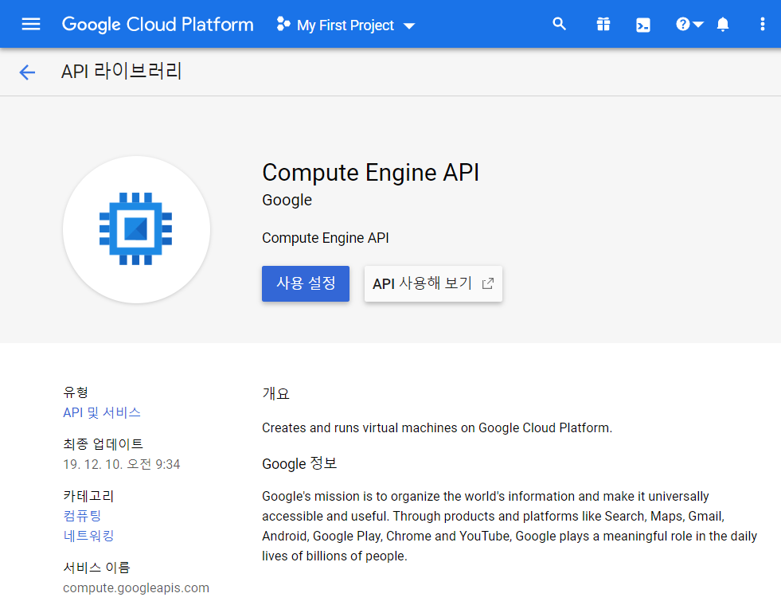
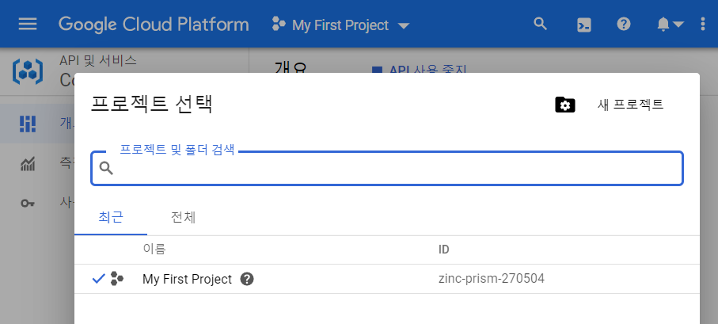
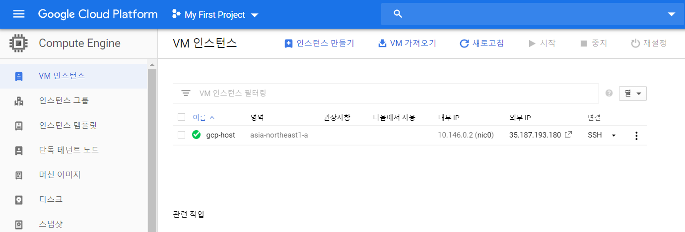
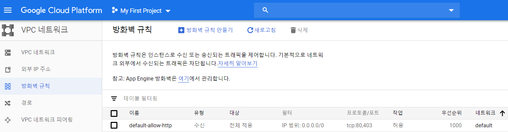
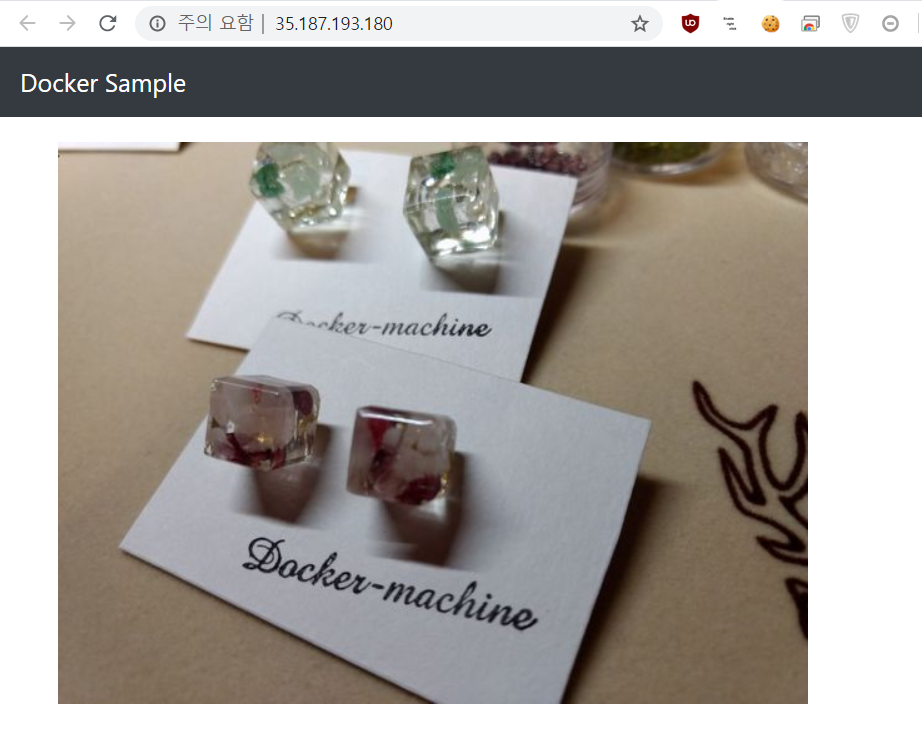

# 8. 멀티호스트 환경에서 Docker 실행 환경 구축
* 멀티호스트 환경 구축(이유)
	- 웹 어플리케이션을 제품환경에서 사양대로 올바르게 작동
	- 서비스 이용자가 항상 이용할 수 있도록 운영관리
	
---
## 8. 멀티호스트 환경에서 컨테이너 관리의 개요
* 웹 시스템 실행 환경은 웹 서버, 프록시 서버, 데이터 스토어 등 역할이 다른 여러 서버들이 연계되어 작동
	- 몰리 서버 또는 가상 머신(VM)으로 구성된 멀티호스트 환경으로 서비스를 제공하는게 일반적
* Docker를 멀티호스트 환경에서 운영 관리

---
#### 1. 멀티호스트 환경과 클러스터링
* 호스트 머신 -> Docker 가동 -> 여러 개의 이미지 작성, 컨테이너 시작
	- Docker Compose -> 여러 개의 Docker를 일원 관리
* 호스트 머신에 장애 -> Docker 위의 모든 서비스 정지 -> 비즈니스 기회 상실 및 기업의 사회적 신용 하락

* 장애가 발생해도 서비스가 정지 되니 않도록 만들 장치가 필요 -> '클러스터링' 
* __클러스터링__
	- 여러 대의 서버나 하드웨어를 모아 한 대처럼 보이게 하는 기술

##### 클러스터링의 이점 2가지
* 가용성(Availabilty)
	- 계속해서 가동될 수 능력(높은 신뢰성 획득)

* 확장성(Scalability)
	- 여러 대의 컴퓨터를 클러스터화하여 처리를 분산 시킴
	- 클라우드의 가상머신의 경우 '오토스케일' 기능을 제공하기도 함
	
###### Docker 멀티호스트
* 단일 또는 여러 대의 호스트 머신에서 Docker를 이용한 높은 가용성과 확장성을 가진 어플리케이션 실행 환경 구축 가능
* 컨테이너 오케스트레니션 툴
	- 멀티호스트 환경에서 컨테이너들의 클러스터링을 수행
* 멀티호스트 환경에서는 
	- 컨테이너 장애 또는 호스트 머신 가동 상황 등을 감시하는 장치 필요함
	- 컨테이너 실행 환경을 지원하는 통합 감시 툴 또는 클라우드 감시 서비스 등 사용 권장

 
---
#### 2. Docker Machine이란?
* 호스트 머신/클라우드/가상 환경 등에 Docker의 실행 환경을 만들 수 있는 __'커맨트라인 툴'__
* Docker Machine을 사용하면 어디서든 명령 하나로 Docker의 실행 환경 구축 가능
* Docker Machine : https://docs.docker.com/machine/


---
## 8.2 웹 어플리케이션을 서비스 공개해 보자
* Google Cloud Platform(GCP)의 Google Compute Engine(GCE)을 사용하여 인터넷 상에 웹 어플리케이션 서비스 공개
* Docker Machine을 사용하여 Docker 실행 환경 구축

---
#### 1. Docker 실행 환경 작성

##### 1.1 GCE에 Docker 실행 환경 만들기

* GCP에 계정을 만들고, GCP 홈으로 이종
* [API 및 서비스] -> [라이브러리]


* 'Google Compute Engine' 검색
* [사용 설정] 클릭


* 기본적으로 하나의 프로젝트가 생성되어 있음
* 프로젝트 ID를 확인함('MY First Profect' 옆 [아래 화살표])
	- '새 프로젝트' 작성은 '완벽한 IT 인프라 구축을 위한 Docker'의 '부록 Google Cloud Platform 사용법' 참조
	- '6. Docker 이미지 공개'에서 사용한 '프로젝트 ID'를 그대로 사용할 예정  


* 'Google Cloud SDK' 설치 필요
	- `snap install google-cloud-sdk --classic`
	- 인증 철차도 필요하기에, '부록 Google Cloud Platform 사용법'의 cloud SDK 설치하기' 참조
	- `./google-cloud-sdk/install.sh` -> `gcloud init` -> `gcloud auth login`
	- `gcloud auth revoke --all` -> 모든 login한 계정 제거

* GCP 프로젝트 설정
```zsh
root@Ubuntu ~ % gcloud config set project zinc-prism-270504
Updated property [core/project].
root@Ubuntu ~ % PROJECT_ID=$(gcloud config list project --format "value(core.project)")
root@Ubuntu ~ % echo $PROJECT_ID
zinc-prism-270504
```

##### 1.2 Docker Machine 설치 및 설정
* 아래의 링크를 참조해 Docker Machine 설치
	- https://docs.docker.com/machine/install-machine/

Ex) Docker Machine 설치 및 확인
```zsh
root@Ubuntu ~ % base=https://github.com/docker/machine/releases/download/v0.16.0 &&
  curl -L $base/docker-machine-$(uname -s)-$(uname -m) >/tmp/docker-machine &&
  sudo mv /tmp/docker-machine /usr/local/bin/docker-machine &&
  chmod +x /usr/local/bin/docker-machine
  % Total    % Received % Xferd  Average Speed   Time    Time     Time  Current
                                 Dload  Upload   Total   Spent    Left  Speed
100   617  100   617    0     0   1424      0 --:--:-- --:--:-- --:--:--  1428
100 26.8M  100 26.8M    0     0  3770k      0  0:00:07  0:00:07 --:--:-- 5735k
root@Ubuntu ~ % docker-machine version
docker-machine version 0.16.0, build 702c267f
```

Ex) GCP에 인증  
```zsh
root@Ubuntu ~ % gcloud auth application-default login
Credentials saved to file: [/root/.config/gcloud/application_default_credentials.json]
```
* 참조 : https://docs.docker.com/machine/drivers/gce/

Ex) GCE에서 실행 환경 작성  
```zsh
root@Ubuntu ~ % docker-machine create --driver google \
--google-project $PROJECT_ID \
--google-zone asia-northeast3-a \
--google-machine-type f1-micro \
--google-tags 'http-server' \
--google-machine-image https://www.googleapis.com/compute/v1/projects/ubuntu-os-cloud/global/images/ubuntu-1604-xenial-v20200223 \
gcp-host
Running pre-create checks...
(gcp-host) Check that the project exists
(gcp-host) Check if the instance already exists
Creating machine...
~생략~
Provisioning with ubuntu(systemd)...
Installing Docker...
~생략~
Docker is up and running!
To see how to connect your Docker Client to the Docker Engine running on this virtual machine, run: docker-machine env gcp-host
```
* 참조 : https://docs.docker.com/machine/drivers/gce/

###### GCP 관련 옵션
* --driver 옵션
	- GCE상에 실행 환경 구축, 드라이버값에 'google' 사용
	
* --google-project 옵션
	- GCP는 프로젝트 단위로 리소스 관리, Docker 실행 환경을 구축하는 프로젝트 지정
	- 위의 '예'에서는 '환경변수'를 사용함
	
* --google-zone 옵션
	- 인스턴스를 생성한 리전(region)을 지정 <!-- reginon: 지방, 지역-->
	- 옵션을 사용 안하면, 미국 중부인 'us-central1-a'로 인스턴스가 생성됨
	- 대한민국 서울 : 'asia-northeast3-a'
	- 참고 : https://cloud.google.com/compute/docs/regions-zones
	
* --google-machine-type 옵션
	- GCE 인트턴스 머신 타입을 지정
	- 머신 타입에 따라 가상 CPU, 메모리 크기, 시간당 요금이 달라짐
	- 'f1-micro' : 공유된 물리적 코어로 지원되며, 0.2개의 vCPU와 0.6GB의 메모리를 사용하는 마이크로 머신 유형
	- 참고 : https://cloud.google.com/compute/docs/machine-types
	
* --google-tags 옵션
	- GCE 인트턴스에 설정할 태그 지정, 여러 개 설정할 때는 ","(콤마)로 구분
	- 'http-server' : 인스턴스에 대해 외부에서 HTTP(80번 포트)를 열기 위해 사용

* --google-machine-image 옵션
	- GCE 인트턴스에 머신 이미지 지정
	- 인트턴스 이미지 URL목록 확인
	`gcloud compute images list --uri`


##### 1.3 GCE에 Docker 실행 환경 만들기

Ex) Docker 실행 환경 확인
```zsh
root@Ubuntu ~ % docker-machine ls
NAME       ACTIVE   DRIVER   STATE     URL                         SWARM   DOCKER     ERRORS
gcp-host   -        google   Running   tcp://35.187.193.180:2376           v19.03.7
```
* 'STATE'가 'Running'으로 확인  


* GCP의 웹 콘솔에서 [홈] -> [Compute Engine] -> [VM 인스턴스] 클릭


---
#### 2. 웹 어플리케이션 전개
* GCE상에 Docker 실행 환경 완료
	- 웹 어플리케이션 전개

Ex) GCE상의 실행 환경에 대한 액세스  
```zsh
➜   docker-machine ssh gcp-host
Welcome to Ubuntu 16.04.6 LTS (GNU/Linux 4.15.0-1055-gcp x86_64)

 * Documentation:  https://help.ubuntu.com
 * Management:     https://landscape.canonical.com
 * Support:        https://ubuntu.com/advantage


2 packages can be updated.
1 update is a security update.

New release '18.04.4 LTS' available.
Run 'do-release-upgrade' to upgrade to it.


docker-user@gcp-host:~$
```
* SSH로 연결하여 프롬프트가 바뀜

Ex) 컨테이너 시작  
```zsh
docker-user@gcp-host:~$ sudo docker container run --name webserver -it -p 80:80 asashiho/photoview-image
Unable to find image 'asashiho/photoview-image:latest' locally
latest: Pulling from asashiho/photoview-image
18c8f805be45: Pull complete
f7869fb3b98c: Pull complete
f75000414ffb: Pull complete
c27c5092058d: Pull complete
add65c7404ea: Pull complete
529875a07df8: Pull complete
8806830df72a: Pull complete
bc307a47fe64: Pull complete
Digest: sha256:b2c35e41de502b98245ebdbb055066f375670e87e018dac7ffb9967103128f36
Status: Downloaded newer image for asashiho/photoview-image:latest
```
*  GCE 인스턴스에 액세스하여, IP주소(35.187.193.180) 확인 후, 작동 확인
* 웹 주소 환경 샘플 : https://github.com/asashiho/photoview-image/blob/master/Dockerfile

##### 만약 접속이 안되면 '방화벽' 설정 확인

* GCP의 웹 콘솔에서 [홈] -> [VPC 네트워크] -> [방화벽 규칙] 클릭


* [Ctrl + C]로 정지, `exit`로 가상머신의 SSH 연결 해제

---
#### 3. Docker 실행 환경 삭제
`docker-machine rm [옵션] 머신명 [머신명]`  


Ex) 실행 환경 삭제  
```zsh
root@Ubuntu: /root
➜   docker-machine rm gcp-host
About to remove gcp-host
WARNING: This action will delete both local reference and remote instance.
Are you sure? (y/n): y
(gcp-host) Deleting instance.
(gcp-host) Waiting for instance to delete.
Successfully removed gcp-host
```
* 다른 환경에서 `docker-machine` 명령을 사용해 구축 가능
	- Digital Ocean, VMware 등 (환경마다 다르므로 자세한 방법은 공식 사이트 참조)
	- Amazon Wev Services, Microsofr Azure는 'Docker Cloud' 제공


---
## 8.3. Docker Machine을 사용한 실행 환경 구축

---
#### 1. Docker Machine의 기본 명령

Ex) Docker Machine의 버전 확인  
```zsh
root@Ubuntu: /root
➜   docker-machine --version
docker-machine version 0.16.0, build 702c267f
```

* Docker Machine의 서브 명령

서브 명령 | 설명
:---:|---
create|	실행 환경 작성
ls	|실행 환경 목록 표시
status|	실행 환경 상태 표시
url	|실행 환경 URL 표시
ssh	|실행 환경에 대한 SSH 연결
start|	실행 환경 시작
stop|	실행 환경 정지
restart|	실행 환경 재시작
scp	|실행 환경에서 파일 다운로드
rm	|실행 환경 삭제
kill|	실행 환경 강제 정지
ip	|실행 환경 IP 주소 확인
inspect|	실행 환경 정보 확인

---
#### 2.1 실행 환경 작성
`docker-compose create --driver <드라이버명> <작성할 Docker 머신명>`  

* --dirver 옵션에서 지정할 수 있는 드라이버
드라이버명	|작성할 환경|	공식 사이트
---|---|---
amazonec2|	Amazon Web Services|	https://docs.docker.com/machine/drivers/aws/
azure	|Microsoft Azure|	https://docs.docker.com/machine/drivers/azure/
digitalocean|	DigitalOcean|	https://docs.docker.com/machine/drivers/digital-ocean/
exoscale|	Exoscale|	https://docs.docker.com/machine/drivers/exoscale/
...|	...|	...
* 참고 : https://docs.docker.com/machine/drivers/


* azure 드라이버에서 사용 가능 옵션

옵션	|설명| 기본값
---|---|---
--azure-subscription-id | Azure 서브스크립션 ID(필수)|- 
--azure-image			| Azure 이미지명 | canonical:UbuntuServer:16.04.0-LTS:latest
--azure-docker-port		| Docker가 사용할 포트 | 2376
--azure-location		| Azure의 로케이션 | westus
...|	...|	...


Ex) Docker Machine 드라이버의 헬프 확인  
```zsh
root@Ubuntu: /root
➜   docker-machine create --driver azure --help
Usage: docker-machine create [OPTIONS] [arg...]

Create a machine

Description:
   Run 'docker-machine create --driver name --help' to include the create flags for that driver in the help text.

Options:

   --azure-availability-set "docker-machine"                                                           Azure Availability Set to place the virtual machine into [$AZURE_AVAILABILITY_SET]
   --azure-client-id                                                                                   Azure Service Principal Account ID (optional, browser auth is used if not specified) [$AZURE_CLIENT_ID]
~생략~
   --swarm-strategy "spread"                                                                           Define a default scheduling strategy for Swarm
   --tls-san [--tls-san option --tls-san option]                                                       Support extra SANs for TLS certs
```

---
##### Virtulbox 설치
`apt-get install virtualbox`
* Docker Machine의 기본 driver는 virtualbox로 되어 있음
* 실습을 위해 호스트 머신에 virtualbox를 설치해 사용
* 로컬 머신 생성
	-`docker-machine create [--driver=virtualbox] host1`
	- 'host1 ~ 4'로 4개 정도 만듬

* 아래 오류 발생시
	```zsh
	Error with pre-create check: "This computer doesn't have VT-X/AMD-v enabled. Enabling it in the BIOS is mandatory"
	```
	* 호스트 머신 종료 후 -> VM -> 설정 ---> 프로세서-> [가상화 Intel VT-x/EPT ro AMD-V/RVI] 활성화 체크

* 로컬 머신 스타트
	- `docker-machine start host1 host2`

* 참고 : https://docs.docker.com/machine/drivers/virtualbox/

###### 오류 발생
* 문제가 발생하는 환경
	- VMware Workstation 14.1.1 및 Ubuntu Server 16.04.4
	- VMware Workstation 15.5.0 및 18.04.2_64bit
	- Docker Engine Community Version 19.03.5 및 docker-machine version 0.12.2.
	- Docker version 19.03.7 및 docker-machine version 0.16.0,
	
* 문제 현상
	- 호스트 머신에 virtualbox 설치후
		+ `docker-machine create [--driver=virtualbox] 머신명`
	- 첫 번째 '로컬 머신'생성 후 두번째 머신 생성부터 ERROR 발생
	- 구글링 결과 다수의 같은 현상의 문제를 가진 사람들 확인
	- 실제 시스템에는 나타나지 않는 것으로 보임

* 문제 원인
	- '인증서' 문제로 보임, 'TLS machine certs' 문제
	- 해결방법 찾는 중

* 해결
	```zsh
	# docker-machine env host2                                                                   [18:14:22]
	Error checking TLS connection: Error checking and/or regenerating the certs: There was an error validating certificates for host "192.168.99.100:2376": x509: certificate signed by unknown authority
	You can attempt to regenerate them using 'docker-machine regenerate-certs [name]'.
	Be advised that this will trigger a Docker daemon restart which might stop running containers.

	FAIL: 1


	# docker-machine regenerate-certs host2                                                      [18:15:12]
	Regenerate TLS machine certs?  Warning: this is irreversible. (y/n): y
	Regenerating TLS certificates
	Waiting for SSH to be available...
	Detecting the provisioner...
	Copying certs to the local machine directory...
	Copying certs to the remote machine...
	Setting Docker configuration on the remote daemon...
	```
	
---
#### 2.2 실행 환경 목록 표시
`docker-compose ls [옵션]`  
	* 주요 옵션  
	--quiet, -q	: 머신명만 표시
	--filter	: 표시할 머신을 필터링

* docker-machine ls 명령의 표시 항목

항목|	설명
:---:|---
NAME	|머신명
ACTIVE	|상태
DRIVE	|사용 중인 드라이버
STATE|	스테이터스(Running|Paused|Saved|Stopped|Stopping|Starting|Error)
URL	|엑세스 URL
SWARM|	Docker Swarm의 매니저명
DOCKER|	Docker 버전
ERRORS|	오류


<!-- 로컬에 있는 여러 머신을 동신에 작동 못 시키고 있음(에러 발생) -->
Ex) 실행 환경 목록 표시  
```zsh
root@Ubuntu: ~
# docker-machine ls --filter driver=virtualbox --filter state=Running                        [17:31:22]
NAME    ACTIVE   DRIVER       STATE     URL                         SWARM   DOCKER     ERRORS
host1   *        virtualbox   Running   tcp://192.168.99.100:2376           v19.03.5
```
* `--filter` 옵션을 사용하여 표시 정보 필터링(key=value)
* 필터 조건은 여러 개 가능
	- ViretualBox상에서 작동하는 호스트 중 'STATE'가 'Running'인 것만 표시
<!-- 임시 -->

Ex) 실행 환경의 스테이터스 확인  
```zsh
root@Ubuntu: ~
# docker-machine status host1                                                                [16:55:12]
Running
```
* status : 스테이터스 확인

Ex) 실행 환경의 URL 확인  
```zsh
root@Ubuntu: ~
# docker-machine url host1                                                                   [16:56:33]
tcp://192.168.99.100:2376
```
* url : URL 확인


---
#### 2.3 실행 환경에 대한 SSH 연결
`docker-compose ssh 머신명`  

Ex) ssh 연결  
```zsh
root@Ubuntu: ~
# docker-machine ssh host1                                                                   [16:47:19]
   ( '>')
  /) TC (\   Core is distributed with ABSOLUTELY NO WARRANTY.
 (/-_--_-\)           www.tinycorelinux.net
```

---
#### 2.4 실행 환경 시작/정지/재시작 
`docker-compose start 머신명 [머신명]`  
`docker-compose stop 머신명 [머신명]`  
`docker-compose restart 머신명 [머신명]`  
* Docker 실행 환경 작성은 시간이 많이 걸림

Ex) 실행 환경 시작/정지/재시작  
```zsh
root@Ubuntu: ~
# docker-machine start host1                                                                 [16:52:38]
Starting "host1"...
(host1) Check network to re-create if needed...
(host1) Waiting for an IP...
Machine "host1" was started.
Waiting for SSH to be available...
Detecting the provisioner...
Started machines may have new IP addresses. You may need to re-run the `docker-machine env` command.

root@Ubuntu: ~
# docker-machine stop host1                                                                  [16:53:52]
Stopping "host1"...
Machine "host1" was stopped.

root@Ubuntu: ~
# docker-machine restart host1                                                               [16:54:24]
Restarting "host1"...
Starting "host1"...
(host1) Check network to re-create if needed...
(host1) Waiting for an IP...
Machine "host1" was started.
Waiting for SSH to be available...
Detecting the provisioner...
Waiting for SSH to be available...
Detecting the provisioner...
Restarted machines may have new IP addresses. You may need to re-run the `docker-machine env` command.
```

---
#### 2.5 실행 환경으로부터 파일 다운로드
`docker-compose scp [옵션] [[유저@]머신명:][path] [[유저@]머신명:][path].`  
* 실행 환경 안의 파일 다운로드
* ssh의 scp와 같음

Ex) 실행 환경에서 파일 다운로드  
```zsh
root@Ubuntu: ~
# docker-machine scp host1:/etc/passwd .                                                     [17:00:12]
passwd                                                          100%  271   255.1KB/s   00:00

root@Ubuntu: ~
# ls                                                                                         [17:00:32]
Docker  docker-machine-vmwareworkstation  dockertext2  fonts  passwd  sample  snap  test
```

---
#### 2.6 실행 환경 삭제
`docker-compose rm [옵션] 머신명`  
* '-f' 옵션 : 작동 중인 실행 환경을 강제로 삭제

`docker-compose kill 머신명`  
* 실행 중인 머신 강제로 정지, `docker-compose stop` 명령이 안 통할 때 사용 권장

Ex) 실행 환경 삭제  
```zsh
root@Ubuntu: ~
# docker-machine rm -f host1                                                                 [17:22:22]
About to remove host1
WARNING: This action will delete both local reference and remote instance.
Successfully removed host1
```

Ex) 실행 환경 강제 정지  
```zsh
root@Ubuntu: ~
# docker-machine kill host2                                                                  [17:24:58]
Killing "host2"...
Machine "host2" was killed.
```

---
#### 2.7 실행 환경 정보 확인
`docker-compose ip [옵션]`  

`docker-compose inspect [옵션] 머신명` 
* 메모리, CPU 등과 같은 구성의 상세 정보 확인
* JSON 배열 형식

Ex) IP 주소 확인  
```zsh
root@Ubuntu: ~
# docker-machine ip host1                                                                    [17:00:36]
192.168.99.100
```

Ex) 실행 환경 상세 정보 확인 1  
```zsh
root@Ubuntu: ~
# docker-machine inspect host1                                                               [17:02:36]
{
    "ConfigVersion": 3,
    "Driver": {
        "IPAddress": "192.168.99.100",
        "MachineName": "host1",
        "SSHUser": "docker",
        "SSHPort": 39185,
        "SSHKeyPath": "/root/.docker/machine/machines/host1/id_rsa",
        "StorePath": "/root/.docker/machine",
        "SwarmMaster": false,
        "SwarmHost": "tcp://0.0.0.0:3376",
~생략~
    "Name": "host1"
}
```

Ex) 실행 환경 상세 정보 확인 2  
```zsh
root@Ubuntu: ~
# docker-machine inspect --format='{{.Driver.IPAddress}}:{{.Driver.SSHUser}}' host1          [17:32:39]
192.168.99.100:docker
```
* `--format` 옵션으로 출력 포맷을 정함

---
