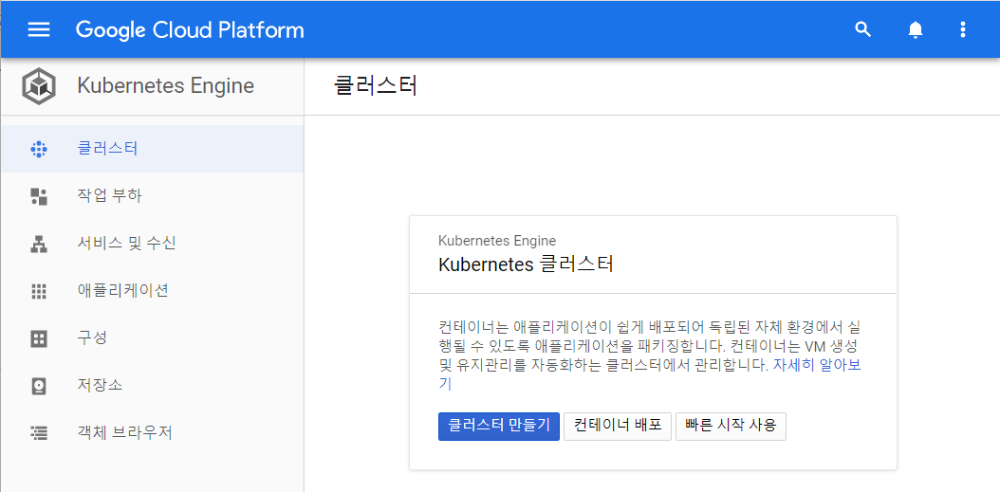
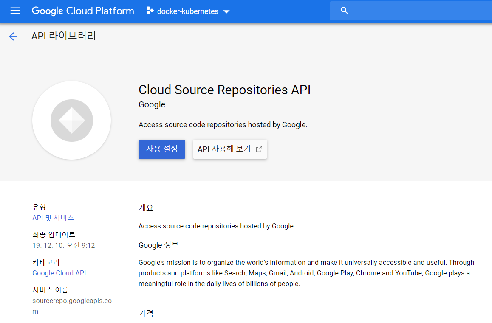
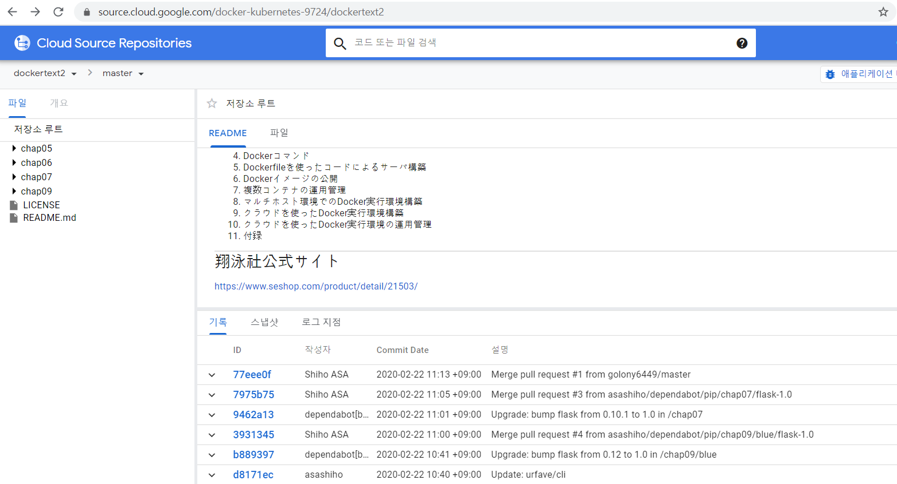
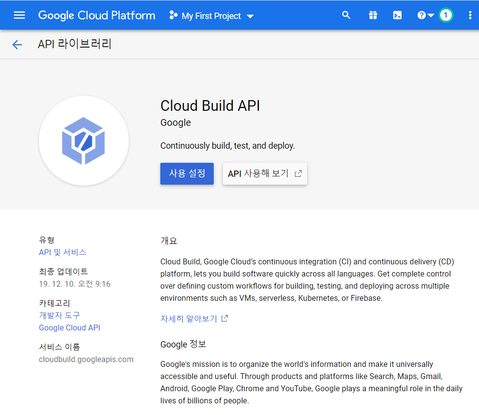
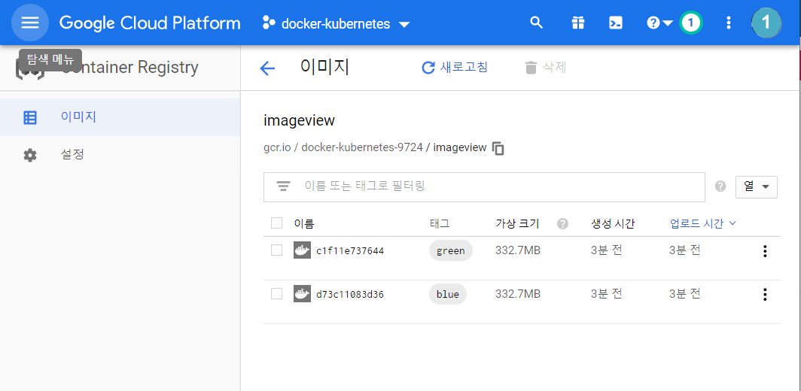
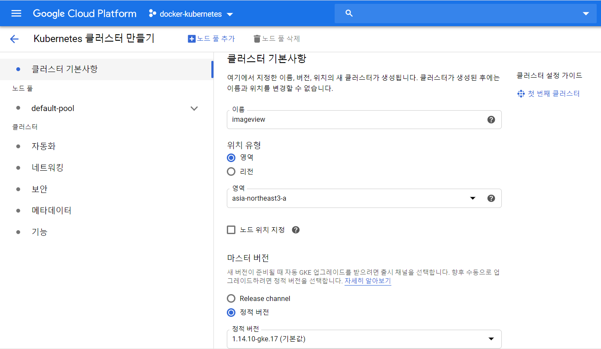
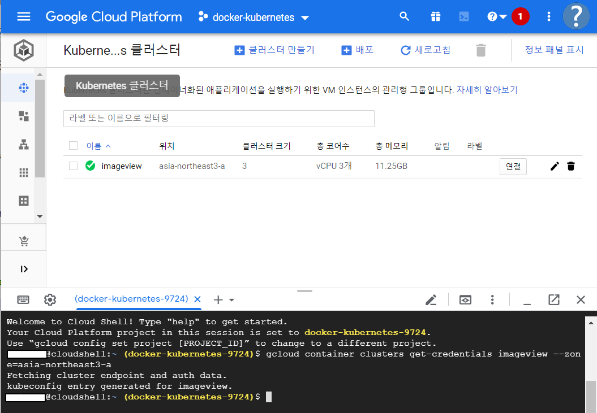
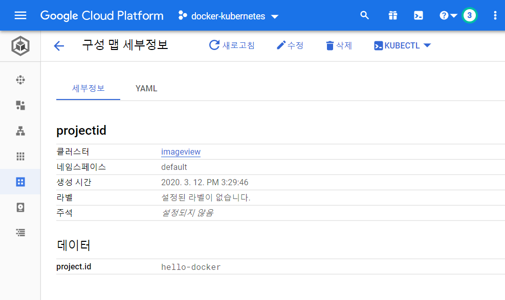
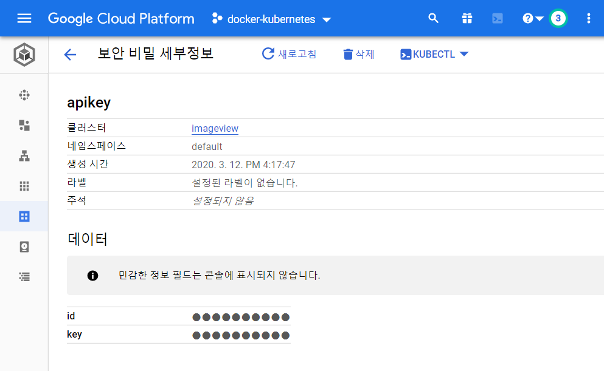

# 9. 클라우드를 사용한 Docker 실행 환경 구축
* Docker의 최대 매력
	- 높은 이식성
	- 온프레미스, 프라이빗 클라우드, 퍼블릭 클라우드, 하이브리드 클라우드에 이르기까지 실행 환경을 요구사항에 맞춰 자유롭게 선택 가능
* Google Cloud Platform(GCP)의 Google Kubernetes Engine(GKE)를 사용하여 Docker 실행 환경 구축

---
## 9.1 클라우드 환경에서 Docker 오케스트레이션하기

---
#### 1. 분산 환경에서의 컨테이너 운용 관리
* 스케줄링
	- 하나의 머신 : 컨테이너의 시작 및 정지
	- 멀티호스트 : 컨테이너의 시작 및 정시, 호스트 간 네트워크 연결, 스토리지 관리, 컨테이너를 어떤 호스트에서 가동시킬지 결정
	- 멀티호스트에서 필요한 다양 관리 기능 '스케줄링' 

* 대표적인 오케스트레이션 툴
	- Kubernetes
		+ Google의 오픈소스 컨테이너 오케스트레이션 툴
		+ 제공 기능 풍부, 대규모 시스템에 도입 실적 풍부, 실질적인 스탠다드
	- Docker Engine(Swarm 모드)
		+ Swarm 모드 : Docker에서 제공하는 클러스터링 기능
		+ 여러 개의 컨테이너를 멀티호스트 환경에서 작동, 그 컨테이너들을 모아서 하나의 명령으로 조작
	- Apache Mesos, Marathon
		+ 오픈소스 컨테이너 오케스트레이션 툴
		+ 대규모 클러스터 지원
		+ 여러 호스트의 CPU, 메모리, 디스크를 추상화하여 하나의 리소스 풀로 다룰 수 있는 특징
			=> Marethon 이라는 별도의 컨테이너 관리용 프레임워크가 필요
---
#### 2. 퍼블릭 클라우드가 제공하는 매니지드 서비스
* 온프레미스 환경에 도입 -> 하드웨어나 네트워크에 대한 지식이 필요
* 클라우드의 가상 머신 인스턴트 구축 -> 인프라 환경 구축, 오케스트레이션 툴, 감시 툴 사용법, 시스템 운용 밑 장애 대응 등 지식이 필요
	- 운영 난이도가 높음
* 퍼블릭 클라우드가 제공하는 '매니지드 서비스' 이용
	- 인프라에 관한 깊은 지식이 없어도 컨테이너 쉽게 운용
	- 어플리케이션 개발, Docker 이미지 작성 및 실행, 테스트 등 개발 업무 주력 가능
	
###### Amazon EC2 Container Service(Amazon ECS)
* AWS의 가상 머신 기능을 제고하는 Amazon EC2를 사용한 Docker 컨테이너 관리 서비스
	- Amazon ECS은 '태스크 정의'라고 하는 JSON 템플릿을 사용하여 환경을 정의
	- 리소스와 가용성 요구사항을 바탕으로 클러스터 전체에 컨테이너를 배치하는 스케줄러 기능
	- 컨테이너 장애 복구, 부하분산(Elastic Load Balancing - ELB) 기능
	- Amazon CloudWatch와 연계 리소스 감시 가능
	- 과학기술계산을 위한 분산 배치 처리 실행 서비스인 Amazon Batch 제공
	
###### Azure Container Service(AKS)
* Microsoft Azure의 컨테이너 매니저드 서비스, Kubernetes 지원
	- 프라이빗 registry 서비스인 Azure Container Registry 제공
	- Azure Batch Shipyrd라는 과학기술계산 등의 용도로 이옹되는 대규모 분산 배치 처리 기반의 일부로도 Docker가 이용됨

###### Google Kubernetes Engine(GKE)
* google이 제공하는 Google Cloud Platform(GCP)의 컨테이너 매니지드 서비스

---
#### 3. Google Cloud Platform의 컨테이너 관련 서비스
* Google Cloud Platform(GCP)
	- Google이 제공하는 퍼블릭 클라우드 서비스
	- 자사가 사용하는 인프라(YouTube, Gmail 등)를 일반사용자에게도 이용할 수 있도록 서비스 함

##### Google Container Builder
* Dockerfile을 바탕으로 Docker 이미지를 GCP 상에 작성하기 위한 툴
	- Dockerfile을 저장하는 '소스 리포지토리'에 저장된 'Dockerfile' -> 이미지 build하고 Container Registry로 자동 업로드
	- '소스 리포지토리'는 Google Cloud Source Repositories, GitHub, Hitbucket을 이용 가능
	- 작성한 Docker 이미지는 Google Cloude Storage(유럽/아시아/미국 리전)에 지정해 저장 가능
	- 스토리지에 액세스 사용자를 지정 가능하기에 프라이빗한 환경에서 이미지를 안전하게 관리 가능
	
##### Google Kubernetes Engine(GKE)
* Docker 컨테이너를 관리하는 풀매니지드 서비스
	- 사용자가 정의한 CPU, 메모리와 같은 인프라 요구사항을 바탕으로 컨테이너를 클러스터에 스케줄링하여 자동 관리
	- 컨테이너에 할당되는 클러스터 리소스나 컨테이너 클러스터의 크기를 조정 가능
	- Kubernetes의 kubectl 명령 또는 Cloud Console에서 조작 가능


##### Google Container Registry
* Docker 이미지를 GCP의 제품 안에서 관리할 수 있는 프라이빗 registry 서비스
	- 저장 위치는 Google Cloude Storage(유럽/아시아/미국 리전)에서 Compute Engine 인스턴스 지리적으로 가까운 곳에 지정 가능
	- Docker Registry V2 API 사용, 프라이빗 registry에 대해 Docker 이미지 업로드(push)/다운로드(pull) 가능
	- Cloud Storage Nearline 버킷에 저장 가능
	
	
---
## 9.2 Kubernetes의 개요
* 여러 개의 호스트를 하나로 묶어 Docker를 이용하기 위한 오케스트레이션 툴
* 주요 기능	
	- 여러 서버들에서의 컨테이너 관리
	- 컨테이너 간 네트워크 관리
	- 컨테이너의 부하분산
	- 컨테이너의 감시
	- 무정지로 업데이트

---
#### 1. Kubernetes의 서버 구성
[^출처2]

##### 마스터 서버(Kubernetes Master)
* Kubernetes 클러스터 전체를 컨트럴 하는 시스템, Kubernetes 클러스터안의 컨테이너를 조작하기 위한 서버
	- 노드의 리소스 사용 상황 확인, 컨테이너 시작시 노드 자동 선택
* API 서버, 스케쥴러, 컨트롤러 매니져로 구성(etcd를 포함하기도 함)
* kubectl 명령 사용

###### API 서버
* Kubernetes의 모든 명령과 통신을 API를 통해서 처리하는 서버
* Kubernetes의 모든 기능들을 REST API로 제공하고 그에 대한 명령을 처리

###### 스케쥴러
* Pod, 서비스 등 각 리소스들을 적절한 노드에 할당하는 역할

###### 컨트롤러 매니져
* 컨트롤러(Replica controller, Service controller, Volume Controller, Node controller 등)를 생성하고 이를 각 노드에 배포하며 이를 관리하는 역할


##### 백엔드 데이터베이스(etcd)
* etcd라 부르는 분산 키 밸류 스토어(KVS)를 사용하여 클러스터 구성 정보 관리
	- 클러스터를 구축하기 위한 설정 정보
* 마스터 서버 상에 구축하기도 함, 다중화 검토 필요

##### 노드
* 실제로 Docker 컨테이너를 작동시키는 서버
* 마스터 서버로부터 명령을 받고, 실제 워크로드를 생성하여 서비스 하는 컴포넌트이기도 함
* 클라우드에서느 가상머신 인스턴스가 노드가 됨

---
#### 2. 애플리케이션 구성 관리(Pod, ReplicaSet, Deployment)

##### Pod(포드)
* 여러 개의 컨테이너를 모아서 'Pod'로 관리
* Pod 단위로 어플리케이션 관리(웹 서버 컨테이너 + 프록시 서버 컨테이너)
* Pod 안의 여러 컨테이너 가상 NIC(프라이빗 IP)를 공유함
* Pod가 여러 개의 노드에 걸칠 수는 없음(역할이 다른 기능을 하나의 Pod에 저장하면 안됨) 

##### ReplicaSet(리플리카 셋)
* 지정한 수 만큼 Pod를 항상 실행시켜 유지하는 장치
* 실행중인 Pod 감시 -> 장애와 같은 이유로 정지 -> 해당 Pod 삭제 후, 새로운 Pod 실행
* Pod의 수를 동적으로 변경하여 오토스케일 구현 가능

##### Deployment(디플로이먼트, 전개) 
* Pod와 ReplicaSet의 모음, ReplicaSet의 이력 관리
* Deployment는 ReplicaSet의 템플릿을 가지고 ReplicaSet의 작성이나 갱신함
* 이력 관리를 통해, Pod안의 컨테이너의 버전을 롤링 업데이트 및 롤백 가능
* etc : DaemonSet, Jobs, CronJob

---
#### 3. 네트워크 관리(Serviced)
* Kubernetes 클라스터 안에서 실행되는 Pod에 대해, 외부로부터 액세스할 때의 서비스를 정의
* 서비스는 Kubernetes 네트워크를 관리함
	- Load Balancer : 서비스에 대응하는 IP + Port에 액세스하면 여러 Pod에 대한 레이어 4 레벨의 부하분산이 일어남
* Cluster IP
	- 클러스터 안의 Pod끼리 통신을 하기 위한 프라이빗 IP 주소(노드 상의 Proxy 데몬이 처리)
* Externl IP
	- 외부 클라이언트가 연결하기 위한 퍼블릭 IP 주소

Ex) 서비스 정의 파일  
```
* 80번 포트
전송

* 글로벌 IP
주소

* 부하분산
```

---
#### 4.Label을 사용한 리소스 식별
* Kubernetes에서는 리소스 식별을 위한 이름이 랜덤하게 자동으로 부여됨
	- 리소스 관리하기 어려움 -> 알기 쉬운 Label을 붙임(운용 부담을 줄임)
* Key-Value형의 임의의 문자열 사용
* Label의 활용
	- 하나의 리소스에 여러 개 설정 가능(Pod의 역할별로 임의의 이름을 붙임)
	- 관련 있는 Pod별로 모아서 유연하게 관리
	- Kubernetes의 정의 파일인 매니페스트 파일 참조

Ex) 서비스 정의 파일  
```
labels:
	app: v1.0
	app: v2.0
selector:
	type: webbserver
	app: v1.0
```
* Selector 를 이용해 'app:v1.0'라는 Label이 붙은 Pod로만 리퀘스트 전송 가능

---
#### 5. Kubernetes의 구조
[^출처]

##### 5.1 마스터(Master)

###### API 서버(API Server)
* Kubernetes의 리소스 정보를 관리하기 위한 프론트엔드 REST API
	- 각 컴포턴트로부터 리소스 정보를 받아 데이터 스토어(etcd)에 저장
* Kubernetes의 모든 기능들을 REST API로 제공하고 그에 대한 명령을 처리
* Kubernetes의 모든 명령과 통신을 API를 통해서 처리하는 서버
	- 웹 GUI 툴, kubectl 명령 사용으로 'API Server 액세스' 및 어플리케이션 안에서 'API Server 호출' 가능
	- API Server에는 '인증 및 인가' 기능 존재

###### 스케쥴러(Scheduler)
* Pod, 서비스 등 각 리소스들을 적절한 노드에 할당하는 역할
* __Pod__를 어떤 노드에서 작동시킬지 제어하는 백엔드 컨포넌트
	- 노드에 할당되지 않은 Pod에 대해 Kubernetes 클러스터의 상태를 확인하고, 빈 영역을 가진 노드를 찾아서 Pod를 실행

###### 컨트롤러 매니져(Controller Manger)
* 컨트롤러(Replica controller, Service controller, Volume Controller, Node controller 등)를 생성하고 이를 각 노드에 배포하며 이를 관리하는 역할
* Kubernetes 클러스터의 __상태를 항상 감시__하는 백엔드 컨포넌트

##### 5.2 데이터 스토어(etcd)
* Kubernetes 클러스터 구성을 유지 관리하는 KVS
	- Key-Value 형태로 데이터를 관리
	- 어떤 Pod를 어떻게 배치할지와 같은 구성 정보를 가짐
	- API Server 참조

##### 5.3 노드(Node)
* 노드는 다음과 같은 컴포넌트로 구성됨

###### kubelet
* Pod의 정의 파일에 따라 Docker 컨네이너 실행 및 스토리지 마운트하는 기능을 가짐
* 노드 스테이터스를 정기적으로 감시 -> 변화 있으면 API Server에 통지

###### Kube-proxy
* 노드로 들어오는 네트워크 트래픽을 적절한 컨테이너로 라우팅하고, 로드밸런싱 등 노드로 들어오고 나가는 네트워크 트래픽을 프록시하고, 노드와 마스터간의 네트워크 통신을 관리 


###### Kubernetes 정의 파일(매니페스트 - manifest)
* 클러스터의 구성정보는 YAML 또는 JSON 형식의 정의 파일로 관리(텍스트 형식)
* Jenkins과 같은 소프트웨어의 버전 관리 시스템과 연게 가능
* kubectl 명령 인수로 클러스터 조작 가능(테스트나 작동 확인시)

참고 : https://kubernetes.io/docs/home

###### Docker는 영구 데이터의 관리에는 적합하지 않음
* 클라우드 테이터 관리 서비스 활용을 권장
	- 참고 : https://cloud.google.com/products/storage
	
---
## 9.3 GCP를 사용한 Docker 어플리케이션 개발

---
#### 1. 어플리케이션 개발 흐름
* 7장 Docker Compose : 로컬 pc에 웹 어플리케이션 실행 환경 전개 -> 로컬 pc만 액세스 가능
* 8장 Docker Machine : GCP 상에서 가상 머신 인스턴스 실행, 서비스를 인터넷상에 공개 -> 가상 머신 인스턴스 1대로 운용, 장애발생시 서비스 정지

* 9장 Google Cloud Platform(GCP)의 Kubernetes 매니지드 서비스인 Google Kubernetes Engine(GKE) 사용

[^출처2]

###### GCP 계정 취득 후, GCP 프로젝트 작성 필요
* 참조 : '완벽한 IT 인프라 구축을 위한 Docker 2판'의 p342


Ex) GCP 프로젝트의 설정  
```zsh
root@Ubuntu:~|⇒  gcloud config set project docker-kubernetes-9724
Updated property [core/project].
root@Ubuntu:~|⇒  PROJECT_ID=$(gcloud config list project --format "value(core.project)")
root@Ubuntu:~|⇒  echo $PROJECT_ID
docker-kubernetes-9724
```
* 작성한 '프로젝트 ID'는 GCP 웹 브라우저에서 확인



* GCP의 [탐색 메뉴] -> [API 및 서비스] -> [라이브러리] 클릭
* 'Cloud Source Repositories API' 검색 -> [사용 설정] 클릭

---
#### 2. 소스코드 관리(Cloud Source Repositories) 
* GCP에서 소스코드의 버전 관리
* 'Cloud Shell'에서 진행 가능, 여기서는 'Cloud SDK' 사용

Ex) repository 작성  
```zsh
root@Ubuntu:~/dockertext2/chap09|master⚡
⇒  gcloud alpha source repos create dockertext2
Created [dockertext2].
WARNING: You may be billed for this repository. See https://cloud.google.com/source-repositories/docs/pricing for details.
```
* 'dockertext2'라는 repository 작성

Ex) 리모트 설정  
```zsh
root@Ubuntu:~/dockertext2/chap09|master⚡
⇒  git remote add google https://source.developers.google.com/p/$PROJECT_ID/r/dockertext2
Alias tip: gra google https://source.developers.google.com/p/$PROJECT_ID/r/dockertext2
```
* Source Repositories에 작성한 repository를 Git의 리모트로 설정

Ex) repository 업로드  
```zsh
root@Ubuntu:~/dockertext2/chap09|master⚡
⇒  git push google master
Alias tip: gp google master
오브젝트 개수 세는 중: 84, 완료.
Delta compression using up to 4 threads.
오브젝트 압축하는 중: 100% (73/73), 완료.
오브젝트 쓰는 중: 100% (84/84), 756.10 KiB | 18.44 MiB/s, 완료.
Total 84 (delta 21), reused 0 (delta 0)
remote: Resolving deltas: 100% (21/21)
To https://source.developers.google.com/p/docker-kubernetes-9724/r/dockertext2
 * [new branch]      master -> master
```
* Source Repositories에 업로드
* GCP의 [탐색 메뉴] -> [소스 저장소] 클릭
	- 처음에는 새로 만들어야 하며, 'dockertext2'라는 repository를 인식을 못함
	- 직접 링크는 가능 'https://source.developers.google.com/p/docker-kubernetes-9724/r/dockertext2'

Ex) repository 업로드 오류 발생 시  
```zsh
Invalid authentication credentials.

Please generate a new identifier:
  https://source.developers.google.com/new-password
```
* 링크를 따라가서, 하라는대로 따라함


* 실제로 어플리케이션을 개발할 때는 GCP 공식 사이트 확인
	- 참고 : https://cloud.google.com/source-repositories

Ex) 샘플 어플리케이션 디렉터리 구성
```zsh	
root@Ubuntu:~/dockertext2/chap09|master⚡
⇒  tree -L 3
.
├── blue
│   ├── Dockerfile
│   ├── app.py
│   ├── requirements.txt
│   ├── static
│   │   ├── css
│   │   └── images
│   └── templates
│       └── index.html
├── config
│   ├── cloudbuild.yaml
│   ├── configmap.yaml
│   ├── cronjob.yaml
│   ├── deployment-blue.yaml
│   ├── deployment-green.yaml
│   ├── secrets.yaml
│   └── service.yaml
└── green
    ├── Dockerfile
    ├── app.py
    ├── requirements.txt
    ├── static
    │   ├── css
    │   └── images
    └── templates
        └── index.html

11 directories, 15 files
```

---
#### 3. Docker 이미지 빌드(Cloud Continer Builder)
* Cloud Container Builder를 사용하면 Dockerfile의 빌드부터 Cloud Source REepositories에 업로드 가능

##### API 유효화하기
* GCP의 [탐색 메뉴] -> [API 및 서비스] -> [라이브러리] 클릭
	- 'google Kubernetes Engine API' 검색 -> [사용 설정] 클릭
	- 'google Container Registry API' 검색 -> [사용 설정] 클릭
	- 'google Cloud Build API' 검색 -> [사용 설정] 클릭



##### Docker 이미지 빌드 파일
* 'Cloud Shell을 실행하여 사용


Ex) 샘플 앱의 다운로드  
```bash
git clone https://github.com/asashiho/dockertext2
cd dockertext2/chap09/
```
* chap09/config/cloudbuild.yaml
	- Container Builder를 사용하여 Docker 이미지를 작성할 때 송신될 build 리퀘스트를 정의한 파일
	- JSON 또는 YAML 형식으로 기술한 text 파일

* 빌드 스텝
	- 컨네이너를 빌드하기 위한 실행 명령
	- 빌드 스텝이 성공하며 Docker 이미지 생성
	- 빌드 완료되면 Google Container Registry에 Docker 이미지 업로드(push)
* 이미지
	- 생성할 Docker 이미지 정보 설정

Ex) 빌드 구성 파일의 빌드 스텝 정의  
```bash
steps:
  - name: 'gcr.io/cloud-builders/docker'
    args: ['build', '-t', 'gcr.io/$PROJECT_ID/imageview:blue', './blue']
  - name: 'gcr.io/cloud-builders/docker'
    args: ['build', '-t', 'gcr.io/$PROJECT_ID/imageview:green', './green']
images: ['gcr.io/$PROJECT_ID/imageview:blue', 'gcr.io/$PROJECT_ID/imageview:green']
```
* [steps] 필드 : Docker 명령을 실행하기 위해 [name]에 'gcr.io/cloud-builders/docker'를 지정
	- [args]에는 인수 지정

Ex) 빌드 구성 파일의 명령  
```bash
docker build -t gcr.io/$PROJECT_ID/imageview:blue ./blue
```
* ./blue에 저장되어 있는 Dockerfile을 바탕으로 'gcr.io/$PROJECT_ID/imageview:blue'라는 태그명이 붙은 이미지로 빌드\
* 'green'의 Docker 이미지도 정의되어 총 2개의 빌드 실행

Ex) 빌드 구성 파일의 이미지명 정의  
```bash
images: ['gcr.io/$PROJECT_ID/imageview:blue', 'gcr.io/$PROJECT_ID/imageview:green']
```
* [images] 필드 : 빌드로 생성된 이미지명 정의
* 이미지명은 'imageview'로 하고, 태그를 'blue', 'green'으로 함으로써 Docker 이미지 식별


Ex) 빌드 실행  
```bash
test@cloudshell:~/dockertext2/chap09 (docker-kubernetes-9724)$ gcloud builds submit --config config/cloudbuild.yaml .
```
* 'test'는 임의의 ID
* `--config' 옵션을 사용하여 빌드 리퀘스트를 정의한 'config/cloudbuild.yaml' 지정
* '.' : 빌드의 소스코드 지정


Ex) 빌드 로그  
```bash
~[로그 1]~
Creating temporary tarball archive of 27 file(s) totalling 691.6 KiB before compression.
Uploading tarball of [.] to [gs://docker-kubernetes-9724_cloudbuild/source/1583983028.92-44ff32e27a934fdb8885594344304318.tgz]
Created [https://cloudbuild.googleapis.com/v1/projects/docker-kubernetes-9724/builds/c66549ff-c58d-4a96-9fc3-6c9b00331256].
Logs are available at [https://console.cloud.google.com/cloud-build/builds/c66549ff-c58d-4a96-9fc3-6c9b00331256?project=773286052167].

~[로그 2]~
BUILD
Starting Step #0
Step #0: Already have image (with digest): gcr.io/cloud-builders/docker
Step #0: Sending build context to Docker daemon  363.5kB
Step #0: Step 1/11 : FROM python:3.6
Step #0: 3.6: Pulling from library/python
~생략~
Step #0: Successfully built 01c7796e10d9
Step #0: Successfully tagged gcr.io/docker-kubernetes-9724/imageview
Finished Step #0
Starting Step #1
~생략~
Step #1: Successfully built 458288b83075
Step #1: Successfully tagged gcr.io/docker-kubernetes-9724/imageview:green
Finished Step #1

~[로그 3]~
PUSH
Pushing gcr.io/docker-kubernetes-9724/imageview:blue
The push refers to repository [gcr.io/docker-kubernetes-9724/imageview]
3eb63cbfb5cc: Preparing
~생략~
Pushing gcr.io/docker-kubernetes-9724/imageview:green
The push refers to repository [gcr.io/docker-kubernetes-9724/imageview]
~생략~
--------------------------------------------------------------------------------------------------------

ID                                    CREATE_TIME                DURATION  SOURCE                                                                     IMAGES                     STATUS
c66549ff-c58d-4a96-9fc3-6c9b00331256  2020-03-12T03:17:11+00:00  57S       gs://docker-kubernetes-9724_cloudbuild/source/1583983028.92-44ff32e27a934fdb8885594344304318.tgz  gcr.io/docker-kubernetes-9724/imageview:blue  SUCCESS
```
* 로그 1
	- Docker 이미지 생성에 필요한 소스코드를 tar로 모아 google Container Registry에 송신
	- '1583~318.tgz'라는 이름의 파일이 'gs://docker-kubernetes-9724_cloudbuild/source/1583983028.92-44ff32e27a934fdb8885594344304318.tgz'에 저장
	
* 로그 2
	- Dockerfile 빌드
	- 2개의 Docker 이미지를 빌드하는 것을 확인 가능
	
* 로그 3
	- 마지막으로 생성한 이미즈를 google Container Registry에 업로드
	- 2개의 이미지를 업로드


* GCP의 [탐색 메뉴] -> [Container Registry] -> [이미지] 클릭
* blue, green 태그 확인

###### Cloud 빌드
* GCP의 [탐색 메뉴] -> [Cloud 빌드] -> [기록]/[트리거] 클릭
* 빌드 기록
	-빌드의 상세 정보 확인

* 빌드 트리거
	- 빌드 소스에 변경사항이 푸시될 때마다 빌드 트리거가 Cloud Build에 이미지를 자동으로 빌드
	- 참고 : https://cloud.google.com/cloud-build/docs/running-builds/automate-builds

---
## 9.4 GCP를 사용한 Docker 어플리케이션 실행 환경 구축
* GKE을 사용하여 사용하여 실행 환경 구축, 어플리케이션 전개

---
#### 1. Kubernetes 클러스터 구축


* GCP의 [탐색 메뉴] -> > [컴퓨팅]탭 -> [Kubernetes] -> [클러스터] 클릭 -> [클러스터 만들기} 클릭


* 컨테이너 클러스터의 설정 값
항목|설명|이번의 설정 값
---|---|---
이름 | Kubernetes에서 관리하는 클러스터의 이름(맨 앞 소문자, 최대 62자, 숫자, 하이픈, 맨 끝 하이픈X) | imageview
설명 | 클러스터 설명(생략 가능)	| -
영역 | 클러스터를 구축하는 마스터 영역 | asia-northeast3-a
클러스터 버전|Kubernetes의 버전	|1.14.10-gke.17
머신 유형| 클러스터의 노드에 사용하는 머신 타입을 선택 | vCPUx1
노드 이미지 | 컨테이너를 작동시킬 노드의 OS | 컨테이너 최적화OS(cos)
크기 | 클러스터 안의 노드 수. 클러스터 크기는 사용 가능한 GCE의 할당량에 따라 제한됨 | 3
자동 노드 업그레이드 | Kubernetes를 자동으로 업그레이드할지 말지 설정 | 사용 중지됨
이전 승인 | 클러스터 안의 제한에서 RBAC를 지원할지 말지 설정. 지원할 때는 '사용 중지됨'을 선택	| 사용 중지됨
모니터링 |Stackdriver Monitoring을 유효로 할지 말지 설정 | 사용 설정됨
로그	| Stackdriver Logging을 유효로 할지 말지 설정	|	사용 설정됨
* 지정 가능한 영역 참고 : https://cloud.google.com/compute/docs/regions-zones




* 작성이 완료 Cloud Console 화면에 녹색 선택 마크 아이콘이 표시
* Cloud Shell을 이용해 kubectl 명령사용하기 위한 설정 파일 취득

Ex) 클러스터 환경 설정  
```bash
test@cloudshell:~ (docker-kubernetes-9724)$ gcloud container clusters get-credentials imageview --zone=asia-northeast3-a
Fetching cluster endpoint and auth data.
kubeconfig entry generated for imageview.
```
* Cloud Shell을 이용하여, kubectl 명령을 사용하기 위한 설정 파일 취득
* '~/.kube/config'가 생성되며, kubectl 명령으로 클러스터 조작 가능

Ex) 노드 확인  
```bash
test@cloudshell:~ (docker-kubernetes-9724)$ kubectl get nodes
NAME                                       STATUS   ROLES    AGE   VERSION
gke-imageview-default-pool-7e087c5d-1b95   Ready    <none>   11m   v1.14.10-gke.17
gke-imageview-default-pool-7e087c5d-s6gs   Ready    <none>   11m   v1.14.10-gke.17
gke-imageview-default-pool-7e087c5d-ws4k   Ready    <none>   12m   v1.14.10-gke.17
```
* GCE의 인스턴스인 3개의 노드 작성 확인, STATUS는 Ready상태
* 이 인스턴스에는 Kubelet이나 Docker 등이 설치되어 있음

##### gcloud 명령을 사용하여 클러스터 구축
* GCP의 [탐색 메뉴] -> > [컴퓨팅]탭 -> [Kubernetes] -> [클러스터] 클릭 -> [클러스터 만들기} 클릭 -> [동등한 REST 또는 명령줄]의 '명령줄' 링크 클릭
* 여기서 [Cloud Shell에서 실행]을 클릭하면 Cloud Shell에서 실행가능
* REST에 의한 호출 가능
* gcloud 명령 참고 : https://cloud.google.com/sdk/gcloud/reference/container

---
#### 2. 어플리케이션의 설정 정보 관리(ConfigMap, Secrets)

* '설정 정보'나 외부 서비스를 이용하기 위한 'API 키' 등은 Docker 컨테이너 안에서 관리하는 것보다 다른 방법으로 관리하는 것을 권장

##### 어플리케이션 프로퍼티 정보(ConfigMap)
* 어플리케이션에서 공통으로 이용하는 프로퍼티 정의
	- 설정 값은 key-value형으로 지정 가능
	- 설정 값을 etcd에서 플레인 text로 관리
* YAML 형식의 정의 파일뿐만 아니라, 리터럴 값이나 다른 형식의 파일을 사용해 작성 가능
* 환경변수뿐만 아니라, 컨테이너 실행 인수 또는 파일로써 이용가능

Ex) ConfigMap 정의파일(chap09/config/configmap.yaml)  
```bash
apiVersion: v1
kind: ConfigMap
metadata:
    name: projectid
data:
    project.id: "hello-docker"
```
* 키는 'project.id', 값은 "hello-docker"인 프로퍼티 정의

Ex) ConfigMap의 등록  
```bash
test@cloudshell:~/dockertext2/chap09 (docker-kubernetes-9724)$ kubectl create -f config/configmap.yaml
configmap/projectid created
```
* `kubectl create` 명령을 실행, ConfigMap을 Kubernetes에서 이용
* `-f` 옵션을 사용, ConfigMap 정의 파일 지정


* [Kubernetes] -> [구성] 클릭
* 'projectid'라는 이름의 설정 정보 클릭

###### 설정 값은 컨테이너 안에서 환경변수로 이용 가능
Ex) 환경변수 취득(python)
```python
project_id = os.environ.get('PROJECT_ID')
```

###### ConfigMap
참고 : https://kubernetes.io/docs/tasks/configure-pod-container/configure-pod-configmap/

##### 기밀 데이터(Secrets)
* 다른 시스템에서 호출하여 사용하는 API 키나 데이터베이스 연결을 위한 ID 및 비밀번호와 같은 기밀 데이터 관리
	- base64 인코딩 값을 사용
	- 설정 값은 key-value형으로 지정 가능
	- 설정 값을 etcd에서 플레인 text로 관리
* YAML 형식의 정의 파일뿐만 아니라, 리터럴 값이나 다른 형식의 파일을 사용해 작성 가능
* 환경변수뿐만 아니라, 컨테이너 실행 인수 또는 파일로써 이용가능
* __base64 인코딩은 암호화가 아님 -> 인터넷상에 공개 repository에 올려두기 금지!__


* 이번의 설정 값  
설정값 | 값 | base64 인코딩
---|---|---
id | asa | YXNh
key | aBcD123| YUJjRDEyMw==

###### base64
```bash
test@cloudshell:~ (docker-kubernetes-9724)$ echo  -n "asa" | base64
YXNh
```

Ex) Secrets 정의 파일(chap09/config/secrets.yaml)    
```bash
test@cloudshell:~/dockertext2/chap09 (docker-kubernetes-9724)$ cat config/secrets.yaml
apiVersion: v1
kind: Secret
metadata:
  name: apikey
type: Opaque
data:
  id: YXNh
  key: YUJjRDEyMw==
```

Ex) Secrets 등록     
```bash
kyj9724@cloudshell:~/dockertext2/chap09 (docker-kubernetes-9724)$ kubectl create -f config/secrets.yaml
secret/apikey created
```
* `kubectl create` 명령을 실행, Secrect의 내용을 Kubernetes에서 이용
* `-f` 옵션을 사용, Secrets 정의 파일 지정


* [Kubernetes] -> [구성] 클릭
* 'apikey'라는 이름의 설정 정보 클릭


###### Secrets
참고 : https://https://kubernetes.io/docs/concepts/configuration/secret/

###### Encrypting Secret Data at Rest
참고 :https://kubernetes.io/docs/tasks/administer-cluster/encrypt-data/


---
#### 3. 앱의 전개(Deployment)

* 'Blue'과 'Green'을 이용한 Pod전개

##### 3.1 디폴로이먼트 정의 파일의 작성
Ex) 파일의 정의(chap09/config/deployment-blue.yaml 일부)  
```zsh

```

Ex) Pod의 정의(chap09/config/deployment-blue.yaml 일부)  
```zsh

```

Ex) 환경변수의 정의(chap09/config/deployment-blue.yaml 일부)  
```zsh

```

Ex) 포트의 정의(chap09/config/deployment-blue.yaml 일부)  
```zsh

```

##### 3.2 어플리케이션의 전개

Ex) 전개  
```zsh

```

Ex) Pod 확인 1  
```zsh

```

Ex) Pod 정지 1  
```zsh

```

Ex) Pod 확인 2  
```zsh

```

Ex) Pod 정지 2  
```zsh

```

---
#### 4. 서비스 공개(Service)

##### 4.1 서비스 정의 파일 작성

Ex) 서비스 정의 파일(chap09/config/service.yaml)  
```zsh

```

##### 4.2 서비스 공개

Ex) 서비스 공개  
```zsh

```

Ex) 서비스 비공개  
```zsh

```

---
#### 5. 앱의 버전업(Blue-Green Deployment)


Ex) 불루 그린 디플로이먼트  
```zsh

```

Ex) 명령을 사용한 불루 그린 디플로이먼트  
```zsh

```

---
#### 6. 배치 잡 실행(CronJob)
` `  

Ex) CronJob 정의 파일(chap09/config/cronjob.yaml)  
```zsh

```

Ex) CronJob 실행  
```zsh

```

Ex) CronJob 확인  
```zsh

```

Ex) CronJob의 실행 내용  
```zsh

```

Ex) CronJob 삭제  
```zsh

```

---
[^출처]: http://m.comworld.co.kr/news/articleView.html?idxno=49737
[^출처2]: '완벽한 IT 인프라 구축을 위한 Docker 2판', 이영란 옮김, 정보문화사